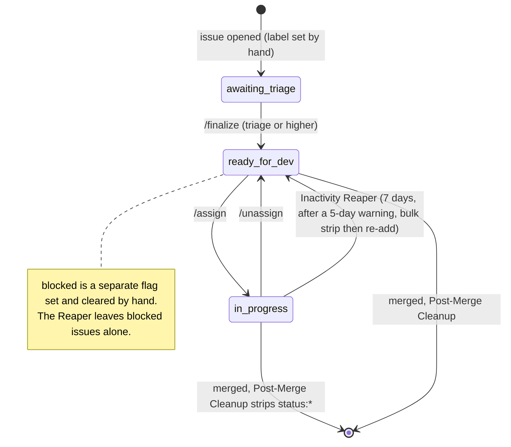
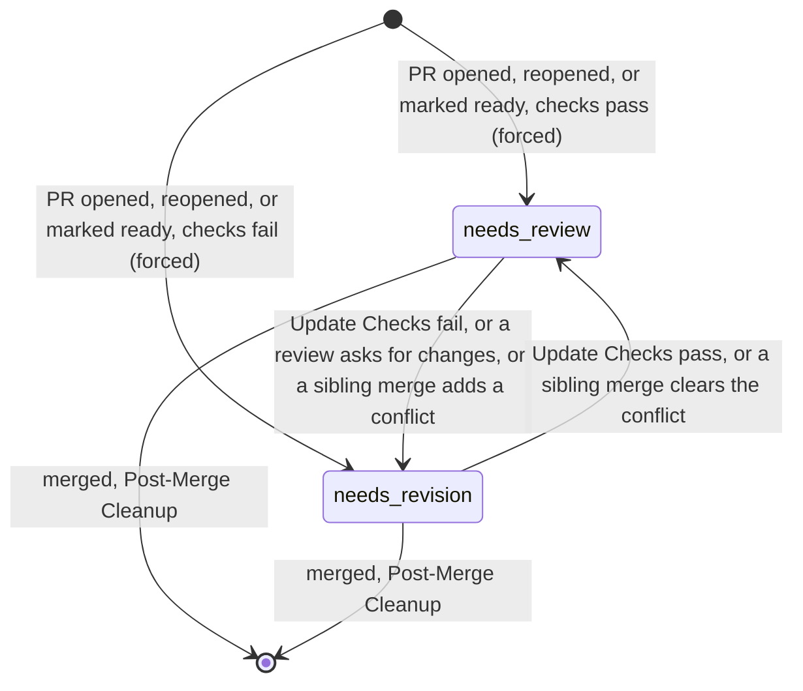

# Label Inventory: Hiero C++ SDK

> **What this covers:** every label that the maintainer automation under `.github/` of
> [`hiero-ledger/hiero-sdk-cpp`](https://github.com/hiero-ledger/hiero-sdk-cpp) reads or writes, and
> which service touches it.
> **Source state:** `main` at `a898153` (2026-05-14).
> **Phase:** 2 (Labels and flows). It builds on the Phase 1 service inventory in `audit/services-cpp.md`.
> **Left out on purpose:** the CI, build, lint, and test workflows (`zxc-*`, `flow-pull-request-checks`,
> `on-schedule-builds`). They were checked and they touch no labels at all (see Appendix C).

## How labels work in the C++ SDK

Here is the short version: every label string is written down in exactly one place,
`.github/hiero-automation.json`. The handlers never type a label out by hand. Instead they import it as
a frozen constant through `helpers/config-loader.js` and `helpers/constants.js`, so the code says
`LABELS.READY_FOR_DEV`, not the string `status: ready for dev`.

That single source of truth is the property the wider project wants to keep, and it makes this audit
easy: the 14 labels below are the whole label surface. There are no surprise variants and no spelling
drift anywhere.

The labels come in three families, all shaped `group: value` in lower case:

| Group | Labels |
|---|---|
| `status:` | `awaiting triage`, `ready for dev`, `in progress`, `blocked`, `needs review`, `needs revision` |
| `skill:` | `good first issue`, `beginner`, `intermediate`, `advanced` |
| `priority:` | `critical`, `high`, `medium`, `low` |

## Which service touches which label

How to read the columns: **Read** means the service checks the label as a condition. **Added** and
**Removed** mean it writes the label. "Bulk `status:*` strip" means the code removes every label whose
name starts with `status:` in one sweep (a prefix match), not a single named label.

### `status:` labels

| Label | Config key | Read by | Added by | Removed by |
|---|---|---|---|---|
| `status: awaiting triage` | `labels.status.awaitingTriage` | `/finalize` (must be present) | none (a person sets it before triage) | `/finalize` |
| `status: ready for dev` | `labels.status.readyForDev` | `/assign` (gate), Post-Merge Recommendation (used to find candidate issues) | `/finalize`, `/unassign`, Inactivity Reaper (when it resets an issue) | `/assign`, Post-Merge Cleanup (bulk strip), Inactivity Reaper (bulk strip before it re-adds) |
| `status: in progress` | `labels.status.inProgress` | Inactivity Reaper (issues without it are skipped) | `/assign` | `/unassign`, Inactivity Reaper (bulk strip), Post-Merge Cleanup (bulk strip) |
| `status: blocked` | `labels.status.blocked` | Inactivity Reaper (sends the item down the 30-day check-in path and exempts it from auto-close), `/assign` (blocked issues are not counted against the open-assignment limit) | none (a person sets it) | nothing targets it on its own, but the Post-Merge Cleanup and Reaper bulk `status:*` strips will remove it if it happens to be present at merge or reset |
| `status: needs review` | `labels.status.needsReview` | PR Open and Update Checks (to swap with the opposite label), Inactivity Reaper (PRs with it are skipped, the clock is paused), `/assign` (the needs-review-PR bypass for the assignment cap) | PR Open Checks (forced), PR Update Checks (conditional), Sibling Conflict Re-check | PR Review Applicator, PR Open and Update Checks, Sibling Conflict Re-check, Post-Merge Cleanup (bulk strip) |
| `status: needs revision` | `labels.status.needsRevision` | PR Open and Update Checks (to swap with the opposite label), Inactivity Reaper (the clock starts from when this label was applied) | PR Review Applicator (forced, on `changes_requested`), PR Open Checks (forced), PR Update Checks (conditional), Sibling Conflict Re-check | PR Open and Update Checks, Sibling Conflict Re-check, Post-Merge Cleanup (bulk strip) |

### `skill:` labels

All four are read-only to the automation. People and issue templates apply them; no bot ever adds or
removes them. They decide who can be assigned and they drive the recommendations.

| Label | Config key | Read by |
|---|---|---|
| `skill: good first issue` | `labels.skill.goodFirstIssue` | `/assign` (the GFI completion cap and the prerequisite floor), `/finalize` (checks that exactly one `skill:` label is present), Post-Merge Recommendation (eligibility and grouping) |
| `skill: beginner` | `labels.skill.beginner` | `/assign` (prerequisite walk), `/finalize`, Post-Merge Recommendation |
| `skill: intermediate` | `labels.skill.intermediate` | same as beginner |
| `skill: advanced` | `labels.skill.advanced` | same as beginner |

### `priority:` labels

All four are read-only to the automation.

| Label | Config key | Read by |
|---|---|---|
| `priority: critical` | `labels.priority.critical` | Post-Merge Recommendation (sort order, via `priorityHierarchy`), `/finalize` (checks that exactly one `priority:` label is present) |
| `priority: high` | `labels.priority.high` | same |
| `priority: medium` | `labels.priority.medium` | same |
| `priority: low` | `labels.priority.low` | same |

## How labels move: the status state machine

Only `status:` labels actually move around. `skill:` and `priority:` are fixed inputs. There are two
separate flows, one for issues and one for PRs. They join at merge time, when the Post-Merge Cleanup
strips every `status:*` label from the merged PR and from the issues it closes.

### Issue status flow



Every edge, and the service that owns the write:

| From | To | Service | What triggers it |
|---|---|---|---|
| (none) | `awaiting triage` | set by hand | issue opened |
| `awaiting triage` | `ready for dev` | `/finalize` | a comment from someone with triage or higher, once the label checks pass |
| `ready for dev` | `in progress` | `/assign` | a comment, if the issue is unassigned, has a skill label, the user is under their limits, and prerequisites are met |
| `in progress` | `ready for dev` | `/unassign` | a comment from the current assignee |
| `in progress` | `ready for dev` | Inactivity Reaper | the daily cron, after 7 days of inactivity (a warning goes out at 5 days first) |
| any `status:*` | (removed) | Post-Merge Cleanup | an issue that a merged PR closes |

### PR status flow



| From | To | Service | What triggers it |
|---|---|---|---|
| (any) | `needs review` | PR Open Checks | PR opened, reopened, or marked ready, and all four checks pass (forced) |
| (any) | `needs revision` | PR Open Checks | PR opened, reopened, or marked ready, and any check fails (forced) |
| `needs revision` | `needs review` | PR Update Checks | a push or a body edit, checks pass, and the opposite label is already there |
| `needs review` | `needs revision` | PR Update Checks | a push or a body edit, checks fail, and the opposite label is already there |
| `needs review` | `needs revision` | PR Review Applicator | a review submitted as `changes_requested` (forced) |
| `needs revision` | `needs review` | Sibling Conflict Re-check | another PR merges and this PR's conflict clears |
| `needs review` | `needs revision` | Sibling Conflict Re-check | another PR merges and introduces a conflict here |
| any `status:*` | (removed) | Post-Merge Cleanup | the merged PR itself |

**What `force` actually does.** The forced writers (PR Open Checks, PR Review Applicator) only force the
*add* side: they apply the target label even when the opposite label is not present. PR Update Checks and
Sibling Conflict Re-check are not forced, so they add the label only when the opposite one is already
there, which means a PR with no status label is left untouched. In every case the *removal* of the
opposite label only happens if that label is actually present (a `hasLabel` check). `force` never makes a
removal unconditional. So, for example, PR Review Applicator always adds `needs revision`, but it only
removes `needs review` when `needs review` is there.

## Prefix scans (operations on a whole label family)

| Prefix | Where | What it does |
|---|---|---|
| `status:` | Inactivity Reaper, `resetItem()` in `bot-inactivity.js` | removes every `status:*` label, then optionally re-adds `ready for dev` |
| `status:` | Post-Merge Cleanup, `removeStatusLabels()` in `bot-on-pr-close.js` | removes every `status:*` label from the merged PR and the issues it closes |
| `skill:` | `/finalize` in `commands/finalize.js` | reads all `skill:` labels to check there is exactly one, and to build the title prefix |
| `priority:` | `/finalize` | reads all `priority:` labels to check there is exactly one |

Why this matters: the two bulk strips are not limited to the six known `status:` strings. Any future
label that starts with `status:` would also get removed. So when this gets generalized, the shared schema
needs to treat `status:` as a managed namespace, not a fixed list of six.

## Labels created at runtime

There are none. There is no `createLabel`, `ensureLabel`, `labels.create`, or `gh label create` anywhere
in `.github/scripts/`. All 14 labels have to already exist in the repository. (Python is different here:
it auto-creates its queue labels. See `audit/labels-python.md`.)

## Differences from Phase 1 and from the source

The live source at `a898153` uses exactly the 14 labels above, no more and no fewer. Every label from the
Phase 1 Appendix B is in `hiero-automation.json` and is used by at least one code path. There is no alias
drift, no hard-coded label string, and no label created at runtime.

## Appendix A: config key to label string

```
labels.status.awaitingTriage  -> status: awaiting triage
labels.status.readyForDev     -> status: ready for dev
labels.status.inProgress      -> status: in progress
labels.status.blocked         -> status: blocked
labels.status.needsReview     -> status: needs review
labels.status.needsRevision   -> status: needs revision
labels.skill.goodFirstIssue   -> skill: good first issue
labels.skill.beginner         -> skill: beginner
labels.skill.intermediate     -> skill: intermediate
labels.skill.advanced         -> skill: advanced
labels.priority.critical      -> priority: critical
labels.priority.high          -> priority: high
labels.priority.medium        -> priority: medium
labels.priority.low           -> priority: low
```

## Appendix B: who can change what

| Service | Adds | Removes |
|---|---|---|
| `/finalize` | `ready for dev` | `awaiting triage` |
| `/assign` | `in progress` | `ready for dev` |
| `/unassign` | `ready for dev` | `in progress` |
| PR Open Checks | `needs review` or `needs revision` (forced) | the opposite one |
| PR Update Checks | `needs review` or `needs revision` (conditional) | the opposite one |
| PR Review Applicator | `needs revision` (forced) | `needs review` |
| Sibling Conflict Re-check | `needs review` or `needs revision` | the opposite one |
| Post-Merge Cleanup | none | all `status:*` (bulk) |
| Inactivity Reaper | `ready for dev` (issues only) | all `status:*` (bulk) |

`skill:` and `priority:` show up under no writer at all, which confirms they are read-only inputs to the
C++ automation.

## Appendix C: out-of-scope workflows (no label contact)

`zxc-build-library.yaml`, `zxc-lint-workflows.yaml`, `zxc-test-bot-scripts.yaml`,
`flow-pull-request-checks.yaml`, and `on-schedule-builds.yaml` were searched for `label`, `status:`,
`skill:`, and `priority:`, and none of them match. These are CI, build, lint, and test, which the project
treats as a non-goal (`planning/goals.md`, Non-goals). They are listed here only so the audit is
complete, and they are left out of all the flow analysis.
