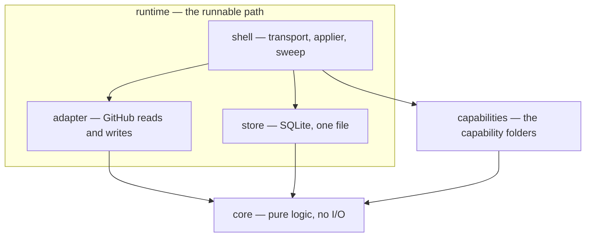

# Architecture

> The map. [`trace.md`](trace.md) is the route — one label from GitHub's POST to GitHub's API call —
> and it is the page to read first; this one says what the pieces are and which rule holds each edge
> in place. The italic line under each drawing names the code or test that falsifies it. Why:
> [`constraints.md`](constraints.md). Vocabulary: [`packages/core/README.md`](../packages/core/README.md).

## 1. Three packages, and the rules between them



Three more sit under `packages/dev/` and never ship: `checks` (repository invariants), `lab` (GitHub
experiments) and `testkit` (fixtures). Store, shell and adapter are DIRECTORIES of `runtime` rather
than packages, and the layer policy did not change when they were filed that way (G4). The rules, as
`.dependency-cruiser.cjs` states them:

| Rule | What it forbids |
|---|---|
| `no-circular` | any cycle — a cycle makes the table unreadable in either direction |
| `core-imports-no-internal-package` | core reaching any workspace neighbour; its TESTS may reach the testkit |
| `core-and-capabilities-stay-pure` | sockets, files and timers in core and capabilities; `node:crypto` is the one argued exception |
| `store-imports-core-only`, `adapter-imports-core-only` | either one reaching the other, the shell, or a capability |
| `shell-imports-core-store-capabilities-adapter` | the shell reaching a development package; composing capabilities is legitimate because the shell decides nothing (D93) |
| `adapter-imported-at-shell-main-only` | credentials entering anywhere but the composition root |
| `testkit-is-test-only`, `testkit-imports-no-internal-package`, `production-imports-no-checks-or-lab` | shipping code importing the testkit, the checks or the lab; the testkit importing anything |
| `no-import-past-the-barrel`, `not-to-unresolvable` | reaching past a barrel, and the named subpath that would resolve to nothing at all |

*Enforced by `packages/dev/checks/test/architecture.test.ts`, which cruises the real tree with these
rules and a deliberately-violating fixture tree to prove they still fire.*

The shell has a second direction rule of its own, inside the one directory that composes everything
(D172):

| Directory | What it owns |
|---|---|
| `compose/` | the environment read into one record, the live seams, and the start |
| `inbound/` | the webhook lane: the receiver, and the delivery it claims and completes |
| `sweep/` | the sweep lane: the schedule row, one firing's budgets, and the driver |
| `decide/` | the one box both lanes call — decide one item, apply, write the rows |
| `apply/` | the applier as a loop over a five-row table, one module per operation below it |
| `jobs/` | the tick's four named jobs, and the shutdown order |
| `observe/` | the read-only commands |
| `log.ts`, `paths.ts`, `effects.ts` | the vocabulary every directory above may name |

Imports run down that list and never back up — `compose` → the lanes and the jobs → `decide` →
`apply` → `apply/operations` — with the root files nameable from anywhere and `compose` from
nowhere. Two more rules ride with it: `apply/actions.ts` is the only file that names the fold's five
states, and `decide/item.ts` the only caller of the applier.

*Enforced by `packages/dev/checks/test/shell-layering.test.ts`, which reads every import under
`src/shell/` and proves each of the three rules can fail over fixture text.*

## 2. One item is the unit of decision

Everything narrows to this. A producer builds one fact record about ONE item; `decide()` calls each
enabled capability once per record; a capability returns intents about that item and nothing else.
No cross-item read, no durable capability state, no subject that is not an item — a capability
needing one has found a platform gap to write down, never a workaround ([`trace.md`](trace.md)).

Three values cross into a capability and no more: the facts (positions and meanings, never label
strings), a view of its own settings plus the mapped names, and a handle offering only the resolvers
it declared. A GitHub client, a raw payload, a sibling's settings, the repository mode and a
claimable world are absent BY SHAPE — there is no type to reach for.

*Sources: `packages/core/src/engine/decide.ts`, `packages/core/src/capability/boundary.ts` · leaks
refuted by `packages/capabilities/test/boundary.test.ts`, P3 by `engine-matrix.test.ts` beside it.*

## 3. Two producers, one shape of record

| Producer | Wakes on | Reads |
|---|---|---|
| webhook (`issues`, `issue_comment`, `pull_request`) | GitHub telling us something | the projection, `readiness`, `actor`, `author`, and `command` on a comment |
| sweep | a due schedule row — nobody told us anything | every group the endpoint-permission matrix has confirmed, one record per open item |

The registry in `packages/core/src/capability/producers.ts` is the promise: a capability declaring a
need no producer of its trigger reads does not boot. The record is judged again on the day — a group
that failed to read, or that the matrix has not confirmed, arrives `"unread"` and `decide()` skips
the capability with `factsUnread`, so it never branches on what woke the platform.

*Contract: [`contracts/facts.md`](contracts/facts.md), generated from the registry ·
the sweep's own reads and their confirmation status: [`guides/sweep.md`](guides/sweep.md).*

## 4. One delivery, in time

```mermaid
sequenceDiagram
    participant GH as GitHub
    participant R as receiver
    participant S as store
    participant P as processor
    participant E as core decide()
    note over GH,S: synchronous — inside the HTTP request
    GH->>R: POST bytes + delivery, event, signature headers
    R->>R: verifyBody — HMAC-SHA256 of the raw bytes (fail → 401)
    R->>S: acceptDelivery — exact bytes, state 'pending'
    S-->>R: accepted, duplicate, or conflict — INSERT ON CONFLICT is the dedup
    R-->>GH: 202 (conflict → 409)
    note over R,GH: P9 — the durable row exists before the ack, so a crash one millisecond later loses nothing
    note over R,E: decoupled — after the response has flushed
    R->>P: onAccepted fires drain (fire-and-forget)
    P->>S: claimNextDelivery — 256-bit claim token, 15-minute stale takeover
    P->>P: loadConfig, then parseConfigDocument (text + sha256 revision)
    alt rejected config, or active mode with no write path composed
        P->>P: record 'configRejected' or 'modeUnsupported' — before decide()
    else disabled, observe, dry-run, or active with an applier
        P->>E: decide(facts, config, capabilities, externals)
        E-->>P: report → record 'decision'; approved effects go to the applier
    end
    P->>S: completeDelivery — 'done', one transaction
    note over P,S: any failure before commit releases the claim
```

Every rejection fails closed and still completes, so a redelivery decides nothing a second time.
`disabled` is deliberately not intercepted: it runs through `decide()` and the `modeDisabled` gate
refuses each intent, which is why it sits with `observe` and `dry-run` rather than with `active`. The
sweep reaches `decide()` through this same path — mode gate, applier, journal and recovery are all
this lane's.

*Sources: `packages/runtime/src/shell/inbound/receiver.ts`, `inbound/deliveries.ts`,
`decide/item.ts`, `sweep/sweep.ts` — pinned end to end by
`packages/runtime/test/shell/compose/shell.test.ts`. The exhaustive rejection-code table is
[`contracts/config-schema.md`](contracts/config-schema.md); it is deliberately not copied here.*

## 5. Safety, and the path a destructive act takes

An intent passes the screen (its own capability, a declared operation, its own item, a legal
transition), then the world is DERIVED from the facts rather than asserted, then the ladder judges
it: kill switch, precondition, door policy, then the general rules in a fixed order. Precedence is
contract, not style — [`contracts/safety.md`](contracts/safety.md) holds both vocabularies and the
order, and the drift test freezes them.

A `clockTriggeredDestructive` act is refused at the general door on purpose: it goes through grace
instead. On first sight the platform approves its OWN warning comment and the act waits; the applier
records the warning when it lands; a later occasion is judged against that record — grace elapsed, no
qualifying activity — and the notice follows the act ([`guides/grace.md`](guides/grace.md)).

## 6. Store — five tables, five questions

One file, two modules over one connection: `inbox.ts` is the delivery queue, whose rows move state
in place; `ledger.ts` is appended and folded, and holds the leases and the schedule beside the facts
(D164).

| Table | The question it answers |
|---|---|
| `seen_delivery` | is this delivery durable, claimed, done, or dead-lettered? |
| `effect_fact` | what has been sent, landed, refused or promised for this effect? |
| `decision` | what did each pass decide about this item, and why? |
| `effect_claim` | who holds this effect's lease right now? |
| `schedule` | what clock-triggered work is due now? |

*Source: `packages/runtime/src/store/schema.ts` — schema version 1, one migration, no history before
launch (D165); drift rejected by the fingerprint D110 established.*

## 7. What is not built

Active mode runs only where the process was composed with the App's identity as well as its
credentials; anything else records `modeUnsupported`. Every read and write with no cited row in
[`findings/endpoint-permission-matrix.md`](findings/endpoint-permission-matrix.md) — two resolvers,
four operations, three of the sweep's facts — is implemented and refuses at the send. Everything
else absent here is an open question in
[`constraints.md`](constraints.md), deliberately not drawn.
