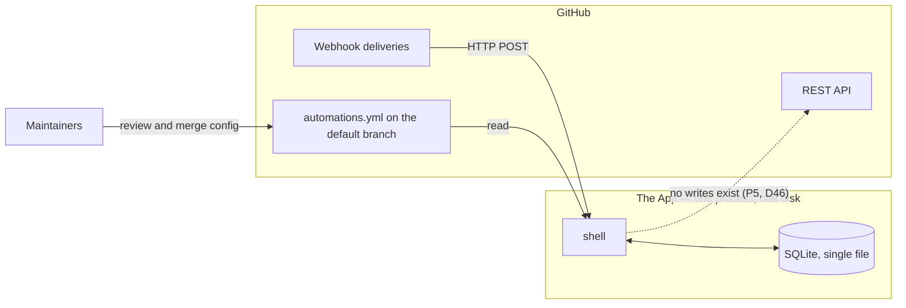
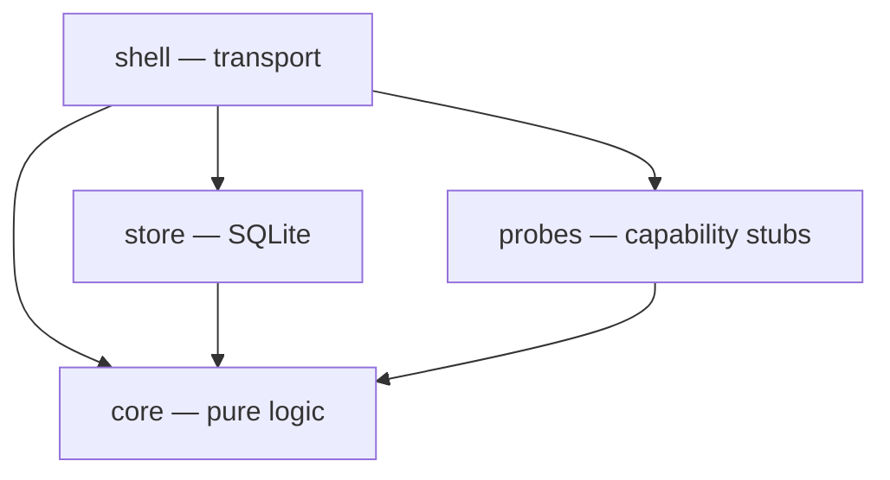
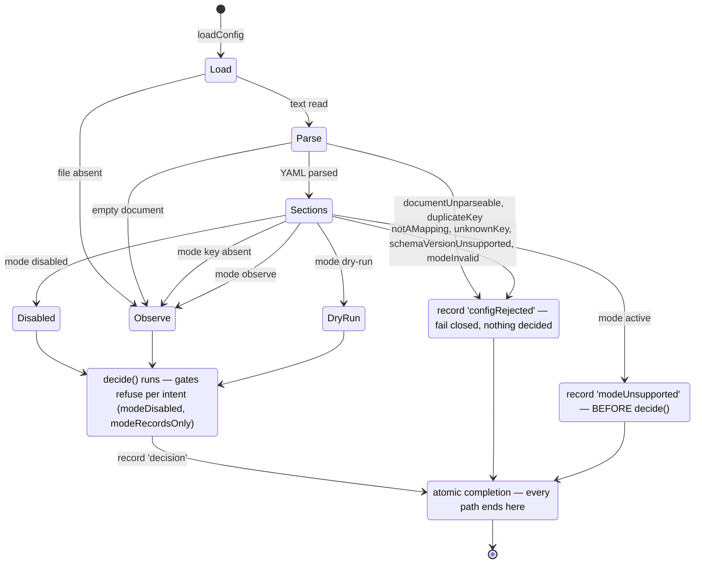
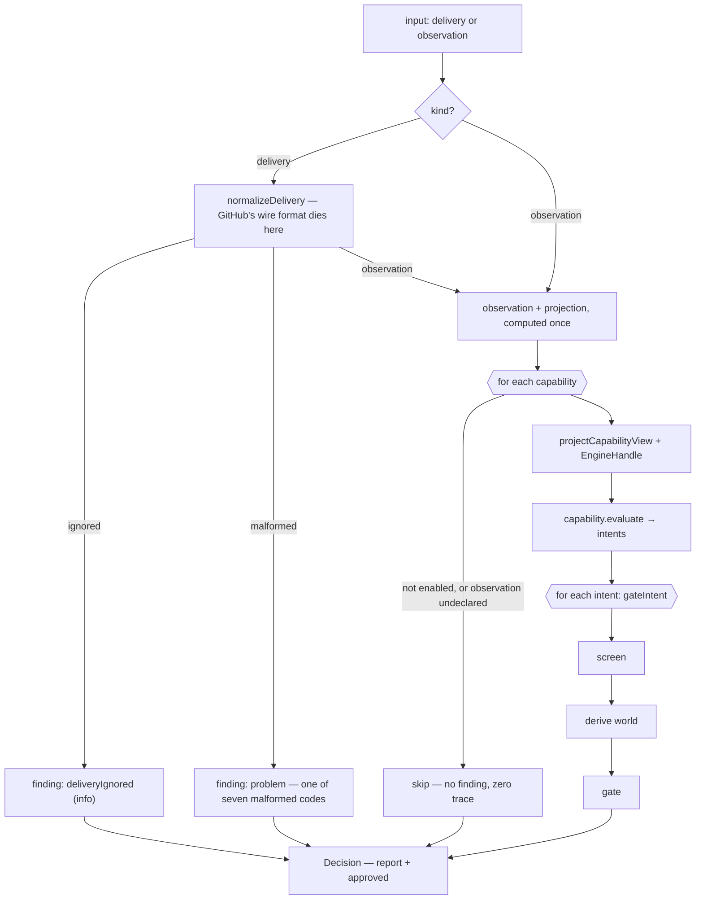
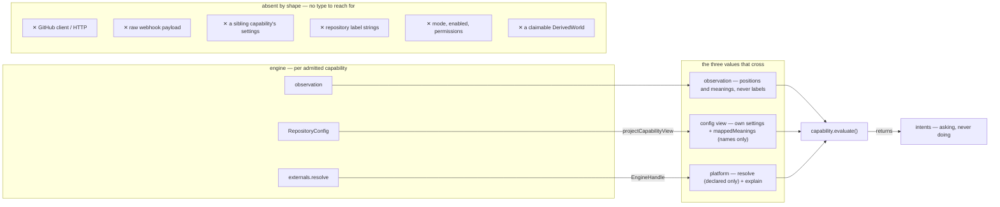
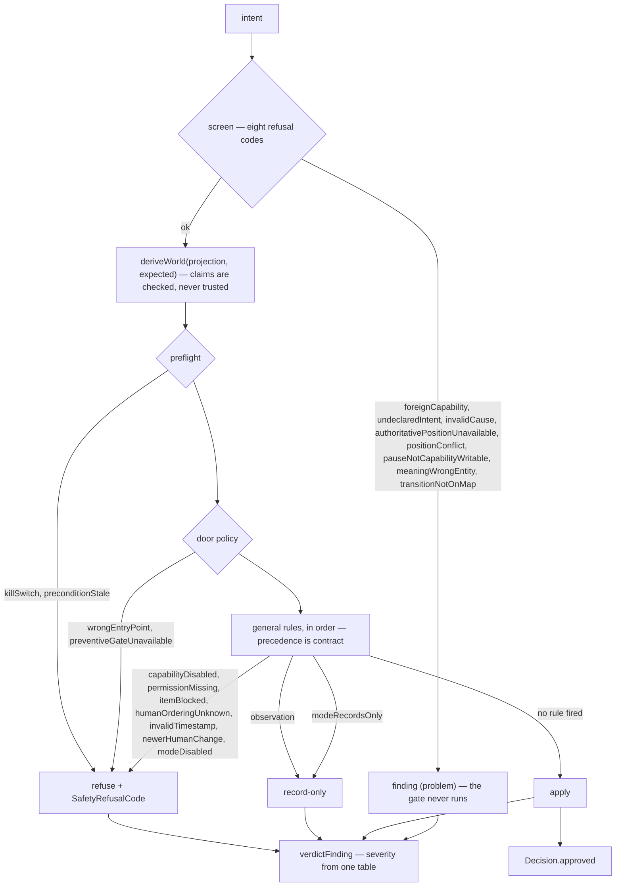
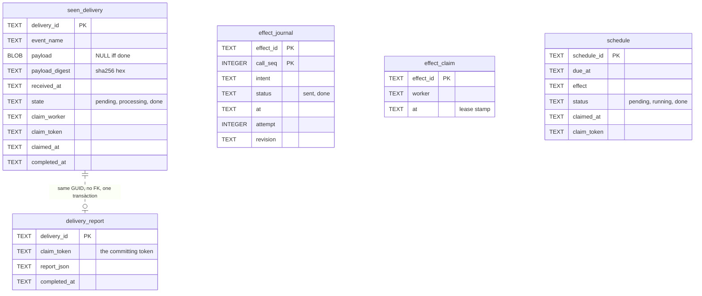
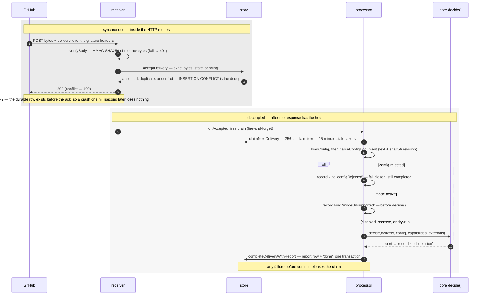
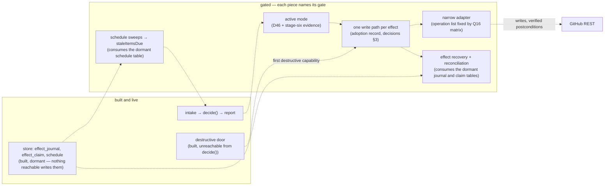

# System architecture (v2 draft — temporary name)

> Drawings, not prose. One italic line under each names the code or test that falsifies it.
> Why: [`decisions.md`](decisions.md). The narrated journey: [`trace.md`](../trace.md).

## Part 1 — The system

### 1. Context

*Sources: `packages/shell/src/receiver.ts` · [`decisions.md`](decisions.md) P5, D46, D110.*

### 2. Packages — the allowed edges, and only those

*An edge not drawn is forbidden — enforced by `.dependency-cruiser.cjs` via
`packages/dev/checks/test/architecture.test.ts`.*

## Part 2 — Inside each package

### 3. shell — the mode gate

*Sources: `packages/core/src/config/parse.ts` · `packages/core/src/config/sections.ts` ·
`packages/shell/src/processor.ts` — pinned by `packages/core/test/config/parse.test.ts` and
`packages/shell/test/shell.test.ts`.*

### 4. core — inside `decide()`

*Source: `packages/core/src/engine/decide.ts` — total by construction; zero-trace skip proven by
`packages/probes/test/engine-matrix.test.ts`.*

### 5. core — the capability boundary (probes plug in here)

*Sources: `packages/core/src/capability/boundary.ts` · the three probes (`prQuality`, `intake`,
`inactivity`) are today's capabilities behind this boundary · leaks refuted by
`packages/probes/test/boundary.test.ts` · independence (P3) by
`packages/probes/test/engine-matrix.test.ts`.*

### 6. core — safety: how an intent becomes a verdict

*Sources: `packages/core/src/safety/rules.ts` · `packages/core/src/safety/write.ts` ·
`packages/core/src/report/convert.ts`. The destructive door
(`packages/core/src/safety/destructive.ts`) is unreachable from `decide()` today.*

### 7. core — the workflow state machine

Drawn once, in [`core/taxonomy.md`](../core/taxonomy.md), where
`packages/dev/checks/test/doc-drift.test.ts` holds its every edge equal to `PROFILE_EDGES` in
`packages/core/src/workflow/transitions.ts`. Not copied here — a second drawing would be the
unchecked one.

### 8. store — five tables, five questions

| Table | The question it answers |
|---|---|
| `seen_delivery` | is this delivery durable, claimed, or done? |
| `delivery_report` | what did we decide for this delivery? |
| `effect_journal` | did this call reach GitHub? |
| `effect_claim` | who holds this effect's lease right now? |
| `schedule` | what clock-triggered work is due now? |

*Source: `packages/store/src/schema.ts` — schema version 4; drift rejected by the D110 fingerprint.*

## Part 3 — How they interact

### 9. One delivery, in time

*Sources: `packages/shell/src/receiver.ts` · `packages/shell/src/processor.ts` — pinned end to end
by `packages/shell/test/shell.test.ts`.*

## Part 4 — The goal

### 10. What remains — solid is built, dashed is gated

*The goal is drawn only where a register row supports it: gates and order in
[`build-plan.md`](../build-plan.md), stages five to eight · adapter operations in
[`endpoint-permission-matrix.md`](../operations/endpoint-permission-matrix.md) · everything else is
an open question in [`decisions.md`](decisions.md) §4, deliberately not drawn.*
