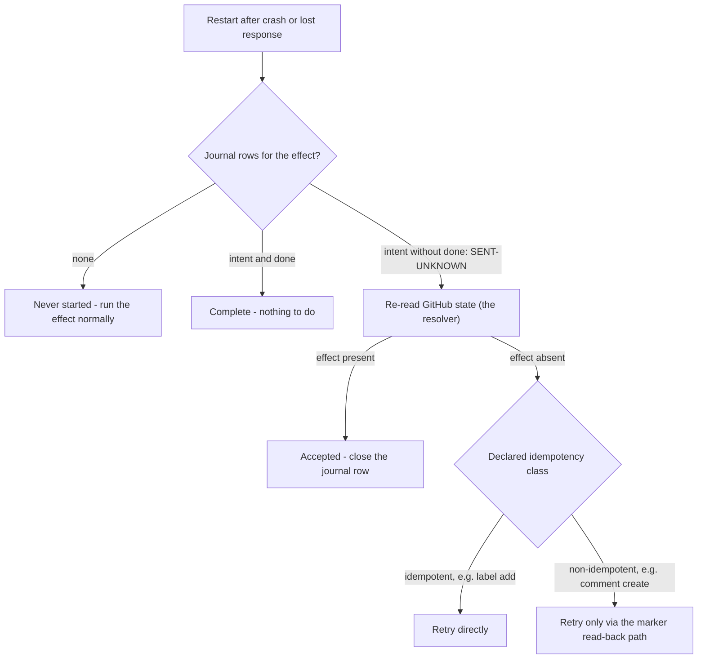

# Storage decision

> Moved from the lab (then `experiments/`) on 2026-07-23: experiments produce evidence,
> their conclusions live in `design/`. The cited evidence logs are local
> and untracked under `lab/harness/evidence/`.

The stage-three exit-gate artifact for Q15, produced by protocol 6.5:
what minimum owned operational state does recovery require? The answer
moves D1, D13, D24, and D27 out of `reopened`.

## The comparison

Each cell: `sufficient` / `insufficient` / `sufficient-at-cost` (name
the cost), with a citation into the 6.5 evidence log. Judged **only** on
observed recovery runs — not on what a source should theoretically hold.

Citations `#n` are into `6.5-recovery-2026-07-23T19-45-28-929Z.jsonl`
unless prefixed; 6.2 citations are from that protocol's run.

| Operational need | (a) GitHub state + events | (b) App comment metadata | (c) Small owned store | Citation |
|---|---|---|---|---|
| Delivery deduplication | insufficient — GitHub's ledger reads `OK` for a delivery the receiver lost (6.2), and redeliveries reuse the guid, so nothing GitHub-side records what *we* processed | insufficient — only effectful deliveries leave a marker; a no-op delivery leaves nothing to dedup against | sufficient — guid as primary key; the same single-`INSERT` mechanism as the claim table | 6.2 ledger `20db79d8…`; `#35` |
| Pending effects (crash mid-sequence) | insufficient — `absent` is indistinguishable from never-requested | insufficient — no record exists until the write lands | sufficient — intent row survives the crash and names the exact call | `#8` |
| Lost-response disambiguation | sufficient as the *resolver* — one re-read is the receipt | sufficient for comment-shaped effects only (the comment is its own receipt); no record for E2 | insufficient alone (`SENT-UNKNOWN`) but it is the *detector*: the open intent row is the only signal that a check is needed | `#14`, `#18`, `#25` |
| Retries with bounded history | insufficient — no attempt record anywhere | sufficient-at-cost — one payload rewrite per attempt, straight into the content-creation secondary limit (6.4: no warning header) | sufficient — attempt bookkeeping is the same journal-row mechanics observed surviving every kill | `#8,#11`; 6.4 `…T19-37-00-198Z#19` |
| Schedules (clock-triggered work) | insufficient — GitHub emits no clock events; the 6.2 delivery corpus contains only event-triggered deliveries | insufficient — same reason | sufficient — a due-time row is the same durable-row machinery (analytic: the one cell resting on construction, not a dedicated run) | 6.2 corpus; `#8` (row durability) |
| Coordination (two workers, one effect) | insufficient — race with full read-checks still duplicated (TOCTOU; GitHub has no conditional create) | insufficient — the read-check *is* the comment-metadata protocol, and it lost the race | sufficient — primary-key claim: one winner, loser exits cleanly | `#32`, `#35` |

## The recovery loop the grid decided

Every observed recovery reduces to one loop: the journal knows *what*
to check, GitHub knows *how it ended*, and the effect's idempotency
class decides how a retry must be performed. This is the shape D24's
replacement takes:



A blind retry that skips the resolver step is the demonstrated failure
mode: it duplicated the managed comment on the first attempt.

## The decision

- **Minimum recovery state observed in protocol 6.5:** a single-file SQLite
  store with four small tables — seen delivery GUIDs, effect intent/done
  journal, claims, schedules. Every recovery in the grid needed it as a
  detector, deduper, or lock; nothing in that grid needed more of it. D110
  later adds `DELIVERY_REPORT` for a different proved boundary: committing a
  canonical decision report with delivery completion.

  ```mermaid
  erDiagram
      SEEN_DELIVERY {
          string delivery_id PK "opaque string, ids exceed 2^53"
          string event_name
          bytes payload "cleared on completion"
          string payload_digest
          string received_at
          string state
          string claim_worker
          string claim_token
          string claimed_at
          string completed_at
      }
      EFFECT_JOURNAL {
          string effect_id PK
          int call_seq PK
          string intent "the call about to be made"
          string status "sent or done"
          string at
          int attempt "durable retry counter - amendment D42"
          string revision "default-branch config revision/effective hash"
      }
      EFFECT_CLAIM {
          string effect_id PK
          string worker
          string at
      }
      SCHEDULE {
          string schedule_id PK
          string due_at
          string effect "the work to run when due"
          string status
          string claimed_at "stamped on claim; drives stuck-requeue - amendment D43"
          string claim_token "per-firing token; fences stale completion"
      }
      DELIVERY_REPORT {
          string delivery_id PK
          string claim_token "token that committed completion"
          string report_json "canonical shell record"
          string completed_at
      }
  ```

  The tables have no foreign keys. Most hot paths remain one `INSERT` or
  primary-key lookup. Delivery finalization is the intentional exception:
  it verifies `SEEN_DELIVERY`, inserts `DELIVERY_REPORT`, and changes the
  delivery to `done` inside one write transaction. `EFFECT_JOURNAL` and
  `EFFECT_CLAIM` are the two the 6.5 harness exercised under
  crashes and races; `SEEN_DELIVERY` and `SCHEDULE` are decided here
  and land as stage-five exit-gate tests (dedup by guid, a due
  schedule firing exactly once across a restart).
- **What stays on GitHub:** all effect *outcomes* (comments, labels)
  — GitHub is authoritative for results and is the resolver for every
  `SENT-UNKNOWN`: recovery is "journal says check, GitHub says how it
  ended." The deliveries API stays the *repair* tool (6.2), never the
  detection mechanism.
- **What comment metadata is still used for (D13):** effect identity
  and receipt — the marker payload makes managed comments
  self-identifying, which is what makes retry-after-check safe and
  cleanup findable. It is **not** operational storage: it cannot
  record intent, cover non-comment effects, or coordinate.
- **Register updates this authorizes:**
  - D1 → close: GitHub delivery machinery alone cannot carry recovery
    (detection requires owned state; 6.2 + dedup row).
  - D13 → close: markers = identity/receipt, not state.
  - D24 → close: lost-response is survivable via intent-journal +
    re-read reconciliation; naive retry demonstrably duplicates.
  - D27 → close: comment-metadata-as-WAL rejected on observed grounds
    (no pre-write record `#8`, no coverage `#25`, no CAS `#32`, write
    cost into an unsignaled secondary limit).
  - Q15 → answered: the recovery minimum is the original four-table
    single-file store above. The current owned schema is five tables after
    D110's separate report-completion evidence.
- **Approving review:** _(names, date — per the ratification rule)_

## Risk-review amendment (2026-07-28)

The local store can fence a stale schedule completion with a per-firing
claim token, and journal rows now retain the configuration revision and
completion time. It cannot fence a GitHub request already in flight when
an effect lease is stolen. D41 is therefore reopened: the serialized
crash grid remains useful restart evidence, but it is not evidence that
live lease takeover preserves a non-idempotent exactly-once outcome.

## Durable report and schema amendment (2026-08-09)

The shell formerly appended a filesystem report and then separately completed
the delivery. A crash between those writes left a pending delivery beside an
already-visible report, so retry appended a duplicate. D110 moves the canonical
record into `DELIVERY_REPORT` and makes `completeDeliveryWithReport` the only
public completion operation. Under one `BEGIN IMMEDIATE` transaction it verifies
the delivery GUID, event name, payload digest, processing state, and current
claim token; inserts exactly one report row keyed by delivery GUID; changes the
delivery to `done`; and clears the payload. The report row retains the committing
token, so retrying the same token and exact JSON returns `alreadyCompleted`.
Released, stale, or stolen tokens return `notOwned`; the same token with changed
JSON returns `reportConflict`. SQLite is the only canonical report store.
`deliveryReports` reads canonical records in stable completion-time and
delivery-ID order. The shell does not create or rebuild a filesystem projection;
startup recovery continues to drain pending deliveries from SQLite.

SQLite `PRAGMA user_version` is the schema contract, currently version 4. A
newer declared version is refused before database configuration or migration.
Version-zero databases are fingerprinted against the exact owned SQLite objects
from the three real schemas previously created here. Table and index SQL is
normalized only for whitespace, preserving types, nullability, primary
keys, checks, and partial-index predicates; extra triggers, views, tables, or
indexes are refused. Migrations run in numeric order with their version updates
inside one write transaction, so an interruption leaves either the complete old
schema or version 4 and reopening is repeatable. Unknown unversioned shapes fail
closed.

Migration cannot invent missing facts. Identity-only delivery rows become
completed legacy identities whose unknown event and digest force a conflict on
redelivery. Original journal rows receive attempt 1 and the non-current revision
`legacy:unknown`; original running schedules, which had no completion token,
return to pending. Deliveries already done before version 4 have no fabricated
report. The one-report guarantee therefore applies exactly to completions made
through the version-4 operation. Retention deletes a completed delivery and its
report in one transaction.
