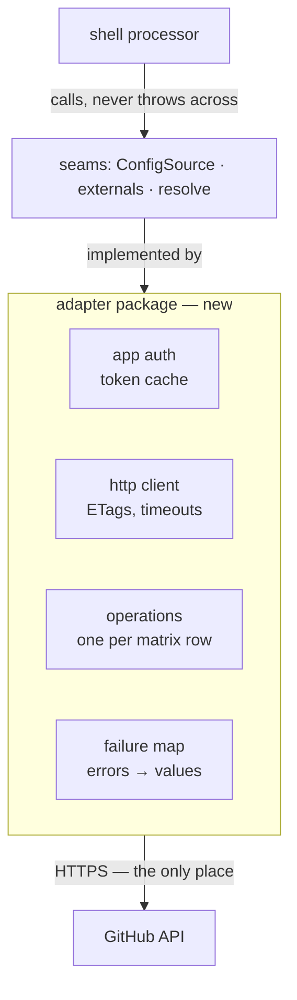
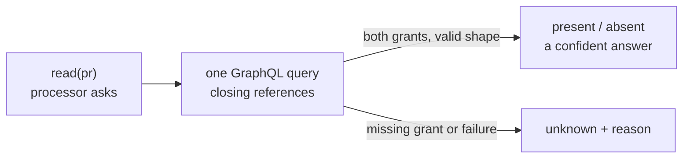
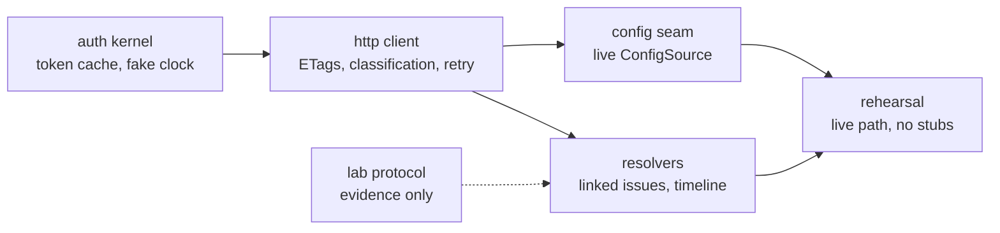

# The read-only adapter

> **Built and rehearsed.** Auth, the shared HTTP client, live config, grants,
> timeline evidence, and the two catalogued resolvers exist. Each part lands behind an existing seam; `main.ts`
> only chooses between live and credential-free implementations.

## Ground rules

| Rule | Consequence |
|---|---|
| The shell changes only when a seam's contract does (D122) | Live reads land behind the existing seams |
| Nothing throws across a seam | Every failure is a typed value — `ConfigLoadOutcome`, `"unknown"` |
| Unknown is never absence (D51) | A failed read must never become a default |
| Core stays pure | A new package; core's one edit is making one seam async — below |
| Fail closed on identity | Config fetches pin the default branch |

- The package is `packages/adapter`, importing `core` alone; `shell → adapter` exists only in `main.ts`.
- Shell production changes stay within composition and seam-contract adaptation.
- Typed failures are why one bad delivery can never wedge the queue.
- The contents API serves fork-authored content at a PR head sha (observed, 6.6).

## Auth

| Concern | Behaviour |
|---|---|
| JWT | The private key signs a ~10-minute JWT (`node:crypto`, no library) |
| Installation token | `POST /app/installations/{id}/access_tokens`, valid 1 hour |
| `TokenSource` | Cached, refreshed early, single-flight |
| Expiry | Locally expiry-aware, clock-injected |
| Credentials | `APP_ID`, `PRIVATE_KEY_PATH`, `INSTALLATION_ID` |

- Single-flight means concurrent requests never stampede the mint endpoint.
- An expired token and a wrong key return the byte-identical 401 `"Bad credentials"`.
- Only a local `expires_at` separates them, so `classifyFailure` takes `tokenPastExpiry` as an input.
- Tests drive expiry with a fake clock, and no test touches the network.
- Credentials are untracked environment only — the lab's rule, extended as D99 predicted.

## HTTP client

| Concern | Behaviour |
|---|---|
| Request shaping | Auth header, API version, timeout via `AbortSignal` |
| Conditional reads | ETag cache per URL; a 304 costs zero quota |
| Rate awareness | Track `x-ratelimit-*` on every response |
| Classification | Non-success builds a `FailureObservation` for core |
| Bounded retry | One retry, and only for two classes |

- One function every operation calls, owning those five concerns.
- A free 304 is how the Q10 budget stays comfortable.
- Classification calls core's `classifyFailure` — no parallel vocabulary.
- Retry: `tokenExpired` refreshes and retries once · `transient` retries once · the rest return at once.
- `secondaryLimit` is **never** auto-retried by the client. The observed write-path block
  carried no wait signal (6.4); GitHub documents that `retry-after` may be present, and core
  honours it when it is. The read path is unprobed — `REPROBE(secondary-limit-read-path)`.
- Deterministic refusals are not weather: what never left the process is `notSent`, a refused
  3xx is `redirected` — both `doNotRetry`, so a wiring defect or a renamed repo cannot burn
  the retry budget under the `transient` label. `notSent` is adapter-local because it is not a
  GitHub response; every response class, including `redirected`, still comes from core.
- **How the two retry layers compose:** the client owns exactly one immediate in-process
  retry (`tokenExpired` after a refresh, `transient` once); core's `retryAdvice` owns durable,
  paced, restart-surviving retries at the operation layer, treating each client call as one
  attempt. With its current zero-based advice (wait after attempts 0, 1, and 2), the initial
  client call plus three durable retries can each make two HTTP attempts: **8 requests per
  persistent transient episode**. That number is accepted here, deliberately, once.
- Its tests replay every row of the failure catalogue, whose body snapshots are the fixtures —
  [`../findings/endpoint-permission-matrix.md`](../findings/endpoint-permission-matrix.md).

## Operations

| Function | Endpoint | Fills | Matrix status |
|---|---|---|---|
| `githubConfigSource()` | `GET …/contents/{path}` | `ConfigSource` | confirmed |
| `fetchInstallationGrants()` | token mint response | `installationGrants` | confirmed |
| `readIssueTimeline(n)` | `GET …/issues/{n}/timeline` | `latestHumanChangeAt` | confirmed |
| `readLinkedIssues(pr)` | GraphQL `closingIssuesReferences` | `resolve: linkedIssues` | confirmed, same-repository only |

- The linked-issue protocol now supplies the matrix evidence and safe first scope.
- Manual links remain excluded; cross-repository support remains deferred.
- **GitHub ids exceed 2^53**, so every id stays a string.
- **404 means "not found *or* not installed"** — it maps to `notFoundOrNotInstalled`, never to a
  confident absence.

## The seams

- **`githubConfigSource`** fetches from the default branch. `revision` is the decoded content revision;
  the blob SHA is retained only for permanent decoding defects. Built.
- A 404 maps to the absent-file default, matching `fileConfigSource`'s semantics exactly — one shared `sha256:absent` sentinel, never a re-spelling.
- **`liveExternals`** — the real grant list, and `latestHumanChangeAt` from the timeline. Built.
- The grant list costs zero calls: it is a field of the mint response, cached and refreshed with the token.
- It answers **unknown** when evidence cannot be established within budget.
- The seam turns async on the way: `main` types `latestHumanChangeAt` synchronously, which a
  timeline read cannot answer and the shell cannot prefetch — `intent.item` exists only inside
  `decide()`. It becomes `Promise`-returning like `resolve` beside it; `decide()` is already
  async, so the one verb's signature and the shell both hold.
- Timeline answers memoize within a delivery, never across one (the 6.8 freshness rule).
- That is the moment dry-run stops overstating. `killSwitchActive` stays operator environment.
- **`linkedIssuesResolver`** — an empty answer and a failed answer are different values.
- It checks live `issues: read` and `pull_requests: read` grants before querying. Missing Issues
  permission otherwise looks like a successful empty answer.
- It supports same-repository references only. A cross-repository target hidden by token or
  installation scope also looks successfully empty, so that wider scope cannot fail honestly yet.
- Wiring: with the three credential variables present, `main.ts` composes live implementations.
- Without them it composes stubs. One conditional — the sandbox runs live, CI stays credential-free.

## The fail-honest read

- Missing grant, GraphQL error, rate limit, timeout, or malformed response becomes `unknown`.
- The decision layer refuses to act on unknown, so a failed read can never fake a fact.

## How the work divides

Four properties make each piece mergeable alone — consequences of the seams, not of a plan.

| Property | Consequence |
|---|---|
| Each piece lands behind an existing seam | GitHub logic stays in the adapter |
| The composition root is environment-gated | An unfinished adapter cannot break CI |
| The measurement is its own piece, no code | Evidence merges as protocol and matrix rows |
| Selecting the live path is the last piece | Zero stubs closes the work |

- Credentials present composes live implementations; absent composes stubs.
- CI never holds a credential, and the runnable sandbox keeps working.
- `readLinkedIssues` is measured under App auth ([`../findings/linked-issues.md`](../findings/linked-issues.md)): closing keywords only, same-repository scope, both grants required, and no memoization across a delivery.
- Zero stubs is the done-when below, not a step toward it.

## Verification

| Layer | Runs | Proves |
|---|---|---|
| Unit and fixture tests | CI, no credentials | Auth edges, ETags, all catalogue rows classify |
| Mutation gate | CI | The adapter's Stryker range, pinned to end-of-file |
| Lab conformance | Sandbox, manual | Linked-issue semantics; D40's prose-snapshot re-probe |
| Sandbox rehearsal | Sandbox, live | Zero stubs produced `newerHumanChange` for a later human label |

## Completion evidence

- A locally signed sandbox delivery ran with live config, grants, timeline, and linked-issue reads.
- The live dry-run stopped overstating and D93 records the result.
- CI needed no credential and the lab tracked none.
- Shell production changes are limited to composition and seam-contract adaptation.
- Every GitHub assumption has an existing documentation, matrix, or protocol citation.
