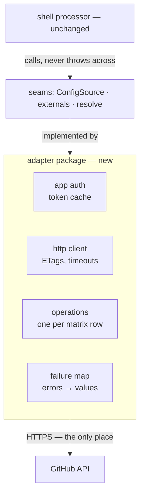
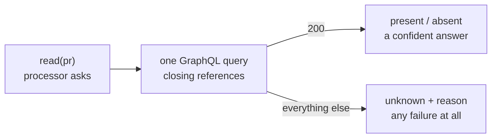
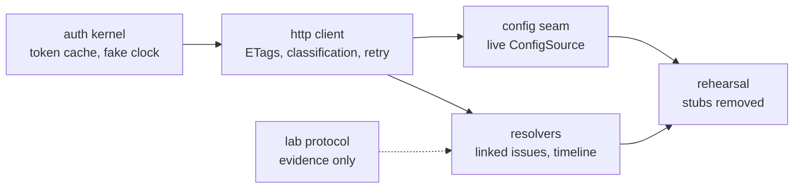

# The read-only adapter

> **Not built — build guide.** The first component that talks to GitHub at runtime. It lands behind
> seams that already exist on `main`, so the shell does not change. How the work divides is below;
> its order and estimates live on issue #111, not here.

## Ground rules

| Rule | Consequence |
|---|---|
| The shell does not change | The whole sequence lands behind the four seams; the final shell diff is one composition-root conditional |
| Nothing throws across a seam | Every failure is a typed value, so one bad delivery can never wedge the queue |
| Unknown is never absence (D51) | A failed read must never become a default |
| Core stays pure | The adapter is a new package; core contributes only `classifyFailure` |
| Fail closed on identity | Config fetches pin the default branch — the contents API serves fork-authored content at a PR head sha (observed, 6.6) |

## Auth

The private key signs a ~10-minute JWT (`node:crypto`, no library);
`POST /app/installations/{id}/access_tokens` returns a 1-hour installation token. The `TokenSource`
that wraps it is:

- **cached, refreshed early, single-flight** — concurrent requests never stampede the mint endpoint;
- **locally expiry-aware** — an expired token and a wrong key return the byte-identical 401
  `"Bad credentials"`, so only a local `expires_at` separates them. This is why `classifyFailure`
  takes `tokenPastExpiry` as an input;
- **clock-injected** — tests drive expiry with a fake clock, and no test touches the network.

Credentials are untracked environment only — `APP_ID`, `PRIVATE_KEY_PATH`, `INSTALLATION_ID` — the
lab's rule, extended to a second package as D99 predicted.

## HTTP client

One function every operation calls, owning five concerns:

| Concern | Behaviour |
|---|---|
| Request shaping | Auth header, API version, timeout via `AbortSignal` |
| Conditional reads | ETag cache per URL; a 304 costs zero quota, which is how the Q10 budget stays comfortable |
| Rate awareness | Track `x-ratelimit-*` on every response |
| Classification | A non-success builds a `FailureObservation` and calls core's `classifyFailure` — no parallel vocabulary |
| Bounded retry | `tokenExpired`: refresh, retry once · `transient`: retry once · `secondaryLimit`: **never** auto-retry, it carries no wait signal at all · everything else returns immediately |

Its tests replay every row of the failure catalogue
([`../findings/endpoint-permission-matrix.md`](../findings/endpoint-permission-matrix.md)); the
catalogue's body snapshots are the fixtures.

## Operations

| Function | Endpoint | Fills | Matrix status |
|---|---|---|---|
| `fetchConfigFile(ref)` | `GET …/contents/{path}` | `ConfigSource` | confirmed |
| `fetchInstallationGrants()` | token mint response | `installationGrants` | confirmed |
| `readIssueTimeline(n)` | `GET …/issues/{n}/timeline` | `latestHumanChangeAt` | confirmed |
| `readLinkedIssues(pr)` | GraphQL `closingIssuesReferences` | `resolve: linkedIssues` | **untested — blocked** |

**The untested read gets a lab protocol before it gets trust.** No matrix row, no citation — and a
row without a citation is a guess. Manual links? Cross-repository references? Quota cost? Those are
questions for `packages/dev/lab/protocols/`, and the answers become matrix rows in
[`../findings/`](../findings/). Only then does the resolver ship.

Two observed facts the operations must honour: **GitHub ids exceed 2^53**, so every id stays a
string; and **404 means "not found *or* not installed"**, so it maps to `notFoundOrNotInstalled` and
never to a confident absence.

## The seams, once implemented

- **`githubConfigSource`** — fetches at the default branch; `revision` is the blob sha; a 404 maps to
  the absent-file default, matching `fileConfigSource`'s semantics exactly.
- **`liveExternals`** — the real grant list, and `latestHumanChangeAt` from the timeline, answering
  **unknown** when evidence cannot be established within budget. This is the moment dry-run stops
  overstating. `killSwitchActive` stays operator environment.
- **`linkedIssuesResolver`** — an empty answer and a failed answer are different values.

Wiring: if the three credential variables are present, `main.ts` composes live implementations;
otherwise stubs. One conditional — the sandbox runs live, CI stays stubbed and credential-free.

## The fail-honest read

Rate limit, 403, timeout, malformed response — all become `unknown` with a reason. The decision layer
refuses to act on unknown, so a failed read can never fake a fact.

## How the work divides

Four properties make each piece mergeable on its own, and they are consequences of the seams rather
than of a plan:

1. **Every piece lands behind a seam that already exists**, so the shell never changes — the final
   diff there is the composition root alone.
2. **The composition root is environment-gated.** Credentials present composes live implementations;
   absent composes stubs. So an unfinished adapter cannot break CI, which never holds a credential,
   or the runnable sandbox.
3. **The measurement is its own piece and carries no code.** `readLinkedIssues` needs a lab protocol
   before it earns trust, and that evidence merges as protocol and matrix rows.
4. **Removing the stubs is the last piece**, and it is what closes the work: zero stubs is the
   done-when below, not a step toward it.

## Verification

| Layer | Runs | Proves |
|---|---|---|
| Unit and fixture tests | CI, no credentials | Auth edges, ETags, every catalogue row classifies correctly |
| Mutation gate | CI | The adapter's Stryker range, pinned to end-of-file |
| Lab conformance | Sandbox, manual | Linked-issue semantics; D40's prose-snapshot re-probe |
| Sandbox rehearsal | Sandbox, live | Zero stubs; dry-run reports stop overstating |

## Done when

- The sandbox rehearsal runs with **zero stubs** — live config, grants, timeline, linked-issue reads.
- Dry-run reports stop overstating, recorded in a register row.
- CI never needed a credential; the lab never tracked one.
- The shell diff across the whole sequence is the composition root only.
- Every GitHub assumption carries a citation — an existing matrix row, or a new one this work
  produced.
