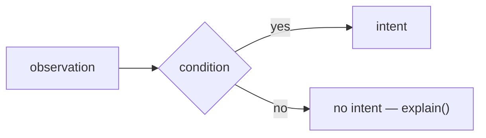

# capability-name — the one-sentence job

> **Candidate — not ranked, not built.** Status changes here when the register does (Q2).

## 1. Declaration

The declaration rows become code when the capability is built. Permission impact is analysis derived from
the proposed catalogue operations; permissions are platform-owned and deliberately not declaration fields
(D62).

| Field | Value | Why |
|---|---|---|
| `triggers` | | |
| `observations` | | |
| `resolvers` | | |
| `intents` | | |
| Permission impact — repository | | derive each from a named operation in `INTENT_OPERATIONS` |
| Permission impact — organization | | empty unless a reviewed catalogue operation requires it |
| `operationalNeeds` | | every `candidate`/`required` explained in §6 |

## 2. Decision

The whole behavior as one diagram: observation in, conditions, intent out — or explicitly no intent.
If it does not fit in one diagram, it is two capabilities.

## 3. Meanings

Which of the seven `MAPPABLE_MEANINGS` this capability touches, and how. Reading a meaning couples you
to whoever writes it; writing one couples every reader to you.

| Meaning | Reads | Writes |
|---|---|---|

## 4. Refuses

What this capability must never do, each with the screen, gate, or declaration that makes it
impossible rather than discouraged.

| Never | Enforced by |
|---|---|

## 5. When evidence is unknown

What happens when a resolver answers `ok: false` or the projection is a conflict. A failed read is
never a default (D51); say what the capability explains instead of doing.

## 6. Operational needs

Only if §1 declared any `candidate` or `required`: the minimum durable facts, why current GitHub
state cannot answer, and the retention.

## 7. Verification

| Scenario | Proves |
|---|---|
| | |

Beyond the shared conformance suite: redelivery, human-override, permission-failure, and the
capability's own edge cases.

## 8. Open

Questions only a maintainer conversation or an experiment can close, each naming which.
