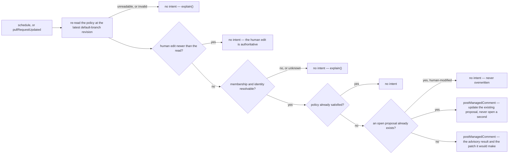

# admin — rotate mentors, maintain a denylist, keep policy files honest

> **Candidate — not ranked, not built.** Status changes here when the register does (Q2).

**Parked, and the permission ceiling is the reason.** The safest useful version opens or updates a
configuration pull request for human review — and creating a branch, a commit, and a pull request needs
`contents:write`, which the ceiling deliberately withholds
(`design/findings/endpoint-permission-matrix.md`, "The ceiling"). That withholding is not incidental:
`contents: read` is what makes the platform unable to modify its own configuration. Deciding who is
eligible needs organization `members:read`, also outside the ceiling. So this candidate is
**evidence-gathering only** until someone decides both are acceptable, and its proposal operation is not
an approved adapter operation in any case. Mentor rotation and denylist enforcement are probably two
capabilities, not one: different evidence, permissions, safety rules, and recovery
(`design/audit/services.md` §2 group 7, Python only).

## 1. Declaration

| Field | Value | Why |
|---|---|---|
| `triggers` | `schedule` (the policy evaluation), `pull_request` events for a managed configuration change | the schedule proposes; the events keep one proposal current instead of opening a second |
| `observations` | `pullRequestUpdated` | the managed configuration pull request, and nothing else. The draft's repository-policy and membership observations do not exist, so the capability **cannot see the facts it decides on** through today's catalogue (D61, §8) |
| `resolvers` | `isAutomationActor` | distinguish a maintainer's edit from an App's. The draft's `mayPerform` and `organizationMembership` are not in the catalogue, and the second is the one the whole rotation rests on (§8) |
| `intents` | `postManagedComment` | advisory output. The draft's propose-configuration-change intent has **no catalogue operation and is not an approved adapter operation** — that is the parking notice above, restated as a declaration |
| `permissions.repository` | `contents:read`, `pull_requests:read`, `issues:write` | read the policy file at the current default-branch revision, read the proposal pull request, write one comment. `contents:write` is what a real proposal would cost, and is refused |
| `permissions.organization` | `members:read`, only if an approved rule requires it | **exceeds the ceiling**; membership visibility and team access need direct App tests before the declaration can even be accepted |
| `operationalNeeds` | `schedule: true`, `durableState: "candidate"`, `crossItemCoordination: true`, `externalDelivery: false` | §6 |

Defaults to disabled (P2). A selected rule names its policy file, the eligible people or teams, the
exclusions, the review owners, the rotation period, and the proposal mode. People and team identifiers
need explicit organization mappings. A denylist additionally needs a clear owner, a reason model, a
visibility policy, a correction process, and an expiry policy — and none of those is a technical
question. Administrative configuration never inherits from an unreviewed or mutable external source: a
change in effective policy must be visible in the pull request that enables it.

## 2. Decision

The right-hand edge is where the parking bites: `A` is a comment describing a change, because the
operation that would *make* the change does not exist and its permission is refused. A later evaluation
detects an existing proposal and updates or suppresses it rather than opening duplicates.

## 3. Meanings

| Meaning | Reads | Writes |
|---|---|---|
| all seven | — | never |

Administration observes policy files and people, not workflow items, so it neither reads nor writes any
of `awaitingTriage`, `ready`, `inProgress`, `needsReview`, `needsRevision`, `readyToMerge`, or `blocked`
(`packages/core/src/config/schema.ts`). The empty table is on purpose, and it is the clearest evidence
that this is a different kind of capability from the other seven — a reason to keep it in a separate
boundary, and possibly a separate GitHub App.

## 4. Refuses

| Never | Enforced by |
|---|---|
| Write to the default branch, or to any branch | no proposal or content operation exists in the closed catalogue (D61), and `contents:write` is absent from `permissions` |
| Change organization roles, repository settings, secrets, or workflow files | same: absent from both the catalogue and the declaration, and each is outside this candidate by its own scope statement |
| Pause an item | `screenIntent` refuses a capability writing `blocked`, code `pauseNotCapabilityWritable` (D79) |
| Move any workflow item | `applyMappedLabel` is absent from `intents`, so `screenIntent` refuses it `undeclaredIntent` |
| Force-push or delete a human-modified branch | there is no branch operation; if one is ever approved, this is the first rule it must carry |
| Open a second proposal for the same rule | the effect key is derived from capability, item, operation and cause, so one occasion is one effect (`packages/core/src/capability/intent.ts`) |
| Overwrite a newer maintainer change to the policy | the `newerHumanChange` rule, ties to the human (`packages/core/src/safety/rules.ts`); the policy is re-read at the latest revision before every proposal |
| Enable or reconfigure another capability | P3, and a capability cannot enable itself either (contract.md §6) |
| Expose a private reason for an exclusion or a denylist entry in a public explanation | the structured explanation is built from configured fields, and visibility is a configured policy |
| Bundle rotation and denylist behind one trigger and one permission block — D1 is the audit's instance | they are separate capabilities after discovery (`design/audit/lessons-learned.md`) |

## 5. When evidence is unknown

Unknown membership, an invalid policy, an ambiguous identity, a missing permission, a changed base
revision, or an existing human proposal each produce no administrative write and one `explain()`. A
membership lookup that could not answer is never read as "not a member" (D51) — here that default would
silently remove someone from a rotation or add them to a denylist, which is the failure this candidate
exists to avoid rather than automate. Git history exposes some changes but does not necessarily
represent the decision that was made, so an absent record is unknown, not "no rotation happened". A
deterministic rule that needs no hidden memory is strictly safer than a durable one, and is the first
thing to try (§6).

## 6. Operational needs

`schedule: true`, `durableState: "candidate"`, `crossItemCoordination: true`. A deterministic policy
check runs against the current repository revision and needs nothing durable. Fair rotation is the
opposite: it needs history about prior selections, absences, overrides, and skipped periods, which git
does not reliably carry. So a rotation feature either defines a durable record with stated retention and
a tenant boundary, or it uses a transparent deterministic rule that requires no memory at all. Proposal
creation, if it is ever allowed, is a multi-call effect whose recovery must distinguish a created branch
from a created commit from a created pull request. Disabling stops schedules and new proposals; existing
pull requests remain ordinary GitHub objects for maintainers to close or merge, and stored rotation or
deduplication records expire by policy.

## 7. Verification

| Scenario | Proves |
|---|---|
| A renamed user, a removed user, and a private team | identity is resolved or reported unknown, never guessed |
| A policy file with a syntax error, and a changed default branch | invalid or moved policy produces an error for maintainers and no write |
| Concurrent human edit between the read and the proposal | the human edit wins; the proposal is abandoned, not merged over |
| Duplicate schedules, and an existing open proposal | one proposal per rule, updated rather than duplicated |
| An existing proposal a human has modified | it is left alone entirely |
| Partial proposal creation, if the operation is ever approved | branch, commit and pull request are distinguishable in recovery |
| A private exclusion reason in a public comment | redaction happens before the write, not after |
| Missing organization `members:read` | `forbidden`, not retried, and the rotation degrades to unknown rather than to a guess |
| No active administrative write in a shared Hiero repository until the exact policy and its rollback are approved | the parking notice is a process rule, not only a design one |

## 8. Open

| Question | Closed by |
|---|---|
| **Blocking:** are `contents:write` and organization `members:read` acceptable above the ceiling? Until both are answered this candidate can only gather evidence, and `contents: read` is what stops the platform editing its own configuration | maintainer review of the permission ceiling, then security review |
| Is mentor rotation, denylist management, or another administrative job actually wanted? Python is the only evidence | maintainer conversation |
| Is advisory output enough, without any proposal at all? | maintainer conversation |
| Should each selected job become its own boundary — and does a content-writing version belong in a separate GitHub App? | maintainer conversation, then security review |
| Does a propose-configuration-change operation ever enter the closed catalogue, with branch naming, commit authorship, signing, fork behaviour, and protection against workflow changes in generated content? | catalogue review (D61), then an isolated adapter design |
| Do a repository-policy observation, a membership observation, and an `organizationMembership` resolver enter it? Without them this capability cannot see what it decides on | catalogue review (D61) |
| Is membership and team visibility usable at all under an App installation? | App experiment |
| Can rotation be made deterministic, or does it require a durable record with retention and a tenant boundary? | App experiment |
| An existing administrative bot stays the sole writer until an explicit handover is approved | per-repository migration plan (Q7) |
