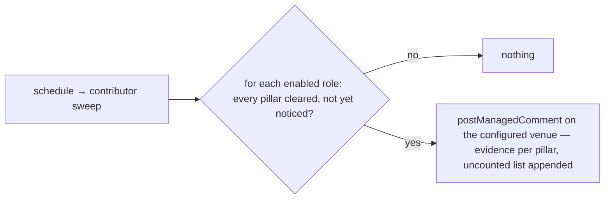

# advancement — notice when a contributor clears the countable floor for a role

Not built: phases 1, 2, 3.

## What the output looks like

One notice per contributor per role, posted as a comment on the contributor's most recent
authored item, cc'ing the maintainer team:

> 📋 **Readiness notice — juniorCommitter floor reached** (cc @maintainers)
>
> alice has cleared every countable threshold for **juniorCommitter** consideration:
>
> - **Active weeks:** 8 of the last 9
> - **Merged PRs (beginner+):** 6 — #1601, #1610, #1622, #1630, #1638, #1645
> - **Reviews submitted:** 9 — #1590, #1612, …
> - **Issues authored, accepted:** 3 — #1580, #1599, #1620
>
> Not counted, for the nominator to assess: review substance, triage judgement, community
> support, responsiveness. A cleared floor is a floor for consideration, not an entitlement —
> see the advancement qualifications (configured link).

Every line derives from config: the role name, each pillar with its links, the uncounted list,
the reference link.

## What the config looks like

A config with three governance roles: Junior Committer, Committer and Maintainer with several partly measurable thresholds.

```yaml
capabilities:
  advancement:
    enabled: true
    noticeOn: latestActivity # comment on the contributor's most recent authored item, cc maintainerTeam
    reference: "https://github.com/hiero-ledger/governance/blob/main/roles/advancement-qualifications.md"
    roles: # any names, any number — each is a set of pillar thresholds
      juniorCommitter:
        enabled: true
        pillars:
          activeWeeks: { atLeast: 8, window: 12 }
          mergedPRs: { atLeast: 5, minTier: beginner }
          reviews: { atLeast: 9 }
          issuesAuthored: { atLeast: 3, outcome: accepted }
        uncounted: [review substance, triage judgement, community support, responsiveness]
      committer:
        enabled: true
        pillars:
          activeWeeks: { atLeast: 20, window: 40 }
          mergedPRs: { atLeast: 20, minTier: intermediate }
          reviews: { atLeast: 20 }
          issuesAuthored: { atLeast: 6, outcome: completed }
        uncounted: [standing as junior committer, review depth, breadth, judgement, mentorship]
      maintainer:
        enabled: true
        pillars:
          activeWeeks: { atLeast: 30, window: 52 }
          mergedPRs: { atLeast: 10, minTier: advanced }
          reviews: { atLeast: 40 }
        uncounted: [standing as committer, technical mastery, design leadership,
          review depth and judgement, API and compatibility judgement, debugging depth,
          stewardship, mentorship, community leadership, escalation]

mappings:
  skills: # only needed by pillars with minTier
    goodFirstIssue: "skill: good first issue"
    beginner: "skill: beginner"
    intermediate: "skill: intermediate"
    advanced: "skill: advanced"

principals:
  maintainerTeam: "hiero-ledger/hiero-sdk-python-maintainers"
```

A different org with a trustedReviewer role with a notification when reaching at least 25 total reviews and activity in the last 10 of 16 weeks. Review quality is marked as a depth judgement.

```yaml
capabilities:
  advancement:
    enabled: true
    noticeOn: trackingIssue
    noticeIssue: 7
    mentionCandidate: false
    roles:
      trustedReviewer:
        enabled: true
        pillars:
          reviews: { atLeast: 25 }
          activeWeeks: { atLeast: 10, window: 16 }
        uncounted: [review quality]
```

Every threshold is a floor: clearing it triggers one notice, nothing more. A role naming a pillar
type outside the catalogue is a parse-time error. `minTier` is optional per pillar: without it,
every merged PR counts, so a repository with no skill labels at all runs advancement untouched.
`uncounted` entries are display text, not labels or meanings — no mappings.

## How it works

Repositories define their own roles, each as a set of pillar thresholds; when a contributor clears
every countable pillar of a role, one notice is posted as a comment to the contributor's most
recent activity in the repository, with the evidence links pre-collected.

Reports only: it never promotes, never applies a role, and never claims someone qualifies — the
floor is for consideration, and maintainers decide. Pillars a machine cannot judge are listed in
the notice as uncounted, for the nominator to assess.



One notice per contributor per role, ever — and per role means a contributor noticed for one role
is noticed afresh when they later clear a higher one; only the same role never repeats.

**The pillar catalogue** is closed, like every platform vocabulary: each type is a counting
resolver the platform provides, and a new type enters by review.

| Pillar type | Counts | Parameters |
|---|---|---|
| `activeWeeks` | weeks with any authored activity by the contributor | `atLeast`, `window` |
| `mergedPRs` | merged pull requests authored; with `minTier`, only those whose linked issue carries at least that skill tier | `atLeast`, `minTier?`, `window?` |
| `reviews` | reviews submitted on others' pull requests | `atLeast`, `window?` |
| `issuesAuthored` | issues opened by the contributor. `outcome: accepted` = not closed as not-planned (still open counts); `outcome: completed` = closed as completed | `atLeast`, `outcome`, `window?` |

Count pillars are **all-time** unless a `window` (in weeks) is given — the accumulated record is
the point, and recency is `activeWeeks`'s job. A `window` bounds the count to the recent past for
repositories that want evidence to age out.

| Phase | Ships | Needs first |
|---|---|---|
| 1 | the role/pillar engine with `mergedPRs`, `reviews`, `issuesAuthored` | the contributor sweep (shares schedule machinery with inactivity) · the three counting resolvers, repo-local · the `skills` mapping family for `minTier` (shared with assignment) · the durable notice record, if `latestActivity` ships in v1 |
| 2 | `activeWeeks` | the expensive one — a long-window activity read, and the likeliest first tenant of the durable-state candidate |
| 3 (candidate) | further pillar types by review · a maintainer command regenerating the evidence fresh for a vote PR | evidence of demand; the commands family |

| Declaration | Value |
|---|---|
| `triggers` | `schedule` — readiness is a slow fact; no webhook is worth reacting to |
| `facts` / `needs` | a `contributor` fact kind (new — carrying per-contributor pillar counts the platform computed, as a group the sweep reads) |
| `resolvers` | the pillar counters (new, repo-local) — or none, if the sweep entries carry the counts |
| `intents` | `postManagedComment` only |
| Permissions | repository: `issues:read`, `pull_requests:read`, `issues:write` · organization: none — repo-local by design |
| Platform needs | durableState: required for `noticeOn: latestActivity` (the dedup record — the venue moves) and candidate for `activeWeeks` (expensive recompute) · crossItemCoordination: true — counts span the repository · externalDelivery: false |

No producer row answers this table, and that is the finding: `sweep` makes `issue` and
`pullRequest` records only, and `contributor` is not a `FactKind`, so the declaration cannot be
checked against a producer, let alone boot. A new fact kind is the last row of `design/trace.md`
§6 — not coverable, because the platform's unit of decision is one item. The design owes the
smallest honest version: the counts as a group on the records that exist.

Efficiency shapes the sweep: every contributor's activity may count, so counting is organised by
expense — cheap counts first, the expensive reads only for contributors still in the running.

## Verified by

| Scenario | Proves |
|---|---|
| Contributor clears every pillar of one role | one notice, evidence links per pillar, the uncounted list appended |
| One pillar short | nothing — no partial notices, no progress-tracking |
| Noticed for one role, later clears a higher one | a fresh notice for the new role — dedup is per contributor per role |
| Two roles cleared in one sweep | two notices, separately deduplicated |
| A role names an unknown pillar type | parse-time error — reported, never a silent zero |
| `minTier` pillar without the `skills` mappings | rejected with the file, not silently ignored |
| Merged PR with no linked issue, under a `minTier` pillar | counts toward `atLeast` only if no tier is required — an untiered PR cannot satisfy a tiered pillar |
| Re-sweep, redelivery, restart | still one notice — managed identity |
| Thresholds raised after a notice | the notice stands; no retraction |
| `trackingIssue` venue, `mentionCandidate: false` | the name appears un-linked; the candidate is not notified |
| `latestActivity` venue, more activity after the notice | still one notice per role — the durable record deduplicates, not the comment's location |
| `noticeOn: trackingIssue` with `noticeIssue` unset | rejected with the file, not silently ignored |
| Repo with no skill labels, pillars without `minTier` | advancement runs untouched — tiers are optional per pillar |
| Count pillar without `window` | all-time — a PR merged years ago still counts; add `window` and it ages out |
| `mode: dry-run` | the exact notice named as `wouldApply`; nothing posted |
