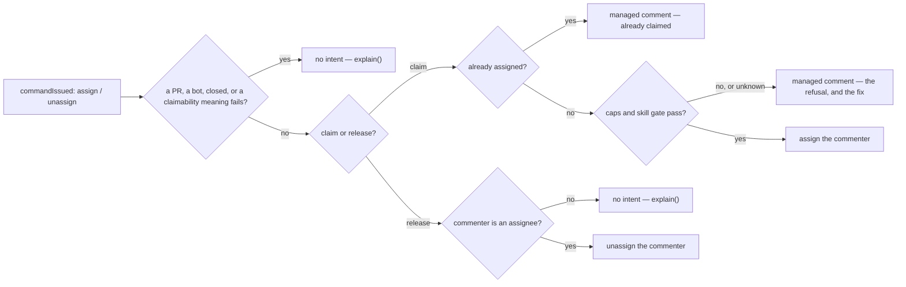

# assignment — let a contributor claim work, and release it again

Not built: phases 1, 2, 3, 4.

## What the output looks like

Claim accepted:

> ✅ @alice you are assigned to this issue — thank you for picking it up. Comment `/unassign` if
> you need to step away.

Claim accepted, at a tier with a support team:

> ✅ @alice you are assigned to this good first issue — welcome, and thank you for picking it up!
> @gfi-support will keep an eye out if you need a hand. Comment `/unassign` if you need to step
> away.

Claim refused — at the cap:

> Hi @alice — you already have 2 open assignments, which is this repository's limit.

Claim refused — skill gate:

> Hi @alice — this is an **intermediate** issue, which unlocks after 3 completed **beginner**
> issues (you have 1).

Already claimed:

> Hi @alice — this issue is already assigned to @bob so cannot be claimed.

Release:

> @alice has been unassigned from this issue at their request. The issue is open for anyone to
> pick up.

## What the config looks like

A config enabling auto-assign and unassign with some guards but no skill progression:
```yaml
capabilities:
  assignment:
    enabled: true
    autoAssign: # the /assign command
      enabled: true
      maxOpen: 2 # default cap; 0 = uncapped
      maxPerDay: 1 # claims per person per day
      minAccountAge: 7d # refuses brand-new accounts
    unassign: # the self /unassign command
      enabled: true
    skillGates:
      enabled: false

mappings:
  commands:
    assign: "/assign"
    unassign: "/unassign"
```

A config enabling auto-assignment only to issues marked as `status: ready for dev`, within their relevant skill level, with assignment caps only applying to assignments not in `status: needs review`.

```yaml
capabilities:
  assignment:
    enabled: true
    autoAssign: # the /assign command
      enabled: true
      claimableOnlyWhen: [ready] # empty = any open issue
      notClaimableWhen: [blocked, awaitingTriage, inProgress]
      maxOpen: 2 # default cap; 0 = uncapped
      capIgnores: [needsReview, blocked] # assignments in these states do not count — review waits and blocks are not the contributor's fault
      maxPerDay: 1 # claims per person per day
      minAccountAge: 7d # refuses brand-new accounts
    unassign: # the self /unassign command
      enabled: true
    skillGates:
      enabled: true
      goodFirstIssue:
        maxCompletions: 2 # after this many, GFIs are for newer contributors
        supportTeam: gfiSupportTeam # cc'd on every claim at this tier — the mentor ping
      beginner:
        requiresPrevious: 1 # completed goodFirstIssue issues
      intermediate:
        requiresPrevious: 3
      advanced:
        requiresPrevious: 10

principals:
  gfiSupportTeam: "hiero-ledger/hiero-sdk-good-first-issue-support"

mappings:
  labels:
    ready: "status: ready for dev"
    blocked: "status: blocked"
    awaitingTriage: "status: needs triage"
    inProgress: "status: in development"
    needsReview: "status: needs review"
  skills: # required when skillGates is enabled; the ladder order is fixed
    goodFirstIssue: "skill: good first issue"
    beginner: "skill: beginner"
    intermediate: "skill: intermediate"
    advanced: "skill: advanced"
  commands:
    assign: "/assign"
    unassign: "/unassign"
```

A config where any open issue is claimable, guarding by progression:

```yaml
capabilities:
  assignment:
    enabled: true
    autoAssign:
      enabled: true
      claimableOnlyWhen: [] # any open issue
      notClaimableWhen: [blocked]
      maxOpen: 3
    unassign:
      enabled: true
    skillGates:
      enabled: true
      goodFirstIssue:
        maxOpen: 1 # tier override of the cap
        maxCompletions: 2
      beginner:
        requiresPrevious: 1
      intermediate:
        requiresPrevious: 5
      advanced:
        requiresPrevious: 10
```

Completions are counted in this repository: closed issues carrying the tier's skill label that the
contributor was assigned to. An issue with no skill label is gated only by the cap. An issue with
two skill labels resolves to the higher tier.

## How it works

`/assign` claims an issue for the commenter; `/unassign` releases their own claim. Optional skill
gates make the ladder self-service: a tier's issues can be claimed only after completing enough of
the tier below.

Every refusal is explained; a person using GitHub's native assignment controls is never fought —
they have team permissions. Commands gate everyone alike, whatever their role: a team member with
triage or higher never needs `/assign`, because GitHub's own assignee control is their ungated
path — the command exists for contributors GitHub will not let assign themselves.

Every guard is a meaning-set or a number, so different repositories express different policies
with the same schema. An unknown answer refuses politely — never assigns, never releases.



Native GitHub assignment is a valid manual decision: the capability observes it and never
counter-writes — a maintainer assigning someone bypasses every gate on purpose.

| Phase | Ships | Needs first |
|---|---|---|
| 1 | `/assign` + `/unassign`, claimability meanings, the caps | nothing new: the `command` group (read by `issue_comment`) and the `actor` field ship · `assign` and `unassign` are write operations (`core/src/intents/operations/`) · `openAssignments` answers `{ item, meanings }[]` and its read is in `CONFIRMED_RESOLVER_READS`. What remains is the capability, and the trigger question the Declaration table names |
| 2 | skill gates · `maxPerDay` · `minAccountAge` · `reclaimCooldown` | the `skills` mapping family (the config meaning-family reader) · a completed-count-by-skill resolver, repo-local · recent-claim times and App-release events (timeline reads, or the durable-state candidate) · account age on the actor |
| 3 | position pairing — claim writes `inProgress`, release writes `ready`, when those meanings are mapped | the two-write recovery record (§operational needs); the `ready`-ownership conversation with intake |
| 4 | next-issue recommendation on merge — designed as its own capability, `merged.md` | demand evidence first; unranked. Role-readiness recognition is `advancement.md`'s job |

| Declaration | Value |
|---|---|
| `triggers` | `issue_comment` (created — an edited comment is never executed) · `issues` (assigned, unassigned; observe-only, for later position sync) |
| `facts` / `needs` | `issue`, needing `command` — a fact GROUP rather than a fact kind, and it ships: the `issue_comment` producer reads it. The `issues` trigger reads no group, so the two triggers cannot share one `needs` |
| `resolvers` | `isAutomationActor` (exists) · open-assignments with meanings (new) · completed-count by skill (new, phase 2) · recent-claim times, account age, and App-release events for one item (new, phase 2) |
| `intents` | `postManagedComment` · `assign` (new — the assignee write family) · `unassign` (same family) · `applyMappedLabel` (phase 3) |
| Permissions | repository: `issues:read`, `pull_requests:read` (the `capIgnores` look at linked PRs), `issues:write` · organization: none — counting stays in this repository |
| Platform needs | durableState: candidate — `maxPerDay` if the timeline read proves too costly, and phase 3's assignee+label pair (two GitHub calls; a crash between them needs a record, never a guess from the label-and-assignee shape) · crossItemCoordination: true — the caps count across issues · externalDelivery: false |

Needs are checked PER TRIGGER: `issue_comment` reads `command` on an issue record while `issues`
reads no group at all, so a declaration naming both triggers and needing `command` is a boot error
about the `issues` one. The observe-only assignment sync is a second declaration or a second
capability, not a second trigger on this one.

## Verified by

| Scenario | Proves |
|---|---|
| `/assign` on an open, claimable, in-gate issue | assigned, one welcome comment |
| `/assign` on an issue without the `claimableOnlyWhen` meaning | refused with the fix — C++'s ready-for-dev rule, expressed as config |
| At the cap, but one assignment sits in `needsReview` | the claim succeeds — `capIgnores` skipped it |
| Assigned to a `blocked` issue, `blocked` in `capIgnores` | does not count toward the cap; remove it from the set and it does — the meaning-set decides |
| Maintainer natively assigns someone past the cap | it counts; their next `/assign` is refused — native bypasses the gates, never the arithmetic |
| At a tier's `maxOpen`, under the default cap | refused — the tier override governs |
| Issue closed as not-planned | not a completion; the gate count is unchanged |
| Skill or block label added after a claim | nothing — gates run at claim time, and this capability never releases |
| Issue carrying both `ready` and `blocked` | not claimable — deny wins |
| `/unassign` then `/assign` the same day | `maxPerDay` counts the earlier claim; releasing is not a refund |
| Second `/assign` by the same person, same occasion | no duplicate comment — managed identity |
| Two contributors race `/assign` | one wins; the loser gets the already-claimed comment — apply-time re-check |
| `/assign` by a bot | nothing — `isAutomationActor` |
| `/assign` in a PR comment | nothing — claims are issue claims |
| `/assign` from a 2-day-old account, `minAccountAge: 7d` | refused, naming the age rule |
| Reaped for inactivity, `/assign` the same issue next day | refused for `reclaimCooldown` — a different issue claims fine |
| Count resolver fails or paginates incompletely | polite refusal, never an assignment (unknown ≠ under the cap) |
| Skill-unlabelled issue | caps apply, the gate does not |
| Claim at a tier with `supportTeam` | the welcome cc's the team — one comment, no roster, no rotation; other tiers stay quiet |
| Maintainer assigns via the UI over every gate | untouched — no counter-write |
| `/unassign` by a non-assignee | explained, nothing released |
| `/unassign` naming someone else | only the commenter's own claim ever releases — self-only is definitional; reaping stays inactivity's own `unassign` (P3) |
| A maintainer types `/assign` at the cap | refused like anyone — no role exemptions exist; the sidebar is their ungated path |
| An edit adds `/assign` to an old comment | never executed — the trigger is `created` only |
| Contributor with open assignments in a sibling repo | uncounted — caps and completions are repo-local (D57) |
| Released by inactivity, then `/assign` again | a fresh claim; the capabilities compose without naming each other |
| Missing `issues:write` | `forbidden`, not retried |
| `mode: dry-run` | the exact assign/unassign named as `wouldApply`; nothing written |
