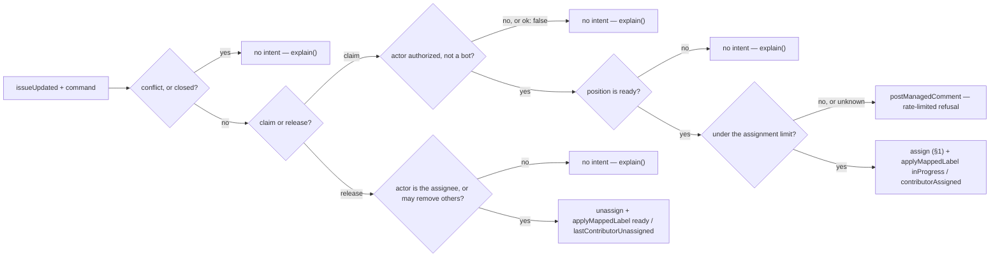

# assignment — let a contributor claim work, and release it again

> **Candidate — not ranked, not built.** Status changes here when the register does (Q2).

A public issue attracts several contributors, abandoned claims, and repeated requests. C++ and Python
both automate it and both are marked 🟢 (`design/audit/services.md` §2 group 2); other repositories
prefer GitHub's own assignee with no gate. So this is a configurable capability, not one universal rule.

## 1. Declaration

| Field | Value | Why |
|---|---|---|
| `triggers` | `issue_comment` (created), `issues` (assigned, unassigned) | the command path and the native-UI path both have to reach the same evaluator, or the App fights the UI |
| `observations` | `issueUpdated` | the issue's projection. The draft also wanted a command observation and an actor observation; neither is in the closed catalogue, and today's payload carries no assignee, comment body, or actor — this capability is **not buildable on the catalogue as it stands** (D61, §8) |
| `resolvers` | `isAutomationActor` | never treat a bot as a claimant. The draft's `mayPerform` and `eligibleForAssignment` are not in the catalogue; the eligibility one also crosses the repository boundary (§8) |
| `intents` | `applyMappedLabel`, `postManagedComment`, `unassign` | the catalogue has `unassign` and **no assign operation**, so the headline write — adding an assignee — is an extension by review (§8). The draft's remove-label intent is deleted (D80) |
| `permissions.repository` | `issues:read`, `issues:write`, `metadata:read` | read assignees, labels, command authors and repository roles; adding or removing an assignee and writing a comment are all `issues:write` |
| `permissions.organization` | none | at the ceiling. A limit counted across repositories would need organization-wide reads and leave it (§8) |
| `operationalNeeds` | `schedule: false`, `durableState: "candidate"`, `crossItemCoordination: true`, `externalDelivery: false` | §6 |

Defaults to disabled (P2). A repository may configure the exact assign and unassign commands, the
authorized actor roles, the maximum open assignments per contributor, whether self-assignment is
allowed, whether several assignees are allowed, and whether a skill policy applies. Skill checking is
optional and is never a platform default (Q3).

## 2. Decision

A person may also use GitHub's native assignment controls. That is a valid manual decision: the
capability either accepts it or advises about a configured violation, and never silently fights the UI —
which is why the `issues.assigned` trigger exists and produces no counter-write.

## 3. Meanings

| Meaning | Reads | Writes |
|---|---|---|
| `ready` | from the projection — a claim is only legal from here | `lastContributorUnassigned`, `inProgress → ready` on a release. This is the draft's `assignmentAvailable`, and one of three writers of `ready`, with `intake` and `inactivity` — A1's shape (`design/audit/lessons-learned.md`) |
| `inProgress` | from the projection — a second claim on claimed work is refused, not queued | `contributorAssigned`, `ready → inProgress`. This is the draft's `assignmentActive` |
| `awaitingTriage` | from the projection — an untriaged issue is explained, not claimed | never; `awaitingTriage → inProgress` is not a documented edge |
| `blocked` | from the projection | never (D79) |
| `needsReview`, `needsRevision`, `readyToMerge` | — | never — it observes no pull request |

Assignee and position move together on both edges. That is A3's exact pair, mutated by separately
togglable features (`design/audit/lessons-learned.md`), which is why §6 exists.

## 4. Refuses

| Never | Enforced by |
|---|---|
| Close, lock, or comment-moderate an issue | absent from `intents`; closure is a reason read from GitHub, never written (D47, D61) |
| Pause an item | `screenIntent` refuses a capability writing `blocked`, code `pauseNotCapabilityWritable` (D79) |
| Claim an issue that is untriaged, already claimed, or conflicted | `screenIntent` returns `transitionNotOnMap` for the first two and `positionConflict` for the third (D35, D78) |
| Overwrite a newer human assignment or label edit | the `newerHumanChange` rule, ties to the human (`packages/core/src/safety/rules.ts`) |
| Bulk-remove assignees because a search result was incomplete | an unknown answer is a distinct value, not `[]` (`ResolverAnswer`, §5); each `unassign` names one login |
| Take a position off without replacing it | `removeMappedLabel` is deleted from the catalogue (D80) |
| Execute an edited comment as a new command | the declared trigger is `issue_comment` **created**; `edited` is not subscribed |
| Reply to every refused command | [`postManagedComment` is `nonIdempotent`](../../contracts/catalogue.md), so one marker per occasion; refusal replies are rate-limited so the App does not amplify spam |
| Call `inactivity` when work goes stale, or be called by it | P3 — no capability names a sibling; `inactivity` reclaims through its own declared `unassign` |

## 5. When evidence is unknown

An eligibility or actor resolver answering `ok: false` produces no assignment write and one `explain()`
naming the reason — a rate limit is never read as "under the limit", and an undetermined actor is never
read as "a human" (D51). Search-backed limit queries are the sharp case: they paginate and are eventually
consistent, so an incomplete page is unknown, not zero. An ambiguous command, an unauthorized actor, an
unavailable GitHub user, a missing permission, or a stale observation all produce no write; a concise
managed response may explain the next step. A conflicted projection has no position to move from, so the
intent is refused rather than repaired. Unassignment is reversible but disrupts a person's work, so it
is the one edge where unknown must read as "do not act".

## 6. Operational needs

`durableState: "candidate"`, `crossItemCoordination: true`. Adding an assignee and setting the position
are separate GitHub calls, so a crash between them leaves a partial effect. The safest first milestone
manages only the native assignee; the alternative is a durable operation record holding the expected
state, the completed step, the cause, and the configuration revision — and the App must never infer a
pending operation from an unusual label-and-assignee combination. Per-actor command budgets and
per-contributor limits are the cross-item part: they need short-lived state or an equivalent counter,
with a named retention and tenant boundary. Disabling stops command handling and assignment writes
immediately and removes no existing assignee.

## 7. Verification

| Scenario | Proves |
|---|---|
| Self-assignment, maintainer assignment, an unauthorized command, an ambiguous command | the authorization gate, and that a refusal is explained rather than silent |
| A limit query spanning more than one page, and a stale search result | pagination and eventual consistency; unknown is not "under the limit" |
| Crash between the assignee call and the label call | the partial effect is recoverable from the record, not guessed from the label-plus-assignee shape |
| Redelivered `issue_comment` and two concurrent commands on one issue | one effect per occasion — the key is derived from capability, item, operation and cause (`packages/core/src/capability/intent.ts`) |
| Native UI assignment and unassignment while the capability is enabled | the manual decision survives; the App does not counter-write |
| Several assignees; fork, outside-collaborator, suspended, renamed, and deleted users | the identity edge cases GitHub actually produces |
| Missing `issues:write` | `forbidden`, and the capability does not retry it |
| Sandbox: dry-run decisions before any real assignee write | the destructive half is seen before it happens |

## 8. Open

| Question | Closed by |
|---|---|
| Is assignment self-service? Does native assignment bypass policy? Are several assignees allowed? | maintainer conversation |
| Do limits cross repositories, and is skill eligibility useful at all? | maintainer conversation (Q3) |
| `ready` has three writers, of which this is one — who owns it, and what is assignment's documented edge? | maintainer conversation, against `intake` and `inactivity` §3 |
| Does an assign operation enter the closed catalogue? Without one there is no claim write, only a release | catalogue review (D61) |
| Do a command observation, an actor observation, and a `mayPerform` resolver enter the catalogue? The current `issueUpdated` payload carries none of the facts a command needs | catalogue review (D61) |
| Does an `eligibleForAssignment` resolver enter it, and what is its privacy boundary and cost when the limit spans repositories? | catalogue review, then App experiment |
| What is the minimum safe recovery record for a two-call effect? | App experiment |
| An older bot accepting the same commands means both answer one comment — it must stop before this one becomes active | per-repository migration plan (Q7) |
