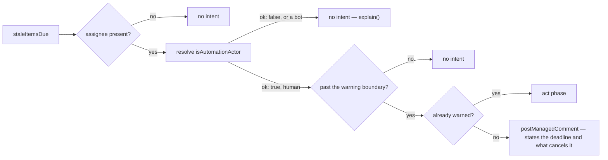
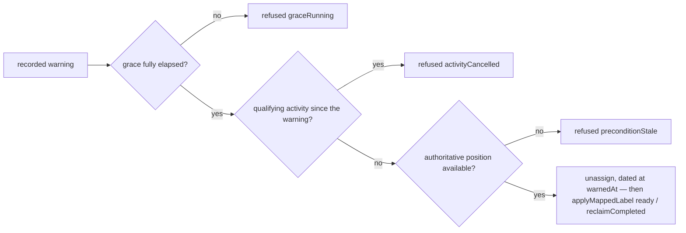

# inactivity — warn about stalled work, then release it

> **Candidate — not ranked, not built.** Status changes here when the register does (Q2).

C++ and Python both reap stale work and both are marked 🟢 (`design/audit/services.md` §2 group 4); the
C++ reaper warns at 5 days and acts at 7, the one built-in safety pattern the audit found worth
generalising (`design/audit/lessons-learned.md`). Every timer and the final action are repository
policy, because the same behaviour annoys an active contributor the moment it misreads activity.

## 1. Declaration

| Field | Value | Why |
|---|---|---|
| `triggers` | `schedule` (the stale sweep), plus `issues`, `issue_comment`, `pull_request` for activity | the sweep finds work; the events are what stop the clock. Neither alone is enough |
| `observations` | `staleItemsDue`, `issueUpdated`, `pullRequestUpdated` | the sweep carries the item, its assignee, `lastHumanActivityAt` and `warnedAt`. It carries **no projection**, which is the whole of §5 |
| `resolvers` | `isAutomationActor`, `linkedIssues` | never reclaim a bot's assignment; read the linked pull request before calling an issue stale. The draft's `mayPerform`, for `/working` authorization, is not in the catalogue (§8) |
| `intents` | `postManagedComment`, `unassign` | the warning and the reclaim. The draft's close-item intent has no catalogue operation — closure is a reason read from GitHub, never written (D47) — so **close is not an available final action** (§8) |
| `permissions.repository` | `issues:read`, `pull_requests:read`, `issues:write` | read timelines, assignees, labels, comments and reviews on both entities; the warning comment and the unassign are both `issues:write`. `pull_requests:write` is not requested, because no pull-request write exists in the catalogue |
| `permissions.organization` | none | at the ceiling |
| `operationalNeeds` | `schedule: true`, `durableState: "candidate"`, `crossItemCoordination: false`, `externalDelivery: false` | §6 |

Defaults to disabled (P2). A repository configures which items are watched, how inactivity starts, which
actors and events count as activity, the warning period, the grace period, an optional `/working`
command, blocked behaviour, linked-pull-request behaviour, and the final action. Timing values need safe
minimums — `MIN_GRACE_DAYS` is the floor the code enforces
(`packages/core/src/safety/destructive.ts`) — and the final action is always explicit. Issue inactivity
and pull-request inactivity are separate policy blocks, because a push, a review, a requested change, a
comment and an assignment do not mean the same thing.

## 2. Decision

Two diagrams, because the two phases pass through **different gates**: the warn phase is an ordinary
human-facing write, and the act phase is `clockTriggeredDestructive`, which
`packages/core/src/safety/destructive.ts` judges before the general rules ever run (D52).

The act intent is dated at `warnedAt`, never at the sweep: redating it would restart the grace period
(`packages/probes/test/inactivity.test.ts`). A valid `/working` command records a new activity fact and
moves the deadline forward. A blocked item and an item with an active linked pull request follow
explicit configuration, never a universal assumption.

## 3. Meanings

| Meaning | Reads | Writes |
|---|---|---|
| `inProgress` | from the projection — claimed work is what the timer watches | never; the claim edge belongs to `assignment` |
| `ready` | from the projection | `reclaimCompleted`, `inProgress → ready`. This is the draft's returned-to-queue meaning, and one of three writers of `ready`, with `intake` and `assignment` — A1's shape (`design/audit/lessons-learned.md`) |
| `needsReview` | from the projection — a pull request waiting on a reviewer is the pull-request-side stale case | never |
| `needsRevision` | from the projection — a pull request waiting on its author is the other one | never |
| `readyToMerge` | — | never, either way: a pull request waiting to merge waits on a maintainer, not on the assignee |
| `blocked` | from the projection, and configured explicitly — the draft names blocked behaviour as a setting | never (D79). `itemBlocked` refuses every capability write on a blocked item anyway (`packages/core/src/safety/rules.ts`) |
| `awaitingTriage` | — | never — nothing unclaimed can go stale under an assignee |

The draft's watched and warned meanings are not positions and map to nothing here: "watched" is the
timer's own predicate and "warned" is `warnedAt`, a durable fact (§6).

## 4. Refuses

| Never | Enforced by |
|---|---|
| Close an item, on either entity | absent from `intents`; no closure operation exists, and closure is read from GitHub, never written (D47, D61) |
| Act on its first stale observation | `evaluateDestructive` refuses `noWarning`; a warning is authority for one request, not a reusable timestamp (D60) |
| Act inside the grace period, or after the person came back | `graceRunning` and `activityCancelled` |
| Reuse one warning for a different item, change, capability, or occasion | the warning carries an immutable request snapshot; a mismatch refuses `warningRequestMismatch` |
| Accept a zero-day or negative grace period | `graceBelowFloor` against `MIN_GRACE_DAYS` |
| Treat a capability claim as current-state evidence — the sweep has no projection | `preconditionStale` on the shared door (`packages/probes/test/inactivity.test.ts`) |
| Pause an item | `screenIntent` refuses a capability writing `blocked`, code `pauseNotCapabilityWritable` (D79) |
| Reclaim a bot's assignment, or one whose actor could not be determined | the `ResolverAnswer` union: `!ok` and "is a bot" take the same branch, precisely where the next step is destructive |
| Reset a linked issue as a side effect of acting on a pull request — C1 is the audit's instance | one intent names one item; a cross-entity write would need its own observation and its own capability |
| Infer inactivity from the absence of an event when history was truncated | an unavailable read is a distinct value, never a default (D51, §5) |
| Keep running when an operator pulls the brake | `killSwitch` is reported first, before every destructive gate (D39, D52) |

## 5. When evidence is unknown

`staleItemsDue` carries no projection, so there is no authoritative current position and every position
write from the sweep refuses `preconditionStale` before any write policy runs — a capability's own claim
is never evidence of current state (`packages/probes/test/inactivity.test.ts`). Missing history, a rate
limit, an unknown `linkedIssues` answer, invalid configuration, or a newer human edit each produce no
expiry action and one `explain()`; the linked-work answer in particular must report unknown rather than
pretend no link exists, which is B2's failure — one question answered two ways
(`design/audit/lessons-learned.md`). A failed read is never a default (D51). Warning comments are
reversible; unassignment is not, so it additionally requires dry-run evidence, the full grace period,
immediate re-observation, and a repository kill switch.

## 6. Operational needs

`schedule: true`, `durableState: "candidate"`. Current GitHub history can compute the latest activity,
but it does not reliably prove when the App first warned an item or which policy revision applied. An
App-authored comment exposes some of that and is not automatically a safe database, so the feasibility
experiment compares reconstruction cost and ambiguity against a narrow record holding the item, the
policy revision, the warning time, the deadline, and the final outcome. `packages/probes/src/inactivity.ts`
declares `durableState: "required"` for exactly that field — the probe is the shape of the answer, not
the answer. How the schedule discovers work is §8's. Disabling stops schedules, warnings, and final
actions; existing assignments remain, and managed warnings either get one update saying automation is
off or stay unchanged, by explicit cleanup policy.

## 7. Verification

| Scenario | Proves |
|---|---|
| Exact timer boundaries, time zones, a delayed schedule, a duplicate evaluation | the boundary is a comparison, not a count of sweeps |
| Activity arriving exactly at the deadline | `activityCancelled` wins; ties go to the person |
| Second sweep after a warning | the act intent is dated at `warnedAt`, not at the sweep — redating restarts the grace period (`packages/probes/test/inactivity.test.ts`) |
| A bot assignee, and an assignee whose actor lookup fails | both skipped, precisely where the next step is destructive |
| A blocked item; an item with an open linked pull request; a truncated timeline | configured behaviour, and unknown history never reads as inactivity |
| `/working` from an authorized and an unauthorized actor; an edited comment | the deadline moves once, from the right person |
| Partial final action — comment written, unassign lost | recovery from the record, not from the resulting shape |
| Sandbox: compressed time over the same transitions, then a real multi-day observation period | no automatic unassignment ships on simulated clocks alone |

`packages/probes/src/inactivity.ts` is a boundary probe chosen for contract diversity, deliberately not
for likelihood of being ranked first ([`probes/README.md`](../../../packages/probes/README.md)) — its
test proves the dating and skip behaviour above, not that this capability is wanted.

## 8. Open

| Question | Closed by |
|---|---|
| What counts as meaningful activity, and what are the warning and grace periods? | maintainer conversation |
| What is blocked behaviour, and linked-pull-request behaviour? | maintainer conversation |
| Which final action is allowed? Close is unavailable through the catalogue, so the choice today is warn, or warn then unassign | maintainer conversation |
| `ready` has three writers, of which this is one — who owns it, and what is inactivity's documented edge? | maintainer conversation, against `intake` and `assignment` §3 |
| Does a `mayPerform` resolver enter the closed catalogue, or does `/working` authorization stay out? | catalogue review (D61) |
| Does a closure operation ever enter it, given D47? | catalogue review |
| How do schedules discover work, and which warning facts require durable storage? | App experiment |
| Is `MIN_GRACE_DAYS = 1` the right floor? The code encodes the weakest defensible reading so the question cannot be skipped | register decision — D30 is open on exactly this |
| An older stale workflow must stop before this one performs final actions on the same items | per-repository migration plan (Q7) |
