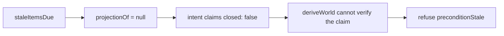

# inactivity — warn about stalled work, then release it

> **Candidate — not ranked and not buildable on the current boundary.** The disposable probe constructs
> warning and unassignment intents, but the engine refuses both from an unprojected sweep. Automatic
> unassignment also cannot reach the clock-triggered destructive gate; §2 records both blockers.

C++ and Python both reap stale work (`design/audit/services.md` §2 group 4). The C++ reaper's warn-at-five,
act-at-seven pattern is the audit's strongest safety precedent. That evidence supports investigating the
capability; it does not authorize the current probe to act.

## 1. Current probe declaration

| Field | Current value | Consequence |
|---|---|---|
| `triggers` | one `schedule` | no webhook event currently resets a clock |
| `observations` | `staleItemsDue` | carries item, assignee, activity time, and warning time; **no workflow projection** |
| `resolvers` | `isAutomationActor` | a failed or bot lookup skips the item |
| `intents` | `postManagedComment`, `unassign` | no close operation and no mapped-position write |
| Permission impact — repository | `issues:write` for both operations | derived from `INTENT_OPERATIONS`, not declared by the capability |
| Permission impact — organization | none | no organization operation exists |
| `operationalNeeds` | schedule true, durable state required, no cross-item coordination, no external delivery | the warning must survive restarts |

The fuller product idea also needs activity events, linked-work evidence, authorization for a `/working`
command, per-entity policy, and safe timer bounds. Those are requirements for a future declaration, not
features of the probe above.

## 2. What happens today

The probe's direct unit tests prove only intent construction:

1. A first stale entry returns a `postManagedComment` intent explaining the configured deadline.
2. A later entry with `warnedAt` returns an `unassign` intent dated at the warning rather than the current
   sweep.
3. A bot assignee or an unavailable actor lookup returns no intent.

Running those intents through the real engine changes the result:

`packages/probes/test/engine-matrix.test.ts` pins that refusal. A capability-authored claim is not current
state evidence, so neither the warning nor unassignment is approved.

There is a second, independent blocker. `INTENT_OPERATIONS.unassign.actionClassFloor` is
`reversibleStateChange`. The engine derives that class from the operation; the capability cannot elevate it
to `clockTriggeredDestructive`. Consequently the warning/grace door in
`packages/core/src/safety/destructive.ts` is never entered. The probe's `warnedAt` changes its idempotency
occasion but grants no destructive authority.

Finally, the declaration contains no `applyMappedLabel`. It can request unassignment only; it does **not**
move `inProgress → ready`. Describing it as a writer of `ready` would hide the assignee/position split that
the coupling audit explicitly warns against.

## 3. Safety requirements for a real capability

| Requirement | Current standing |
|---|---|
| A current, authoritative view of open/closed state and any watched workflow position | missing from `staleItemsDue`; engine refuses closed |
| First stale observation warns and never acts | product requirement; the direct probe constructs the warning, but the engine currently refuses it |
| The warning identifies item, assignee, policy revision, deadline, cancellation, and reversal | warning persistence/shape still to design for this capability |
| Qualifying activity cancels the pending action, including at the deadline | destructive gate supports the rule, but no operation reaches it |
| A clock-triggered final action cannot travel through the ordinary reversible-write path | not representable with current operation facts |
| A blocked item receives no capability write | built globally as `itemBlocked` in the shared safety rules |
| Unknown actor, history, link, permission, or ordering evidence means no action | partially built; missing resolver/adapter facts remain |
| Close, lock, or remove labels by prefix | impossible through the current catalogue |
| Pull an operator kill switch | built as a process-level safety refusal |

The safe first scope may be **report-only** until the two structural blockers are resolved. Adding automatic
unassignment is a catalogue and safety design change, not a documentation toggle.

## 4. Meanings and ownership

The current probe receives no projection and writes no meaning. It is therefore not a `ready` writer.

A future integrated reclaim might want `inProgress → ready`, but that edge already belongs to the candidate
assignment policy when the last contributor unassigns. If inactivity performs the same release, the design
must choose one owner for the combined assignee-and-position outcome or define one explicit operation that
keeps them atomic. Two independently toggled writers recreate audit lessons A1 and A3.

The current candidate writer question is therefore between `intake` and `assignment`; inactivity joins it
only after it gains a reviewed mapped-position operation.

## 5. Operational needs

The warning time, item, assignee, policy/config revision, deadline, and final outcome require durable state.
The SQLite store already supplies schedule and journal primitives, but no scheduler calls `decide()` and no
effect executor applies a reclaim. GitHub comments may be user-facing receipts; they are not a substitute
for pending-work state.

Disabling the capability must stop new scheduling, warnings, and actions without silently changing existing
assignments. A migration must ensure the old stale-work bot and this App never write the same assignee or
position at the same time (Q7).

## 6. Verification required before ranking

| Scenario | What it must prove |
|---|---|
| First observation, second observation, duplicate sweep, delayed sweep | warning and occasion identities converge |
| Activity immediately before, at, and after the deadline | ties and cancellation favor the person |
| Bot assignee and unavailable actor lookup | both skip without a destructive default |
| Missing projection, conflicted labels, closed item, blocked item | every case refuses with the truthful code |
| Warning survives restart and config revision changes | old authority cannot act under new policy |
| Lost comment or unassign response | read-back and journal recovery do not duplicate |
| Existing assignment automation still installed | migration prevents two writers |
| Compressed sandbox clock followed by a real multi-day soak | simulation alone never authorizes rollout |

## 7. Open decisions

- What counts as activity for issues and pull requests, and which facts can GitHub establish reliably?
- Is the first capability report-only, warning-only, or allowed to unassign after a separately reviewed
  destructive operation exists?
- Does the catalogue add a clock-triggered unassignment operation, or can one operation carry context-sensitive
  action classes without restoring capability-authored authority?
- How does a scheduled observation acquire the authoritative projection and ordering evidence required at
  decision and act time?
- Who owns the combined unassign-and-position transition if a future capability writes `ready`?
- Which warning facts map onto the existing store, and what scheduler/recovery interface is still missing?
- Is `MIN_GRACE_DAYS = 1` the right platform floor (D30), and what longer repository minimum is acceptable?
