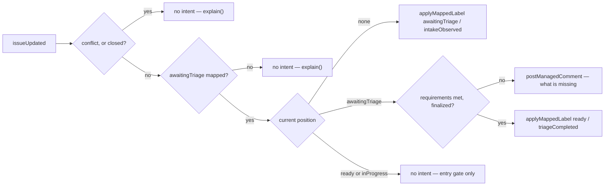

# intake — turn a new or edited issue into a clear next step

> **Candidate — not ranked, not built.** Status changes here when the register does (Q2).

The C++ workflow checks required issue content and relabels once a contributor finalizes; the Python
workflow moderates (`design/audit/services.md` §2 group 1). Both are evidence that some repositories
want help at the front door. Neither proves a universal required template, and the platform must not
invent one.

## 1. Declaration

| Field | Value |
|---|---|
| `triggers` | `issues` opened/edited · `issue_comment` created |
| `observations` | `issueUpdated` |
| `resolvers` | `isAutomationActor` |
| `intents` | `applyMappedLabel`, `postManagedComment` |
| `permissions` | `issues:read`, `issues:write` — at the ceiling, no organization grant |
| `operationalNeeds` | none |

The `issue_comment` trigger exists only for the optional finalization command; without that setting
the first two suffice. Labels and comments both cost `issues:write` even though neither changes the
body. Three things the draft wanted are absent from the catalogue — a managed-comment observation, a
command observation, and a `mayPerform` resolver — so the App-authored comment is found by read-back
and the command slice needs a catalogue review (§8).

## 2. Decision

Each configured requirement — a form field, a body section, an accepted type, the finalization command —
is a further condition on the same `requirements met` edge, each separately configurable and each
resolving to met, missing, or unknown with its own explanation. In comment-only mode both label edges
collapse into the same comment; the promotion edge is the one a maintainer has to ask for.

## 3. Meanings

| Meaning | Reads | Writes |
|---|---|---|
| `awaitingTriage` | from the projection — the entry gate is "no position", and this is where an untriaged issue lands | `intakeObserved`, `[*] → awaitingTriage` |
| `ready` | from the projection — a triaged issue is left alone | label mode only: `triageCompleted`, `awaitingTriage → ready`. This is the draft's `intakeReady`, and one of three writers of `ready`, with `assignment` and `inactivity` — A1's shape (`design/audit/lessons-learned.md`) |
| `inProgress` | from the projection — claimed work is never re-triaged | never; the claim edge belongs to `assignment` |
| `blocked` | from the projection | never (D79) |
| `needsReview`, `needsRevision`, `readyToMerge` | — | never — it observes no pull request |

The draft's `intakeNeedsInformation` maps to no meaning at all. "This issue is missing information" is a
sentence, not a position: the item stays in `awaitingTriage` while the comment says what is missing.

## 4. Refuses

| Never | Enforced by |
|---|---|
| Lock, close, reopen, or edit a contributor's title or body — Python does moderate (`design/audit/services.md` §2 group 1) | absent from `intents`; the closed catalogue holds no such operation, and closure is a reason read from GitHub, never written (D47, D61) |
| Pause an item | `screenIntent` refuses a capability writing `blocked`, code `pauseNotCapabilityWritable` (D79) |
| Move an issue that already holds a later position | `screenIntent`'s `transitionNotOnMap` — `ready → awaitingTriage` is not a documented edge (D78) |
| Act on a double-labelled issue | `screenIntent` returns `positionConflict`; a conflict is reported, never repaired (D35) |
| Take a position off without replacing it, or create and delete labels by prefix — A1's bulk strip | `removeMappedLabel` is deleted from the catalogue (D80), and the capability never sees a label string (contract.md §6) |
| Undo a newer human label decision because a late validation event arrived | the `newerHumanChange` rule, ties to the human (`packages/core/src/safety/rules.ts`) |
| Use a meaning the repository has not mapped | only mapped meanings reach the capability (contract.md §6); `packages/probes/test/intake.test.ts` proves the sweep explains and skips |
| Execute an edited comment as a new command | the declared trigger is `issue_comment` **created**; an `edited` action is not subscribed, so the capability is never called |

## 5. When evidence is unknown

`isAutomationActor` answering `ok: false` produces no intent and one `explain()` naming the reason — "the
author could not be determined" is never read as "a human opened it" (D51). An unmapped `awaitingTriage`
has the same shape: the capability explains that this repository has not mapped a triage meaning and
emits nothing rather than guessing a label (`packages/probes/test/intake.test.ts`). A conflicted
projection has no position to move from, so the intent is refused `positionConflict` and the comment
says the issue holds two positions. Invalid configuration or a missing required mapping produces a
configuration error for maintainers and no write; a permission failure stops retries until permissions
change; a rate limit delays advisory work and changes nothing. Unknown labels and unrelated comments are
left untouched, and the comment must distinguish a missing requirement from an App limitation so a
contributor is never blamed for an infrastructure failure.

## 6. Operational needs

None declared. Current issue content, current labels, and one deterministic App-authored comment whose
authorship is verified are enough for the first experiment; the marker identity is the capability's own
and never another's (A2). Warning history, command history, and multi-step moderation would each need
declared durable state and retention — whether a narrow operation record is safer than reconstructing
history from comments is §8's, and it must not be answered by hiding state inside the evaluator.
Disabling stops every intake evaluation and write; existing managed comments remain as historical GitHub
content unless configuration asks for one final neutral cleanup update.

## 7. Verification

| Scenario | Proves |
|---|---|
| No mapped `awaitingTriage`; then an issue already positioned | explains and skips, and the entry gate does not re-triage (`packages/probes/test/intake.test.ts`) |
| Redelivered `issues` event | one comment and one label, not two — [`postManagedComment` is `nonIdempotent`](../../contracts/catalogue.md) so recovery goes through read-back, while `applyMappedLabel` converges on `already` |
| Newer human label edit, or a changed configuration revision | the stale expectation returns `conflict` and the human change survives |
| Malformed and valid issue forms; hostile Markdown; a comment carrying the App's own marker | a fake marker is not mistaken for the App's comment, and untrusted body text is never executed |
| An edited comment carrying a valid command; an unauthorized actor; an ambiguous command | the command runs once, from the right person, or not at all |
| Missing `issues:write` | `forbidden`, and the capability does not retry it |
| Sandbox: personal App installation, then comment-only dry runs in a Hiero Hackers repository | maintainers review accuracy **and** tone before any label write |

`packages/probes/src/intake.ts` is a boundary probe chosen for contract diversity, deliberately not for
likelihood of being ranked first ([`probes/README.md`](../../../packages/probes/README.md)) — its test
proves the mapping and entry-gate behaviour above, not that this capability is wanted.

## 8. Open

| Question | Closed by |
|---|---|
| Is the wanted outcome validation, moderation, finalization, or a smaller combination? Are comments enough, or is the position write wanted too? | maintainer conversation |
| Who may finalize an issue, and which labels are repository-owned? | maintainer conversation |
| `ready` has three writers, of which this is one — which capability owns it, and what is intake's documented edge? | maintainer conversation, against `assignment` and `inactivity` §3 |
| Does any lock, close, or reopen behaviour belong in scope? Each needs its own permission and safety review | maintainer conversation, then security review |
| Do a command observation and a `mayPerform` resolver enter the closed catalogue, or does the finalization slice stay out? | catalogue review (D61) |
| Is command and warning history reconstructable from App-authored comments, or does it need a durable record with stated retention? | App experiment |
| An older workflow writing the same labels means comment-only mode until it stops | per-repository migration plan (Q7) |
