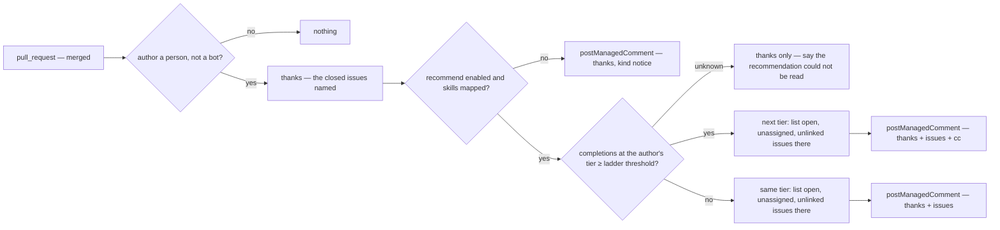

# merged — when a pull request merges, thank the author and point at what comes next

When a pull request merges, posts one managed comment on it: thanks by name, the issues it closed,
and up to a few open, unassigned issues at the author's current or next skill tier that they could
take next.
Acts on the merge and nothing else. Never labels, never assigns, never counts anything toward a
role — that is `advancement`'s. Never recommends an issue that is assigned, paused, or already
linked to an open pull request.
The recommendation walks the skill ladder the way the Python and C++ bots did: an author whose
completions at their tier have reached the ladder's threshold is pointed at the next tier; one who
has not is pointed at more of the same. It composes with `assignment` through the same skill
mappings and completion count, never by reading its comments.

## What the config looks like

Thanks only:

```yaml
capabilities:
  merged:
    enabled: true
```

Thanks and a recommendation, walking the ladder:

```yaml
capabilities:
  merged:
    enabled: true
    settings:
      recommend:
        enabled: true
        count: 3 # at most this many issues, newest first
        onlyWhen: [ready] # meaning-set: recommend only issues in these positions; empty = any open, unassigned issue
        ladder: # completions at a tier before the next tier is recommended
          goodFirstIssue: 2
          beginner: 3
          intermediate: 5
      cc: mentorTeam # optional — pinged only when the author is recommended a NEW tier

mappings:
  labels:
    ready: "status: ready for dev"
  skills:
    goodFirstIssue: "skill: good first issue"
    beginner: "skill: beginner"
    intermediate: "skill: intermediate"
    advanced: "skill: advanced"

principals:
  mentorTeam: "hiero-ledger/hiero-sdk-python-mentors"
```

`recommend` demands `mappings.skills`; enabling it without the family is reported as unusable. A
tier absent from `ladder` has no threshold and is never advanced past. The author's tier is the
highest tier of any issue this pull request closed; a pull request that closed no skill-labelled
issue is thanked and recommended issues at the lowest mapped tier.

## How it works



| Read | Resolver | Unknown means |
|---|---|---|
| the author is a person | `isAutomationActor` | nothing posted |
| completions at a tier | `completedCount({ login, tier })` — closed issues carrying the tier's label the author was assigned to, this repository | thanks only, with one honest line |
| candidate issues | `openIssues({ tier, unassigned: true, onlyWhen })` — the list read the matrix confirms, filtered to issues with no open linked pull request | thanks only, with one honest line |

The comment, same tier:

> 🎉 Merged — thank you, @alice! This closed #1632.
>
> If you'd like another, these are open and unassigned at the same level:
> - #1640 Handle an empty transaction memo (configured link)
> - #1651 Document the mirror-node retry policy (configured link)
>
> Comment `/assign` on one to take it.

The comment, next tier reached:

> 🎉 Merged — thank you, @alice! This closed #1632, your second good first issue here.
>
> You've cleared the good-first-issue tier — these are open at the next level, beginner:
> - #1655 Validate account ids before signing (configured link)
> - #1660 Add a retry to the receipt query (configured link)
>
> Comment `/assign` on one to take it. cc @mentors-team — @alice is moving up a tier.

The comment when the count could not be read:

> 🎉 Merged — thank you, @alice! This closed #1632.
>
> I couldn't read your completed issues just now, so no recommendation this time.

Issue titles are attacker-controlled and rendered inert; the `/assign` sentence appears only when
`mappings.commands.assign` is mapped.

## Phases

| Phase | Ships | Needs first |
|---|---|---|
| 1 | thanks, with the closed issues | `merged` on the pull-request facts (exists as `closedBy`) · `links.issues` and `author` (exist) |
| 2 | the recommendation and the ladder walk | `completedCount` and `openIssues` resolvers — the same closed-issue and list reads `assignment` needs, gated on the endpoint matrix · `mention` (exists) |

## Declaration

| Field | Value |
|---|---|
| `triggers` | `pull_request` |
| `facts` / `needs` | `pullRequest`, needing `links` |
| `resolvers` | `isAutomationActor` (exists) · `completedCount` (new, shared with assignment) · `openIssues` (new) |
| `intents` | `postManagedComment` (`notice`, one per pull request) |
| `requiredMappings` | `skills` when `recommend` is enabled; `labels` for `onlyWhen`'s meanings |
| Permissions | repository: `issues:read`, `pull_requests:read`, `issues:write` · organization: none |
| `operationalNeeds` | schedule: false · durableState: none · crossItemCoordination: false · externalDelivery: false |

## Verified by

| Scenario | Proves |
|---|---|
| Pull request merged, closing one issue, recommend off | one thanks naming the issue |
| Closed by a human without merging | nothing — closure is not a merge (D47) |
| Merged by a bot author | nothing |
| Merged, author below the tier threshold | thanks plus issues at the same tier |
| Merged, author reaches the threshold | thanks plus issues at the next tier, the cc pinged once |
| Author already at the top mapped tier | thanks plus issues at that tier; no cc |
| Candidate issue is assigned, paused, or has an open linked pull request | not recommended |
| Fewer candidates than `count` | the ones there are; none is not an error |
| No candidates at all | thanks, and one line saying nothing is open at that level |
| `completedCount` or `openIssues` cannot answer | thanks with the honest line; never a guessed list |
| Redelivered `closed` event | one comment, updated in place |
| Closed no skill-labelled issue | thanks; recommendations at the lowest mapped tier |
| `recommend` enabled without `mappings.skills` | reported as unusable |
| `commands.assign` unmapped | the `/assign` sentence is omitted |
| Hostile issue title | renders inert |
| `mode: dry-run` | the comment named as `wouldApply`; nothing posted |
