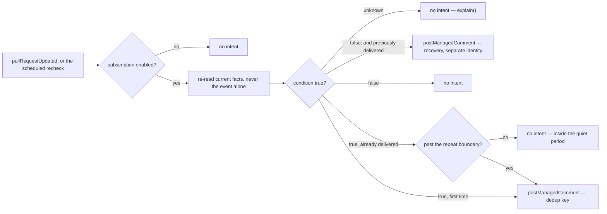

# notifications — deliver one focused alert to the people who need it

> **Candidate — not ranked, not built.** Status changes here when the register does (Q2).

This is a collection of candidate subscriptions, not one behaviour: Python alerts and a JavaScript Slack
feed (`design/audit/services.md` §2 group 6). Each subscription needs its own demand, configuration,
delivery channel, and rate limit. GitHub already sends many notifications, so another message earns its
place only by reaching a smaller audience with less noise. In-repository comments and off-GitHub
delivery are separate adapters behind one condition evaluator, because their security boundaries differ.

## 1. Declaration

| Field | Value | Why |
|---|---|---|
| `triggers` | selected `pull_request` events, plus `schedule` for a reminder that rechecks | one event is never trusted on its own; the reminder re-reads immediately before delivering |
| `observations` | `pullRequestUpdated` | the only catalogue member a subscription can stand on. The draft's repository and workflow observations do not exist, and `staleItemsDue` is about stale assignments, not conditions — the workflow-failure subscription has **no observation** today (D61, §8) |
| `resolvers` | `isAutomationActor` | so a bot's own activity does not page a human. The draft's `notificationAudience` and `requiredChecks` are not in the catalogue; `requiredChecks` is the same gap `pr-quality` names (§8) |
| `intents` | `postManagedComment` | the in-repository channel. The draft's external-delivery intent has **no catalogue operation**, so off-GitHub delivery cannot be expressed at all yet — which is the safest possible default for an unrecallable send (§8) |
| Permission impact — repository | `metadata:read`, `pull_requests:read`, `actions:read` for a workflow subscription, `issues:write` only for catalogued comments | narrowed per subscription; none of the missing notification operations is admitted yet |
| Permission impact — organization | none | `actions:read` already **exceeds the ceiling** (`design/findings/endpoint-permission-matrix.md`, "The ceiling"), as does any off-GitHub destination |
| `operationalNeeds` | `schedule: true`, `durableState: "required"`, `crossItemCoordination: false`, `externalDelivery: true` | §6 — durable deduplication and retry state are intrinsic to this candidate |

Defaults to disabled (P2). Each subscription names its condition, its repositories, its audience, its
delivery channel, its quiet period, its repeat policy, and its recovery message. Workflow and check
names are exact repository mappings — a fixed `build` or `DCO` is not portable, and B1 is the audit's
instance of exactly that hand-copied string (`design/audit/lessons-learned.md`). External destinations
need separately stored secrets and an explicit statement of which fields may leave GitHub; a destination
URL supplied by repository content is never allowed.

## 2. Decision

The transition that matters is false-or-unknown **to** true; the deduplication key is stable across
redelivery, retry and restart, and a recovery notice carries its own identity so it can never be
mistaken for a repeat of the alert.

## 3. Meanings

| Meaning | Reads | Writes |
|---|---|---|
| `needsReview` | from the projection — the long-review-wait subscription is a clock on this position | never |
| `readyToMerge` | from the projection — the checks-complete subscription is this position arriving | never |
| `blocked` | from the projection | never (D79) |
| `needsRevision` | — | never, either way: the failing-check subscription fires on the workflow run that failed, an `actions:read` fact, not on the label that follows it |
| `awaitingTriage`, `ready`, `inProgress` | — | never — it observes no issue |

This capability writes **no meaning at all**. Its coupling is the delivery channel, not a position, and
a notification that moved an item would be a workflow capability wearing a notifier's name.

## 4. Refuses

| Never | Enforced by |
|---|---|
| Change any workflow position, or pause an item | `applyMappedLabel` is absent from `intents`, so `screenIntent` refuses it `undeclaredIntent`; `blocked` is additionally refused `pauseNotCapabilityWritable` (D79) |
| Deliver off GitHub | no external-delivery operation exists in the closed catalogue (D61) |
| Be enabled as a side effect of another capability | P2 and P3 — no capability can subscribe a repository, and none may name a sibling |
| Require a sibling capability to run in order to evaluate its condition | P3; a subscription reads shared normalized facts, never another capability's output |
| Read another capability's rendered comment prose, or own its marker | its own configured marker; A2 is the audit's instance (`design/audit/lessons-learned.md`) |
| Blindly retry an unknown delivery | no executor or external-delivery result type exists yet; the future adapter must represent unknown separately from forbidden and retry-later because retrying it can duplicate a page |
| Send a destination URL taken from repository content | destinations are configuration with stored secrets, never observed data |
| Keep delivering after the brake is pulled | `killSwitch` refuses every requested write before the other safety rules (D39); the future queue must also cancel work that has not begun |
| Bundle several subscriptions behind one trigger and one permission block — D1 is the audit's instance | each subscription is separately configurable and separately disableable (P3) |

## 5. When evidence is unknown

An unknown condition delivers nothing and explains once. A missing workflow, an invalid audience, an
unavailable secret, a rate limit, or a disabled destination is likewise no delivery — an unknown read is
never a default (D51), and here the default would be an unrecallable message. The queue must distinguish
an unknown delivery from a confirmed failure: temporary destination failures use bounded retries with
backoff and jitter, while permanent authentication or configuration failures stop retrying and alert
maintainers through a safe channel rather than the failing one. A conflicted projection tells this
capability nothing it acts on, since it writes no position; it still reports the conflict rather than
picking one of the two.

## 6. Operational needs

`schedule: true`, `durableState: "required"`, `externalDelivery: true`. Reliable delivery cannot be
derived from current GitHub labels or comments, so a narrow record holds the subscription, the condition
revision, the deduplication key, the destination, the attempt count, the last outcome, and the next
eligible time. Retention and removal must be defined, and defined hardest for private repositories and
external destinations. Notifications create social and operational noise even though they change no
repository state, so budgets, quiet periods, tenant isolation, redaction, and a kill switch are safety
controls rather than features. Disabling a subscription stops new deliveries and cancels pending retries
that have not begun; records survive a short audit and deduplication window, then expire. Removing an
installation revokes or deletes its destination credentials and its queued work.

## 7. Verification

| Scenario | Proves |
|---|---|
| Duplicate and reordered events for one condition | the deduplication key holds across delivery order, not just across retries |
| A renamed workflow, and a renamed check | the exact-string coupling B1 warns about is caught, not silently dropped |
| Repeated failure, then recovery | the recovery notice has its own identity and never reads as another alert |
| Quiet period boundary; a repeat exactly at the boundary | the repeat policy is a comparison, not a counter |
| Unknown delivery outcome, then the truth | the unknown is not retried blindly; no duplicate page |
| A missing destination and a rotated secret | permanent failure stops retrying and reaches maintainers on a different channel |
| A private repository's fields in an external payload | redaction is applied before the send, not after |
| More than one page of checks; one noisy repository sharing the service | pagination, and a per-tenant budget that isolates the noisy neighbour |
| Sandbox: an in-repository or operator-only destination first | no external integration is proven by an internal one |

## 8. Open

| Question | Closed by |
|---|---|
| Which notification is genuinely more useful than GitHub's own notices? Nothing is worth building until one is named | maintainer conversation |
| Which delivery channel is first, and what data may leave GitHub? | maintainer conversation, then security review |
| Does external delivery belong in the November milestone at all? | maintainer conversation |
| What retention applies to delivery records, especially for private repositories? | maintainer conversation, then security review |
| Do an external-delivery operation, a repository or workflow observation, a `notificationAudience` resolver, and a `requiredChecks` resolver enter the closed catalogue? Without them there is no subscription this can serve except a pull-request one | catalogue review (D61) |
| Does `actions:read` get added above the ceiling, or does the workflow-failure subscription stay out? | maintainer review of the permission ceiling |
| Are Slack, email, and a custom webhook one adapter or three? Their authentication and privacy behaviour differ | App experiment |
| An existing notifier covering the same condition must stop before this one delivers | per-repository migration plan (Q7) |
