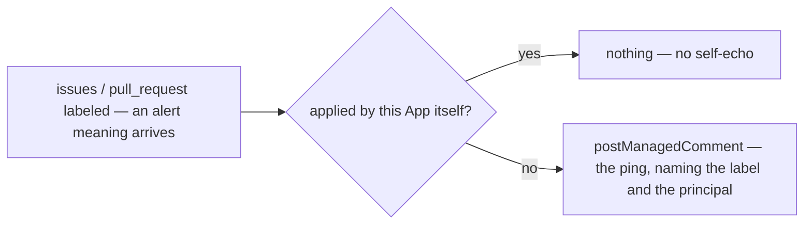

# notifications — ping the right people when a configured label arrives

Subscriptions map an alert to a team.

## What the output looks like

One ping per subscription per item, ever:

> 🚨 @maintainers — this issue was marked **priority: critical**.

> ⚠️ @triage-team — this issue was marked **priority: high**.

## What the config looks like

```yaml
capabilities:
  notifications:
    enabled: true
    settings:
      subscriptions: # alert name → who gets pinged
        critical:
          notify: maintainerTeam
        high:
          notify: triageTeam

mappings:
  alerts: # repo-defined alert names → the label or native field value that triggers each
    critical: { field: Priority, value: Critical }
    high: { field: Priority, value: High }

principals:
  maintainerTeam: "hiero-ledger/hiero-sdk-python-maintainers"
  triageTeam: "hiero-ledger/hiero-sdk-python-triage"
```

The same schema where priorities are labels rather than native github:

```yaml
capabilities:
  notifications:
    enabled: true
    settings:
      subscriptions:
        p0:
          notify: maintainerTeam
        security:
          notify: securityTeam

mappings:
  alerts:
    p0: { label: "P0-🔥" }
    security: { label: "Security" }

principals:
  maintainerTeam: "hiero-ledger/solo-maintainers"
  securityTeam: "hiero-ledger/solo-security"
```

`mappings.alerts` is an open-keyed mapping family: alert names are the repository's own, spellings
are injective with every other label mapping. 

## How it works



## Phases

| Phase | Ships | Needs first |
|---|---|---|
| 1 | label-arrival pings | the `alerts` mapping family (open-keyed; the family reader's next instantiation) · alert meanings carried on issue and PR observations — today's projection carries only the workflow meanings |
| 2 | field-value alerts — the native `Priority` form | issue-field values on the observations · the App experiment: do field edits deliver a webhook, and on which event? · a matrix row for the field read |

Not planned: direct Discord/Slack sends — the GitHub↔Slack/Discord integrations forward the
in-repo ping, and nothing here ever holds a secret.

## Declaration

| Field | Value |
|---|---|
| `triggers` | `issues` (labeled) · `pull_request` (labeled) |
| `observations` | `issueUpdated` / `pullRequestUpdated` (exist) — needs adding: alert meanings per entry (phase 1) |
| `resolvers` | `isAutomationActor` (exists) — only to skip the App's own label writes |
| `intents` | `postManagedComment` only |
| Permissions | repository: `issues:read`, `pull_requests:read`, `issues:write` · organization: none |
| `operationalNeeds` | schedule: false · durableState: none · crossItemCoordination: false · externalDelivery: false |

## Verified by

| Scenario | Proves |
|---|---|
| Maintainer applies the `critical` label | one ping naming the label and the team |
| Label removed and re-applied | no second ping — identity, not events |
| Redelivered `labeled` event | one ping — managed identity |
| Two subscriptions fire on one item | two pings, separately deduplicated |
| The App's own label write (another capability's `applyMappedLabel`) | silence — no self-echo |
| Subscription naming an unmapped alert or unknown principal | reported as unusable, not silently ignored |
| Alert label applied to a pull request | pings the same as an issue — both surfaces subscribe |
| `mode: dry-run` | the exact ping named as `wouldApply`; nothing posted |
