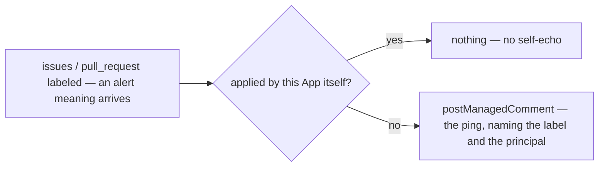

# notifications — ping the right people when a configured label arrives

Not built: phase 2.

## What the output looks like

One ping per subscription per item, ever:

> 🚨 @maintainers — this issue was marked **priority: critical**.

> ⚠️ @triage-team — this issue was marked **priority: high**.

## What the config looks like

```yaml
capabilities:
  notifications:
    enabled: true
    subscriptions: # alert name → who gets pinged
      critical:
        notify: maintainerTeam
      high:
        notify: triageTeam

mappings:
  alerts: # repo-defined alert names → the label that carries each
    critical: "priority: critical"
    high: "priority: high"

principals:
  maintainerTeam: "hiero-ledger/hiero-sdk-python-maintainers"
  triageTeam: "hiero-ledger/hiero-sdk-python-triage"
```

The same schema in a repository that spells its priorities its own way:

```yaml
capabilities:
  notifications:
    enabled: true
    subscriptions:
      p0:
        notify: maintainerTeam
      security:
        notify: securityTeam

mappings:
  alerts:
    p0: "P0-🔥"
    security: "Security"

principals:
  maintainerTeam: "hiero-ledger/solo-maintainers"
  securityTeam: "hiero-ledger/solo-security"
```

`mappings.alerts` is an open-keyed mapping family: alert names are the repository's own, spellings
are injective with every other label mapping. A native project field —
`{ field: Priority, value: Critical }` — is phase 2: the day the project-field read has an
endpoint-matrix row, an entry's value widens to a string-or-object union, which accepts every file
written against today's label string.

## How it works

Subscriptions map an alert to a team. One ping per subscription per item, and the App never echoes
its own label writes.



| Phase | Ships | Needs first |
|---|---|---|
| 1 | label-arrival pings | nothing — the open-keyed `alerts` family ships (`config/schema.ts`, `OPEN_MAPPING_FAMILIES`), and both fact kinds carry `alerts` as a plain always-read field, projected through `mappings.alerts` |
| 2 | field-value alerts — the native `Priority` form | issue-field values on the observations · the App experiment: do field edits deliver a webhook, and on which event? · a matrix row for the field read |

Not planned: direct Discord/Slack sends — the GitHub↔Slack/Discord integrations forward the
in-repo ping, and nothing here ever holds a secret.

| Declaration | Value |
|---|---|
| `triggers` | `issues` (labeled) · `pull_request` (labeled) |
| `facts` / `needs` | `issue` and `pullRequest`, needing no group. `alerts` is a plain field on both kinds rather than a group, so there is nothing to need: every producer reads it |
| `resolvers` | `isAutomationActor` (exists) — only to skip the App's own label writes |
| `intents` | `postManagedComment` only |
| Permissions | repository: `issues:read`, `pull_requests:read`, `issues:write` · organization: none |
| `operationalNeeds` | schedule: false · durableState: none · crossItemCoordination: false · externalDelivery: false |

`issues` reads no group on an issue record and `pull_request` reads `readiness` on a pull-request
record, so a declaration needing no group boots on both triggers.

## Verified by

| Scenario | Proves |
|---|---|
| Maintainer applies the `critical` label | one ping naming the label and the team |
| Label removed and re-applied | no second ping — identity, not events |
| Redelivered `labeled` event | one ping — managed identity |
| Two subscriptions fire on one item | two pings, separately deduplicated |
| The App's own label write (another capability's `applyMappedLabel`) | silence — no self-echo |
| Subscription naming an unmapped alert or unknown principal | rejected with the file, not silently ignored |
| Alert label applied to a pull request | pings the same as an issue — both surfaces subscribe |
| `mode: dry-run` | the exact ping named as `wouldApply`; nothing posted |
