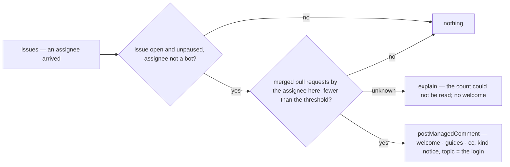

# onboarding — when a new contributor takes an issue, bring the people and the pages to them

When someone with no merged pull request in this repository becomes an assignee of an open issue,
posts one managed comment on that issue: a welcome by name, the optional guides the repository
chose to link, and a cc to the mentor team if one is configured.
Acts on the assignment arriving, however it happened — `/assign`, the sidebar, a maintainer.
Never acts on a returning contributor, a bot, a pull request, or a closed or paused issue.
One comment per contributor per issue, updated in place; nothing is ever removed or re-posted.
It composes with `assignment` through the fact that an assignee arrived, never by reading its
comments; `assignment`'s own per-tier `supportTeam` ping is the skill ladder's, this is the
newcomer's, and a repository may enable either or both.

## What the config looks like

Minimal — a welcome and nothing else:

```yaml
capabilities:
  onboarding:
    enabled: true
```

With a mentor team and the guides a newcomer should open first:

```yaml
capabilities:
  onboarding:
    enabled: true
    settings:
      newContributor:
        mergedFewerThan: 1 # a contributor with this many merged PRs here, or fewer, is new — 0 means "first assignment only"
      cc: mentorTeam # optional — a principal; absent means no ping
      guides: # optional — each is one line of the comment, in this order
        - title: "Contributing guide"
          url: "https://github.com/hiero-ledger/hiero-sdk-python/blob/main/CONTRIBUTING.md"
        - title: "Development setup"
          url: "https://github.com/hiero-ledger/hiero-sdk-python/wiki/Development-Setup"
        - title: "The Signing Guide"
          url: "https://github.com/hiero-ledger/hiero-sdk-python/wiki/Signing-Guide"

principals:
  mentorTeam: "hiero-ledger/hiero-sdk-python-mentors"
```

`mergedFewerThan` counts merged pull requests authored by the assignee in this repository, at the
moment of assignment; `1` (the default) welcomes anyone who has never had a pull request merged.
A `cc` naming a principal the document does not declare, or a guide without a `url`, is reported as
unusable, not silently ignored. Guides are rendered as the platform renders any link: title and
address, never as markdown the repository wrote.

## How it works



| Guard | Reads | Unknown means |
|---|---|---|
| the assignee arrived in this observation | `assignees.arrived` on the issue facts | — (a fact, not a read) |
| the assignee is a person | `isAutomationActor` | skip, silently |
| merged count below the threshold | `mergedCount({ login })` | explain, no comment — unknown is never "new" |

The welcome, with a mentor team and three guides:

> 👋 Welcome, @alice — thanks for taking this on! A few pages that will save you time:
>
> - Contributing guide (configured link)
> - Development setup (configured link)
> - The Signing Guide (configured link)
>
> Comment `/working` if you want to let us know development is active, and `/unassign` if you find
> you cannot continue — no hard feelings. cc @mentors-team, a new contributor has picked up this
> issue.

Without a mentor team or guides, the same comment stops after the first sentence and the two
commands. The commands are named only when `mappings.commands` maps them; an unmapped command is
not mentioned rather than mentioned wrongly.

## Phases

| Phase | Ships | Needs first |
|---|---|---|
| 1 | the welcome on assignment | `assignees.arrived` on the issue facts from the `issues` webhook (the `assigned` action names the login; today the webhook reads no assignee group) · a `mergedCount({ login })` resolver — the search or list read the assignment design also needs, gated on the endpoint matrix |
| 2 (candidate) | a second welcome variant for a contributor's first pull request | the `pull_request` facts already carry `author`; the same resolver |

## Declaration

| Field | Value |
|---|---|
| `triggers` | `issues` |
| `facts` / `needs` | `issue`, needing `assignees` (the arrival) |
| `resolvers` | `isAutomationActor` (exists) · `mergedCount` (new) |
| `intents` | `postManagedComment` (`notice`, topic = the assignee's login) |
| `requiredMappings` | none; `commands.working` and `commands.unassign` are read if mapped |
| Permissions | repository: `issues:read`, `pull_requests:read`, `issues:write` · organization: none |
| `operationalNeeds` | schedule: false · durableState: none · crossItemCoordination: false · externalDelivery: false |

## Verified by

| Scenario | Proves |
|---|---|
| First-ever assignee, `/assign` | one welcome, the guides in configured order, the cc |
| First-ever assignee, assigned from the sidebar by a maintainer | the same welcome — the arrival is the fact, not the command |
| Assignee with one merged pull request, threshold 1 | nothing — returning contributors are not welcomed twice |
| Threshold 0 | a contributor's first assignment is welcomed even if they have merged before; the second is not |
| Two new assignees arrive together | two comments, one per login — the topic is the login |
| Redelivered `assigned` event | one comment, updated in place |
| Human edits the welcome | the edit stands until the facts change |
| Assignee is a bot | nothing, silently |
| `mergedCount` cannot answer | explained; no comment — unknown is never "new" |
| Issue is paused (`blocked`) or closed | nothing |
| `cc` names an undeclared principal | reported as unusable, not silently ignored |
| A guide without a `url` | reported as unusable |
| `commands.working` unmapped | the welcome omits the command sentence rather than naming a command nobody mapped |
| `mode: dry-run` | the welcome named as `wouldApply`; nothing posted |
