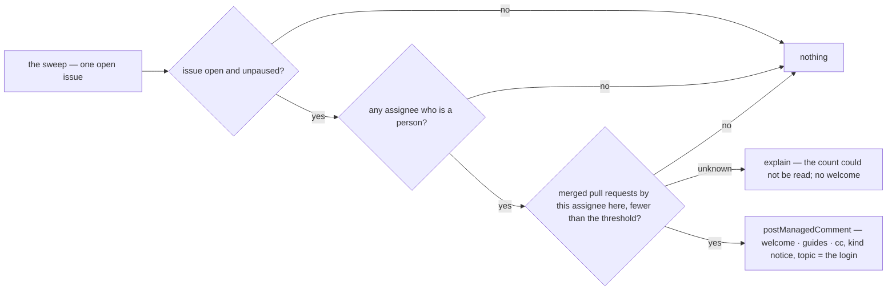

# onboarding — when a new contributor takes an issue, bring the people and the pages to them

Not built: phases 1, 2, 3, 4.

## What the output looks like

The welcome, with a mentor team and three guides:

> @hiero-ledger/hiero-sdk-python-mentors — 👋 Welcome, @alice — thanks for taking this on!
>
> A few pages that will save you time:
>
> - Contributing guide (configured link)
> - Development setup (configured link)
> - The Signing Guide (configured link)
>
> Two commands are available on this repository: `working`, to say development is active, and
> `unassign`, if you find you cannot continue — no hard feelings. The words they are spelled with
> are in this repository's automation configuration.

The cc leads rather than trails: `postManagedComment`'s `mention` is a principal NAME, and the
platform resolves it into a handle and addresses the comment with it
(`packages/core/src/intents/managed.ts`). Without a mentor team or guides, the same comment stops
after the first sentence and the commands. The commands are named only when `mappings.commands` maps
them; an unmapped command is not mentioned rather than mentioned wrongly.

## What the config looks like

Minimal — a welcome and nothing else:

```yaml
capabilities:
  onboarding:
    enabled: true
```

With a mentor team and the guides a newcomer should open first:

```yaml
capabilities:
  onboarding:
    enabled: true
    newContributor:
      mergedFewerThan: 1 # a contributor with fewer than this many merged PRs here is new; 0 welcomes nobody
    cc: mentorTeam # optional — a principal; absent means no ping
    guides: # optional — each is one line of the comment, in the order written
      contributing:
        title: "Contributing guide"
        url: "https://github.com/hiero-ledger/hiero-sdk-python/blob/main/CONTRIBUTING.md"
      setup:
        title: "Development setup"
        url: "https://github.com/hiero-ledger/hiero-sdk-python/wiki/Development-Setup"
      signing:
        title: "The Signing Guide"
        url: "https://github.com/hiero-ledger/hiero-sdk-python/wiki/Signing-Guide"

principals:
  mentorTeam: "hiero-ledger/hiero-sdk-python-mentors"
```

`mergedFewerThan` counts merged pull requests authored by the assignee in this repository, at the
moment of the sweep; `1` (the default) welcomes anyone who has never had a pull request merged, and
`0` welcomes nobody.

`guides` is a MAPPING and not a list, because the settings toolkit has no constructor for a list of
records (`design/guides/capability-kits.md` §3, and §3.3's rule that the design's config is what
moves). The keys are the maintainer's own and are read by nothing; the order they are written in is
the order the comment lists them in.

A `cc` naming a principal the document does not declare, or a guide missing its `title` or its
`url`, is rejected with the file, not silently ignored. Guides are rendered as the platform renders
any untrusted text: title and address, quoted, never as markdown the repository wrote — so a
configured address appears as text rather than as a link.

## How it works

When someone with no merged pull request in this repository holds an open issue, posts one managed
comment on that issue: a welcome by name, the optional guides the repository chose to link, and a cc
to the mentor team if one is configured.

Acts on the assignment however it happened — `/assign`, the sidebar, a maintainer — because the
sweep reads who holds the issue and not what put them there. Never acts on a returning
contributor, a bot, a pull request, or a closed or paused issue. One comment per contributor per
issue, updated in place; nothing is ever removed or re-posted.

It composes with `assignment` through the fact that somebody holds the issue, never by reading its
comments; `assignment`'s own per-tier `supportTeam` ping is the skill ladder's, this is the
newcomer's, and a repository may enable either or both.



| Guard | Reads | Unknown means |
|---|---|---|
| the issue is open and unpaused | `isOpen`, `isPaused` over the projection | — (a fact, not a read) |
| the assignee is a person | `isAutomationActor`, through `people` | that assignee is dropped, silently |
| merged count below the threshold | `mergedCount({ login })` | explain, no comment — unknown is never "new" |

| Phase | Ships | Needs first |
|---|---|---|
| 1 | the welcome, on the hourly sweep | a `mergedCount({ login })` resolver that ANSWERS, and before that a DECISION about which read it sends: it is not in `RESOLVER_NAMES`, and `design/findings/endpoint-permission-matrix.md` holds two candidate rows for "merged pull requests by one author", both probed and NOT adopted. `GET /search/issues` answers in one call but draws on its own thirty-per-minute budget and runs on an eventually-consistent index — a count that is sometimes low would welcome a returning contributor as a newcomer, the one mistake this capability must not make. `GET /pulls?state=closed` is exact and on the ordinary budget but cannot filter by author server-side, so it costs the whole closed history per assignee per sweep. The decision needs a cost model against the fleet budget (Q10) and a register row |
| 2 | the welcome at the moment the assignment arrives | an assignee group a WEBHOOK can fill. `AssigneeClock` carries `assignedAt` and `lastWorkingAt`, which no `issues` payload carries, so the producers registry has the `issues` webhook reading no group at all. Either a clockless arrival fact or a second group — not a registry row |
| 3 | the commands sentence in the repository's own words | the command SPELLINGS on the capability view, which carries mapped NAMES only (contract.md §2). The welcome above names `working` and `unassign` and points at the configuration |
| 4 (candidate) | a second welcome variant for a contributor's first pull request | the `pull_request` facts already carry `author`; the same resolver |

| Declaration | Value |
|---|---|
| `triggers` | schedule (the sweep) |
| `facts` / `needs` | `issue`, needing `assignees` |
| `resolvers` | `isAutomationActor` (exists) · `mergedCount` (not in `RESOLVER_NAMES`; and refused by `CONFIRMED_RESOLVER_READS` until one of its two probed rows is chosen) |
| `intents` | `postManagedComment` (`notice`, topic = the assignee's login) |
| `requiredMappings` | none; `commands.working` and `commands.unassign` are read if mapped |
| Permissions | repository: `issues:read`, `pull_requests:read`, `issues:write` · organization: none |
| `operationalNeeds` | schedule: true · durableState: none · crossItemCoordination: false · externalDelivery: false |

`sweep` reads `assignees` on an issue, the `issues` webhook reads no group at all, and needs are
checked per trigger, so this declaration is one trigger or no needs.

## Verified by

| Scenario | Proves |
|---|---|
| A first-ever contributor holds the issue | one welcome, the guides in the order written, the cc |
| Assignee with one merged pull request, threshold 1 | nothing — returning contributors are not welcomed twice |
| Threshold 0 | nothing, for anyone — a repository can turn the welcome off by the number as well as by `enabled` |
| Two new assignees on one issue | two comments, one per login — the topic is the login |
| The next sweep over a welcomed issue | the same comment identity, so the welcome is updated in place rather than posted again |
| Assignee is a bot | nothing, silently |
| `mergedCount` cannot answer | explained; no comment for anyone on the issue — unknown is never "new" |
| Issue is paused (`blocked`) or closed | nothing |
| No guides and no cc configured | the welcome is the greeting and the commands, and nothing else |
| `commands.working` unmapped | the welcome names only `unassign` rather than a command nobody mapped |
| Neither command mapped | the welcome omits the commands sentence entirely |
| A guide's title carries markdown | quoted inert, so a repository cannot write markup into a comment the App signs |
| `cc` names an undeclared principal | rejected with the file, not silently ignored |
| A guide without a `url` | rejected with the file |
| `mode: dry-run` | the welcome named as `wouldApply`; nothing posted |
