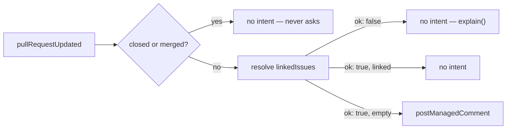

# pr-quality — tell a contributor what still stops their pull request from being reviewable

> **Candidate — not ranked, not built.** Status changes here when the register does (Q2).

GitHub already enforces branch protection and reports checks. This capability explains repository
policy and combines signals; it never pretends to replace that enforcement.

## 1. Declaration

| Field | Value | Why |
|---|---|---|
| `triggers` | `pull_request` (opened, edited, synchronize, ready_for_review) | every signal is recomputed from current facts, never accumulated across events |
| `observations` | `pullRequestUpdated` | it needs the pull request's own projection and its closure; it reads no issue |
| `resolvers` | `linkedIssues` | the one fact the event does not carry. Check-based signals would need a `requiredChecks` resolver the closed catalogue does not have — an extension by review (D61), §8 |
| `intents` | `postManagedComment` | one deterministic App-authored comment. Label mode would add `applyMappedLabel`; there is no remove operation (D80) |
| `permissions.repository` | `pull_requests:read`, `issues:write`, `contents:read` | read the pull request, its files and reviews; GitHub exposes pull request comments and labels through the issue API, so the comment costs `issues:write`; `contents:read` only for a check that inspects a repository file |
| `permissions.organization` | none | at the ceiling. It needs no merge and no `contents:write` |
| `operationalNeeds` | `schedule: false`, `durableState: "none"`, `crossItemCoordination: false`, `externalDelivery: false` | §6 |

## 2. Decision

Every other configured signal — title format, assignee, required status checks, review state, merge
conflicts, sign-off, verified signatures — is a further condition on the same edge, each separately
configurable because repositories disagree, and each resolving to pass, fail, pending, or unknown with
its own explanation. Check and workflow names are exact configured identifiers or derived from
protected-branch rules; there is no universal CI job name.

## 3. Meanings

| Meaning | Reads | Writes |
|---|---|---|
| `needsReview` | — | label mode only; `qualityReadyForReview` maps here (§8) |
| `needsRevision` | — | label mode only; `qualityNeedsWork` maps here (§8) |
| `readyToMerge` | from the projection — it must not contradict a queue that owns this | never |
| `blocked` | from the projection | never (D79) |
| `awaitingTriage`, `ready`, `inProgress` | — | never — it observes no issue |

## 4. Refuses

| Never | Enforced by |
|---|---|
| Merge, approve, push, change code, or request a reviewer | absent from `intents`; the closed catalogue holds no such operation (D61) |
| Close a pull request for a missing link, signature, assignee, or check — Python does close (`design/audit/services.md` §2 group 3) | no closure intent exists; closure is a reason read from GitHub, never written (D47) |
| Pause an item | `screenIntent` refuses a capability writing `blocked` (D79) |
| Take a position off without replacing it | `removeMappedLabel` is deleted from the catalogue (D80) |
| Read a failed resolver as a fact | the `ResolverAnswer` union makes the two values different (§5) |
| Decide from another capability's rendered comment prose, or own its marker | its own configured marker; A2 is the audit's instance of this failure (`design/audit/lessons-learned.md`) |

## 5. When evidence is unknown

A resolver answering `ok: false` produces no intent and one `explain()` naming the reason — a rate limit
is never read as "no linked issue" (`packages/probes/test/prQuality.test.ts`). A failed read is never a
default (D51). The same holds for `mergeable: null`, a still-running check suite, unavailable branch
rules, incomplete pagination, and a missing permission: unknown is neither pass nor fail, so the
capability waits for a later event or a bounded reconciliation rather than posting a contradiction, and
emits no readiness label. A conflicted projection tells this capability nothing, since it reads no
position — but closure is read on both branches (D59), so a merged pull request whose labels happen to
conflict still draws nothing. The comment must distinguish repository work from an App limitation, so a
contributor is never blamed for an infrastructure failure.

## 6. Operational needs

None declared. Everything recomputes from current GitHub facts against one deterministic App-authored
comment whose authorship is verified. A short coalescing queue may reduce repeated work during a burst
of check events, but correctness must not depend on that queue retaining every delivery. Quality trends
and one-time notices would need declared durable state and retention, and must not hide inside the
evaluator.

## 7. Verification

| Scenario | Proves |
|---|---|
| Resolver answers `ok: false`; the same pull request then answers `[]` | unknown is not "no linked issue", and the silence was the failure (`packages/probes/test/prQuality.test.ts`) |
| Redelivered `pull_request` event | one comment, not two — `postManagedComment` is `nonIdempotent`, so recovery goes through read-back |
| Newer human label edit, or a changed configuration revision | the stale expectation returns `conflict` and the human change survives |
| Missing `issues:write` | `forbidden`, and the capability does not retry it |
| More than one page of commits, checks, and files; duplicate check names; reruns; cancelled checks; renamed workflows; changed branch protection | pagination and rename handling, the B1 failure in `design/audit/lessons-learned.md` |
| `mergeable: null`, draft, fork-sourced pull request, dismissed review, hostile title | unknown stays unknown, and a fork pull request is evaluated with no write access to its branch |
| Sandbox: App result against GitHub's visible branch-protection result on the same pull request | the capability explains policy rather than replacing enforcement |

`packages/probes/src/prQuality.ts` is a boundary probe chosen for contract diversity, deliberately not
for likelihood of being ranked first ([`probes/README.md`](../../../packages/probes/README.md)) — its
test proves the resolver-failure behaviour above, not that this capability is wanted.

## 8. Open

| Question | Closed by |
|---|---|
| Which checks do maintainers actually want; is advice enough, or are labels useful; how should an unknown result read? | maintainer conversation |
| Are `qualityNeedsWork` and `qualityReadyForReview` real meanings, or do they collapse into `needsRevision` and `needsReview`, which another capability may also write? | maintainer conversation, against `review-routing` §3 |
| Does required-check and mergeability discovery work under the ceiling? `checks` is deliberately withheld and `statuses:read` sits outside it | App experiment |
| Are DCO sign-off text, GitHub verified signatures, and organization identity one fact or three? | App experiment |
| Is closing-reference detection reliable enough to comment on? B2 records two mechanisms answering this question differently (`design/audit/lessons-learned.md`) | App experiment |
| Does a `requiredChecks` resolver enter the closed catalogue, or does the check slice stay out? | catalogue review (D61) |
| An older quality bot owning the same labels means comment-only advisory mode until it stops | per-repository migration plan (Q7) |
