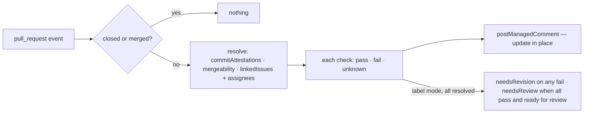

# pr-quality — one dashboard comment that tells a contributor what stops their pull request from being ready to review

A comment containing a dashboard reporting on basic quality checks that a maintainer specifies as essential.

Updates in-place as the PR changes — and when `main` moves, once phase 3 lands. Advisory only: it
explains, it never closes (closing stale work belongs to the inactivity capability).

## What the output looks like

> Hey @contributor 👋 Thanks for the PR!
>
> ✅ **DCO Sign-off** — All commits have valid sign-offs.
>
> ❌ **GPG Signature** — These commits have no verified signature:
> `abc1234` fix: handle empty payload
> See the Signing Guide (configured link).
>
> ✅ **Merge Conflicts** — No merge conflicts detected.
>
> ✅ **Issue Link** — Linked to issues #1632 and #1640
>
> ❌ **Assignment Check** — You are not assigned to #1640
>
> ⏳ All checks must pass before this PR is ready for review.

Unknown checks render as undetermined — never pass or fail — and withhold the all-clear. Commit
text is escaped and `@mentions` broken before rendering (it is attacker-controlled).

## What the config looks like

Proposed `automations.yml` block:

```yaml
schemaVersion: 1
mode: dry-run # disabled | observe | dry-run | active — rehearse, then arm

capabilities:
  prQuality:
    enabled: true # explicit true only; anything else is off
    settings:
      checks: # a check runs only with an explicit enabled: true
        dcoSignoff:
          enabled: true
          guide: "https://github.com/<org>/<repo>/wiki/Signing-Guide" # optional; shown on failure
        gpgSignature:
          enabled: true
          guide: "https://github.com/<org>/<repo>/wiki/Signing-Guide"
        mergeConflicts:
          enabled: true
        linkedIssues:
          enabled: true
          guide: "https://github.com/<org>/<repo>/wiki/Linked-Issues"
          assignedIssues: # sub-check — the dependency is the structure
            enabled: true
            guide: "https://github.com/<org>/<repo>/wiki/Assignment"
      applyLabels: true # requires mappings.labels below

mappings:
  labels: # read only in label mode
    needsReview: "status: needs review"
    needsRevision: "status: needs revision"

principals:
  maintainerTeam: "hiero-ledger/hiero-sdk-python-maintainers" # pinged on App-side errors
```

A trimmed setup — two checks, comment only (unused sections simply absent):

```yaml
schemaVersion: 1
mode: active

capabilities:
  prQuality:
    enabled: true
    settings:
      checks:
        dcoSignoff:
          enabled: true
        mergeConflicts:
          enabled: true

principals:
  maintainerTeam: "hiero-ledger/hiero-sdk-python-maintainers"
```

Rules: a check runs only when its `enabled` is explicitly `true` — the platform's own consent rule,
one level down; omitted or `false` means off, and a kept block with `enabled: false` is a check
parked, not a check running. `assignedIssues` nests inside `linkedIssues`, so its dependency is
structural — anywhere else it is an unknown key. `applyLabels: true` requires the two mappings; the
label reflects the enabled checks only. A missing guide or maintainer principal renders without the
link or the ping.

## How it works



| Check | Pass | Fail | Unknown |
|---|---|---|---|
| DCO sign-off | every non-merge commit has `Signed-off-by:` | failing commits listed | commit list unreadable |
| GPG signature | every commit `verification.verified` | failing commits listed | commit list unreadable |
| Merge conflicts | `mergeable: true` | `mergeable: false` | GitHub never resolves it |
| Issue link | ≥1 linked issue | none found | resolver failed |
| Assignment | author assigned to every linked issue | unassigned issues listed | resolver failed |

## Phases

| Phase | Ships | Needs first |
|---|---|---|
| 1 | the dashboard comment — DCO · GPG · merge conflict · linked issue(s) · assigned to all linked issues | PR author on the observation · `commitAttestations` + `mergeability` resolvers · linked-issue assignees |
| 2 | labels, opt-in — `needsRevision` if any check fails · `needsReview` when all pass and the PR is marked ready for review | draft/ready state on the observation · mappings + the `applyLabels` setting |
| 3 | sibling-conflict recheck after merges | cross-item fan-out (platform design) |

## Declaration

| Field | Value |
|---|---|
| `triggers` | `pull_request` (opened, edited, synchronize, reopened, ready_for_review) |
| `observations` | `pullRequestUpdated` — needs adding: PR author (phase 1), draft/ready state (phase 2) |
| `resolvers` | `linkedIssues` (exists) · `commitAttestations` (new) · `mergeability` (new) · linked-issue assignees (new) |
| `intents` | `postManagedComment` (`summary`) · `applyMappedLabel` (`needsReview`/`needsRevision`, phase 2) |
| Permissions | repository: `pull_requests:read`, `issues:read`, `issues:write` · organization: none |
| `operationalNeeds` | schedule: false · durableState: none · crossItemCoordination: candidate (sibling recheck, deferred) · externalDelivery: false |

## Verified by

| Scenario | Proves |
|---|---|
| Redelivered event | one dashboard, updated, never duplicated |
| Human edits the comment | edit survives until facts change |
| Hostile commit message | renders inert |
| `mergeable` never resolves | unknown shown, no all-clear, no label |
| >250 commits (REST cap) | renders unknown, not pass |
| Missing `issues:write` | `forbidden`, not retried |
| Newer human label change | `conflict`; the human change survives |
| Draft PR | dashboard posts; `needsReview` is never written |
| A disabled check | its section is absent — not shown as pass |
| Failing check later fixed | dashboard updates; label swaps `needsRevision` → `needsReview` |
| `assignedIssues` outside `linkedIssues` | unknown key, reported — the nesting is the dependency |
