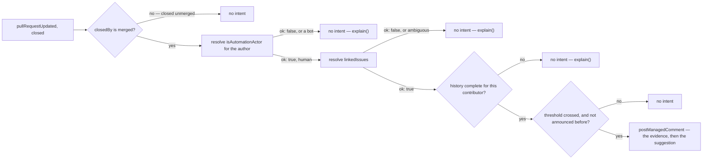

# progression — recognise completed work, and suggest what to try next

> **Candidate — not ranked, not built.** Status changes here when the register does (Q2).

**Parked, and the scope problem is the reason.** The C++ workflow has skill labels and skill-gated
assignment (`design/audit/services.md` §2 group 5), but a level is a fact about a *contributor*, not
about a repository — and the moment it counts work across repositories it needs organization-wide reads
(D57) and leaves the first milestone by this document's own §8. A repository-local ladder that ignores a
contributor's work next door is not the thing anyone asked for. That is the question to close before any
of the rest matters.

## 1. Declaration

| Field | Value | Why |
|---|---|---|
| `triggers` | `pull_request` (closed), `issues` (closed) | a completion is a closure; the draft's scheduled evaluation adds nothing a closure event does not already carry |
| `observations` | `pullRequestUpdated`, `issueUpdated` | merged and closed-unmerged are distinguished from the projection's closure reason, not from a label (D47, D59). The draft's contribution and actor observations do not exist (D61, §8) |
| `resolvers` | `linkedIssues`, `isAutomationActor` | find the work a merge completed; exclude bot contributions. The draft's `contributionHistory` is not in the catalogue, and it is the one carrying the org-wide problem above (§8) |
| `intents` | `postManagedComment` | guidance only. `applyMappedLabel` **cannot carry a level**: `skill:` labels are outside the seven `MAPPABLE_MEANINGS` (`packages/core/src/config/schema.ts`), so the draft's whole label output has no operation (§3, §8) |
| `permissions.repository` | `issues:read`, `pull_requests:read`, `issues:write` | read merged pull requests, linked issues, authors, labels and reviews; write one guidance comment. It needs no content write, no merge, and no organization role |
| `permissions.organization` | none for a repository-local ladder; `members:read` the moment it counts work org-wide | which is the ceiling problem stated above (D57) |
| `operationalNeeds` | `schedule: false`, `durableState: "candidate"`, `crossItemCoordination: true`, `externalDelivery: false` | §6 |

Defaults to disabled (P2), and the platform ships **no** hidden default ladder — a repository may enable
every other capability without defining a single level. A repository defines its levels or milestones,
the qualifying contribution types, the evidence thresholds, the excluded work, the recommendation rules,
and the output mode.

The 2026-07-23 draft configuration sketch — input for the Q3 review, not an approved shape — is a
prerequisite chain: ordered `levels`, each with a `label` in this repository's own spelling and an
`advanceAfter` completion count, a `completion` enum (`mergedLinkedPr`), and a `visibility` floor of
`contributorOnly` with public as an explicit choice. Validation it implies: ordered list, unique names
and labels, `advanceAfter` a positive integer on every level except the terminal one, at least two
levels. Three semantic positions recorded so the sketch is falsifiable — completions **at or above** the
current level count toward its quota, because maintainers hand-assign above level and that work must not
evaporate; a level is a **high-water mark** derived from the ledger, so config edits and credit
corrections never demote and demotion is an explicit maintainer action; **manual promotion is
first-class**, recorded as a maintainer grant. With those, level derivation is a pure function over the
ledger and the `levels` list, buildable and testable before any GitHub integration.

## 2. Decision

The level itself is never written by this capability, because there is no operation that can write it
(§1). The comment states the evidence and the next step; the label, if a repository wants one, stays a
maintainer's action until §8's first row is closed.

## 3. Meanings

| Meaning | Reads | Writes |
|---|---|---|
| `readyToMerge` | — | never. The completion signal is `closedBy: merged`, a closure **reason** read from the projection (D47), not a position — a pull request that reached `readyToMerge` and was then closed unmerged completed nothing |
| `awaitingTriage`, `ready`, `inProgress` | — | never; it neither triages nor claims |
| `needsReview`, `needsRevision` | — | never; it judges no pull request in flight |
| `blocked` | — | never (D79) |

Progression touches **none** of the seven. Its whole vocabulary — `skill: beginner` and its siblings —
lives outside `MAPPABLE_MEANINGS`, which is why every row above reads "never" and why §8's catalogue
question is not cosmetic. It must also never treat a label as proof of anything, since
maintainers and other bots apply labels for unrelated reasons.

## 4. Refuses

| Never | Enforced by |
|---|---|
| Grant an organization role, change a GitHub permission, or decide whether a pull request merges | absent from `intents`; the closed catalogue holds no such operation (D61), and `permissions` requests none of it |
| Write a level as a workflow position | `applyMappedLabel` takes a `MappableMeaning`; `skill:` is not one, so it is a compile error before it is a policy question |
| Pause an item | `screenIntent` refuses a capability writing `blocked`, code `pauseNotCapabilityWritable` (D79) |
| Credit a closed-unmerged pull request | closure carries its reason; `merged` and `closedByHuman` are different values (D47) |
| Credit a bot | `isAutomationActor`, with an undetermined answer treated as do-not-credit (§5) |
| Mutate the linked issue as a side effect of a merged pull request — C1 is the audit's instance | one intent names one item (`design/audit/lessons-learned.md`) |
| Control who may claim an issue | P3 — `assignment` may read the same repository-approved level mapping through shared configuration; neither calls the other |
| Announce the same milestone twice | `postManagedComment` is `nonIdempotent`, so render-once needs the record §6 names — or the announcement is omitted |
| Present a level as an employment judgment, an identity claim, or a GitHub permission | wording is a maintainer-reviewed setting, with `visibility: contributorOnly` as the floor |

## 5. When evidence is unknown

An ambiguous link, incomplete history, a changed policy revision, or a rate limit produces no level
change and one `explain()` — a search that could not finish is never read as "no prior contributions"
(D51). This matters more here than elsewhere, because the failure mode is not a missing comment but a
*wrong ranking* of a person, and label changes being reversible does not make a public ranking harmless.
The App explains the uncertainty instead. Wording, appeal, correction, and opt-out behaviour all need
maintainer review before any write, and no Hiero Hackers write experiment begins until a maintainer
explicitly asks to evaluate a progression policy.

## 6. Operational needs

`durableState: "candidate"`, `crossItemCoordination: true`. Current GitHub history supports some
threshold policies, but repeated full-history searches are slow and eventually consistent. One-time
announcements, historical snapshots, and cross-repository totals each need a durable record **with
correction and deletion rules**, because a ledger about people is the kind of record that must be
correctable. The right move is to avoid that complexity entirely until a maintainer confirms progression
is wanted. Disabling stops evaluations and writes and affects no other capability; existing comments and
labels remain unless maintainers choose an explicit cleanup.

## 7. Verification

| Scenario | Proves |
|---|---|
| Merged and closed-unmerged pull requests with identical labels | the credit comes from the closure reason, not the position |
| A reverted merge, and a merge with several authors | what "completion" actually means when the work did not survive or was shared |
| Bot contributions, and an author lookup that fails | neither is credited |
| A missing or ambiguous link; more than one page of history | unknown is not zero contributions |
| A policy revision changing between two evaluations | the level is a high-water mark; a config edit never demotes |
| A manual promotion recorded as a maintainer grant | observed reality is first-class, not an anomaly to be corrected |
| Duplicate events, renamed labels, a repeated milestone | the announcement renders once or not at all |
| Level derivation over a fixed ledger and `levels` list | a pure function, testable with no GitHub at all |

## 8. Open

| Question | Closed by |
|---|---|
| **Blocking:** is a level a repository fact or a contributor fact? A repository-local ladder cannot see work next door, and an org-wide one needs organization reads (D57) and leaves the first milestone | maintainer conversation |
| Does any repository want this capability at all? Nothing below matters until one does | maintainer conversation (Q3) |
| If one does: what is the policy, the evidence boundary, the correction process, and the output? | maintainer conversation |
| Can a level be written at all? `skill:` labels are outside `MAPPABLE_MEANINGS`, so either the meaning vocabulary grows or progression stays comment-only | catalogue review, against `packages/core/src/config/schema.ts` |
| Does a `contributionHistory` resolver enter the closed catalogue, and at what privacy and rate-limit cost? | catalogue review (D61) |
| Is repository-local history reliable enough, and do one-time results justify storage with correction and deletion rules? | App experiment |
| Are the sketch's three semantic positions — at-or-above counting, high-water marks, first-class manual promotion — the right ones? | Q3 review of the configuration sketch |
| An old skill-ladder writer must stop before this one manages the same labels | per-repository migration plan (Q7) |
