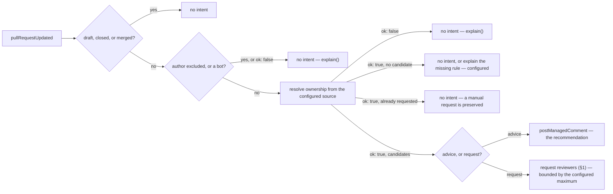

# review-routing — recommend, or request, the right reviewer for a pull request

> **Candidate — not ranked, not built.** Status changes here when the register does (Q2).

Pull requests wait because the right reviewer does not notice them. The Python audit shows only
`queue:*` behaviour (`design/audit/services.md` §2 group 3), which is weaker evidence than any other
candidate has, and routing creates noise and unfair load exactly when ownership facts are incomplete.
Nothing here should be promised before maintainers explain how they make the decision today.

## 1. Declaration

| Field | Value | Why |
|---|---|---|
| `triggers` | `pull_request` (opened, ready_for_review, synchronize) | routing happens when a pull request becomes reviewable, and again only when policy says a dismissed or completed review must be renewed |
| `observations` | `pullRequestUpdated` | its projection and its closure. Changed files and existing review requests are not in the payload and have no resolver, so the ownership evidence has to come from somewhere the catalogue does not yet reach (D61, §8) |
| `resolvers` | `isAutomationActor` | so a bot author is excluded from a routing decision. The draft's `reviewCandidates` and `mayPerform` are not in the catalogue, and `reviewCandidates` is the one that decides everything (§8) |
| `intents` | `postManagedComment`, `applyMappedLabel` | recommendation mode, and a configured position write (§3). The draft's request-reviewers intent has **no catalogue operation**, so request mode is unbuildable today — which happens to be the lower-risk half first |
| `permissions.repository` | `pull_requests:read`, `pull_requests:write`, `contents:read` | read changed files, current requests and reviews; `contents:read` only when an ownership file is the configured source; `pull_requests:write` only for real review requests |
| `permissions.organization` | `members:read`, only when team routing is configured | **exceeds the ceiling.** Team visibility is optional precisely because it adds a permission (`design/findings/endpoint-permission-matrix.md`, "The ceiling"), and the App must not broaden organization access to support an optional setting without maintainer agreement |
| `operationalNeeds` | `schedule: false`, `durableState: "candidate"`, `crossItemCoordination: true`, `externalDelivery: false` | §6 |

Defaults to disabled (P2). A repository configures path-to-team rules, excluded authors, draft
behaviour, the maximum reviewers requested, whether existing requests are preserved, and whether the
result is advice or a real request. It may point at a CODEOWNERS file, explicit path rules, or configured
teams — and the platform must not assume those three sources mean the same thing.

## 2. Decision

A synchronize event does not re-request the same reviewer unless policy says a dismissed or completed
review must be renewed. A maintainer's manual request is valid input, preserved, and never removed to
enforce a rotation.

## 3. Meanings

| Meaning | Reads | Writes |
|---|---|---|
| `needsReview` | from the projection — a pull request sitting here is exactly what routing is for | never; arriving at `needsReview` is `pr-quality`'s edge, not this one |
| `needsRevision` | from the projection — a pull request waiting on its author is not routed to a reviewer | never |
| `readyToMerge` | from the projection — it must not contradict a queue that owns this | label mode only: `reviewPolicySatisfied`, `needsReview → readyToMerge`. **Genuinely ambiguous** — the draft says this capability does not grant approval, yet it is the only one that observes review state (§8) |
| `blocked` | from the projection | never (D79) |
| `awaitingTriage`, `ready`, `inProgress` | — | never — it observes no issue |

## 4. Refuses

| Never | Enforced by |
|---|---|
| Approve, merge, push, or change code | absent from `intents`; the closed catalogue holds no such operation (D61) |
| Close a pull request that has no eligible reviewer | no closure intent exists; closure is a reason read from GitHub, never written (D47) |
| Pause an item | `screenIntent` refuses a capability writing `blocked`, code `pauseNotCapabilityWritable` (D79) |
| Remove a maintainer's manual review request to enforce its own rotation | no remove-reviewer operation exists, and none is proposed |
| Take a position off without replacing it | `removeMappedLabel` is deleted from the catalogue (D80) |
| Move a pull request along an undocumented edge — `needsRevision → readyToMerge` is not one | `screenIntent`'s `transitionNotOnMap` (D78) |
| Guess a reviewer when a team is invisible or a rule is missing | the `ResolverAnswer` union: an invisible team is `ok: false`, not an empty candidate list (§5) |
| Request reviewers while quality guidance is disabled, or wait for it | P3 — a compatibility rule may require a shared quality-ready fact, but neither capability calls the other |
| Keep requesting after the brake is pulled | `killSwitch` refuses first, at repository and organization scope (D39) |

## 5. When evidence is unknown

An ownership resolver answering `ok: false` produces no request and one `explain()` naming the reason —
missing team access is never read as "no eligible reviewer" (D51). The same holds for a private team, an
outside collaborator whose membership cannot be seen, an incomplete page of changed files, a pull request
with too many changed files to attribute, a rate limit, and stale pull-request facts: unknown is neither
a candidate nor an absence, so the capability recommends nothing rather than requesting the wrong person.
A conflicted projection has no position to move from, so any label-mode intent is refused
`positionConflict` while the recommendation, which moves nothing, may still be explained. A recommendation
is the lower-risk output because a real request generates notifications, and repeated wrong notifications
damage trust faster than silence does.

## 6. Operational needs

`durableState: "candidate"`, `crossItemCoordination: true`. Path ownership recomputes from current GitHub
facts and needs nothing durable. Fair round-robin selection, recent workload, cooldowns, and vacation
handling are the cross-item half, and they need history GitHub does not expose reliably — so they either
get a defined durable record with stated retention, or they stay out of the first experiment. A request
to several reviewers is idempotent only after the adapter verifies existing requests against GitHub's
response, and a partial result must report exactly which requests succeeded. Disabling stops
recommendations and requests; it removes no existing review request.

## 7. Verification

| Scenario | Proves |
|---|---|
| Ownership resolver answers `ok: false`; the same pull request then answers an empty candidate list | unknown is not "no eligible reviewer", and the silence was the failure |
| Drafts; renamed and deleted files; more than one page of changed files | the file-level evidence survives GitHub's pagination and rename behaviour |
| CODEOWNERS and explicit path rules disagreeing on one path | precedence is configured, not assumed — the three sources are not one fact |
| A private team, an outside collaborator, and the author appearing in their own ownership group | invisible membership is unknown; self-review is excluded |
| An existing manual request, then a synchronize event | the manual request survives and is not re-requested |
| Partial multi-reviewer request | exactly which requests succeeded is reported, not inferred |
| Redelivered `pull_request` event | one recommendation, not two — [`postManagedComment` is `nonIdempotent`](../../contracts/catalogue.md), so recovery goes through read-back |
| Missing `pull_requests:write`, and missing organization `members:read` | `forbidden`, not retried, and team routing degrades to unknown rather than to a guess |
| Sandbox: dry-run recommendations measured for accuracy before any request is sent | the noise cost is measured before it is inflicted |

## 8. Open

| Question | Closed by |
|---|---|
| Do maintainers want routing at all? The demand evidence here is the weakest of the eight | maintainer conversation |
| Which ownership source is authoritative — CODEOWNERS, path rules, or configured teams? | maintainer conversation |
| Is advice sufficient, or is a real review request wanted? | maintainer conversation |
| Does this capability write `readyToMerge` when the review policy is satisfied, or does it write nothing and leave that to whoever owns the merge queue? §3 records the ambiguity rather than resolving it | maintainer conversation, against `pr-quality` §3 |
| Do fairness and availability belong in scope, and does their history justify durable storage? | maintainer conversation, then App experiment |
| Do a `reviewCandidates` resolver, a changed-files observation, and a review-request operation enter the closed catalogue? Without them this capability has no evidence and no request | catalogue review (D61) |
| Does organization `members:read` get added above the ceiling, or does team routing stay out? | maintainer review of the permission ceiling, then App experiment on team visibility |
| An older reviewer bot must stop before active request mode begins, though both may be compared safely in a no-write experiment | per-repository migration plan (Q7) |
