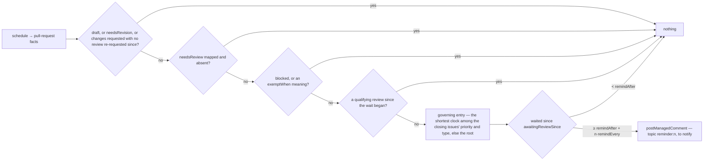

# reviews — when a pull request has waited on its reviewers, say so

Not built: phase 1.

## What the output looks like

Every comment is addressed by the platform, which prefixes the handle of each principal the
capability names (`packages/core/src/intents/managed.ts`, `addressManagedComment`); no body names a
team itself, and none names the author. Each closing issue is restated with the priority and type
GitHub holds for it, so the reader sees why this clock and not another; both are organization-defined
text and render through `inert()`.

The reminder:

> @security-team @reviewers-team — 👀 This pull request has waited 3 days for a review. It closes
> #1632 (Urgent · Bug).

The reminder again, `remindEvery` later, as a NEW comment — a rewrite notifies nobody:

> @security-team @reviewers-team — 👀 This pull request has waited 24 days for a review. It closes
> #1632 (Urgent · Bug).

The reminder for a pull request whose issues carry no priority, on the default clock:

> @reviewers-team — 👀 This pull request has waited 7 days for a review. It closes #1640 (no
> priority · Feature).

Each comment prints its own THRESHOLD rather than a running total. A change of addressee or of an
issue's priority rewrites the comment it belongs to in place; neither is part of its identity.

## What the config looks like

The smallest policy — one team, the default clock:

```yaml
capabilities:
  reviews:
    enabled: true
    notify: reviewersTeam # required — who the reminder addresses; remindAfter defaults to 7d

principals:
  reviewersTeam: "hiero-ledger/hiero-sdk-python-reviewers"
```

The full policy — the defaults first, then the clocks and teams that follow GitHub's own priority
and type:

```yaml
capabilities:
  reviews:
    enabled: true
    remindAfter: 7d # default 7d — waited this long for a review, counted from entering review
    remindEvery: 21d # default 21d — remind again this long after each reminder, until a review lands
    notify: [reviewersTeam, sdkLeads] # one principal or a list; every name must be declared below
    reviewsFromAnyone: false # default false — only owners, members and collaborators stop the clock
    exemptWhen: [readyToMerge] # meanings that also stop the clock — each must be mapped below; `blocked` always does
    byPriority: # keyed by the Priority field's options, spelled as GitHub shows them
      Urgent:
        remindAfter: 1d
        remindEvery: 3d
        notify: [securityTeam, maintainerTeam] # this entry's addressees, replacing the root list
        byType: # the pair — an urgent bug, as distinct from an urgent anything
          Bug:
            remindAfter: 1h # hours are clocks too; the sweep's cadence (default hourly) is how soon an hour is seen
      Low:
        remindAfter: 60d
    byType: # keyed by issue type names, spelled as GitHub shows them
      Bug:
        remindAfter: 3d

mappings:
  labels:
    needsReview: "status: needs review" # mapped: the capability acts ONLY on pull requests carrying it
    needsRevision: "status: changes requested"
    readyToMerge: "status: approved"

principals:
  reviewersTeam: "hiero-ledger/hiero-sdk-python-reviewers"
  sdkLeads: "hiero-ledger/hiero-sdk-leads"
  securityTeam: "hiero-ledger/hiero-security"
  maintainerTeam: "hiero-ledger/hiero-sdk-python-maintainers"
```

Priority and type are GitHub's native issue fields, never labels: an organization spells its own
options (Urgent, High, Medium, Low and Bug, Feature, Task are the defaults, and both are editable),
so the keys of `byPriority` and `byType` are those spellings and there is nothing to map. The price
is that a misspelt key never matches and is never refused — no offline check can know an
organization's options — so `configReport` prints every key the App read, and the reminder restates
the values it saw. A pull request is marked by the issues it closes; a pull request carries no
fields of its own.

Which entry governs: for each closing issue, the most specific entry it matches — a priority entry's
own `byType` entry, else the priority entry, else the top-level type entry, else the root — and
across several closing issues, the one with the shortest `remindAfter`. That entry's `remindEvery`
and `notify` apply with it, each falling back outward where the entry sets none. Entries are never
merged: two teams on urgent work are two names on the `Urgent` entry. Above, an urgent bug is
reminded about after an hour, an urgent feature after a day, a medium bug after three days, and
anything else after seven. An hour-scale clock is honoured at the first sweep after it runs out.

`notify` is required — a reminder with nobody to address is a comment nobody reads — so every
document that enables this capability states it and declares each name it lists
(`design/guides/capability-kits.md` §3). Clocks are durations and resolve most-specific-first, the
entry's own value, else the root's, else the default (§3.1). A pull request carrying `blocked` is
never reminded about — a human said wait — and `exemptWhen` names the meanings that should count
the same way; `blocked` is not the platform's pause, so the capability honours it itself.

## How it works

Reminds the people whose turn it is, after a pull request has sat waiting for review for a
configured length of time, and again on a cadence for as long as nobody reviews it. The wait is
the reviewers': a pull request offered for review that no reviewer has answered. This is the mirror
of `inactivity`, which acts on the contributor's wait, and where the repository maps `needsReview`
the two partition pull requests by that one meaning — `inactivity` already steps aside for anything
carrying it, and this capability acts on nothing else.

**What counts as a review is what GitHub counts, from someone inside the repository:** a submitted
review — an approval, a request for changes, or a review comment, including a single inline comment,
which GitHub wraps in a review of state `COMMENTED` — whose author GitHub labels an owner, an
organization member, or a collaborator (`author_association` on the review itself; triage permission
is a collaborator). Not the author, not a bot, and — unless `reviewsFromAnyone: true` — not a
contributor or an unaffiliated account: on a public repository anyone can submit a review, GitHub
shows it and counts it for nothing, and by default neither does this. No role is read — the label
rides on the review. A comment in the pull request's
conversation is not a review and moves nothing. A pending review is invisible to everyone but its
writer and moves nothing. A dismissed review was still given.

Never closes, never labels, never addresses the author. Never touches a draft, a paused item, or a
pull request waiting on its author — that clock is `inactivity`'s. A reminder every `remindEvery`
while the wait goes on, each a new comment whose topic carries its ordinal — `reminder`, `reminder:2`
— so a managed comment's identity, per item and topic, is also the guarantee that no window is
posted twice. Nothing this capability posts ever stops the clock: only a review does.



| Clock | Starts | Stops | Read from |
|---|---|---|---|
| waiting for review | the newest of: opened, marked ready for review, a review requested — a re-request after changes were requested puts the ball back with the reviewers | a qualifying review submitted after the start. A commit does not restart it: a push while nobody asked for changes is the author working ahead, and the reviewers are re-asked by a review request, not by a push | `review.awaitingReviewSince` · `review.lastReviewAt` |

The occasion of the intent is the moment its window opened — the clock's start plus its threshold —
never the sweep (D190), so two sweeps with nothing changed between them build the same effect id.
The explanation summary: "Reminded the reviewers about a pull request waiting on them." A pull
request that reaches the capability already several windows in earns the current window's reminder
alone; the windows it slept through are not posted.

| Declaration | Value |
|---|---|
| `triggers` | `schedule` — no webhook carries the timeline or the reviews this clock is read from |
| `facts` / `needs` | `pullRequest`, needing `review` (the clock, the last review, the changes-requested state), `readiness` (draft) and `links` (the closing issues' priority and type). A producer that read less — a webhook — is a `factsUnread` skip; `sweep` reads all three |
| `resolvers` | none — the author and the bot flag are on each review as the sweep reads it |
| `intents` | `postManagedComment` (`notice`; topics `reminder`, `reminder:n`; `mention` one principal or several) |
| `requiredMappings` | none. `needsReview` and `needsRevision` are guards over what the repository happens to have mapped; `exemptWhen` naming an unmapped meaning is the meaning list's own refusal |
| Permissions | repository: `pull_requests:read`, `issues:read` (the closing issues' fields) and `issues:write` (the comment) · organization: none |
| Platform needs | durableState: none — one comment per topic per item is the platform's own identity · crossItemCoordination: false · externalDelivery: false |

| Phase | Ships | Needs first |
|---|---|---|
| 1 | everything above | **Two fields on the `review` group**, a fact-shape change from reads the sweep already makes: `awaitingReviewSince`, folded from `ready_for_review` and `review_requested` on the timeline call that fills `reapableSince` (`packages/runtime/src/adapter/reads/facts.ts`, `readReapableSince`); `lastReviewAt`, the newest submitted review by an owner, member or collaborator who is neither the author nor a bot, from the reviews call that fills `changesRequested` — both under their existing rows in `design/findings/endpoint-permission-matrix.md`. **Two fields on `LinkedIssue`**, `priority` and `type`, a fact-shape change on the `links` group: the `closingIssuesReferences` query asks `issueType { name }` and the Priority value alongside, and the changed query is a lab probe before a matrix row — which grant answers `issueFieldValues`, and whether a field edit delivers a webhook. **A list of teams on one comment**: `mention` widens to a string or a list, joined in `addressManagedComment`, and the toolkit gains a `principals()` reader — one constructor, its rule stated in `design/guides/capability-kits.md` §3 |

Not planned: addressing requested reviewers by login, counting approvals against the branch rule, and
a weekly digest — each is a read the platform does not have, and none is needed for the job above.

## Verified by

| Scenario | Proves |
|---|---|
| Ready 7 days, no review | one reminder, addressed to `notify`, no author named, each closing issue restated with its priority and type |
| Ready 6 days | nothing — the clock has not run out |
| `notify` lists two principals | one reminder, both handles prefixed, one effect id |
| Opened as a draft, marked ready 3 days ago, `remindAfter: 7d` | nothing — the clock runs from ready, not from opened |
| Ready 10 days ago, a review re-requested 2 days ago | nothing — a review request restarts the wait |
| Ready 10 days ago, a commit pushed yesterday, nothing requested | the reminder — a push does not restart the reviewers' wait |
| A reviewer approved, or asked for changes, or left one inline comment, after the wait began | nothing — each is a review GitHub counts |
| A reviewer's review was later dismissed | nothing — it was still given |
| The author replied inline, creating a `COMMENTED` review of their own | the reminder — the author's review is not a reviewer's |
| A bot submitted a review | the reminder — a bot is not a reviewer |
| A collaborator with triage permission left a review comment | nothing — a collaborator at any level is inside |
| An account with no affiliation approved the pull request | the reminder — GitHub counts that approval for nothing, and by default so does this |
| The same, `reviewsFromAnyone: true` | nothing — the repository chose to count it |
| A comment in the conversation, by anyone | the reminder — a comment is not a review |
| A review submitted while the pull request was still a draft | the reminder — it predates the wait |
| Changes requested, nothing since | nothing — the wait is the author's, `inactivity`'s clock |
| Changes requested, then a review re-requested, no review since | the reminder — the re-request put the ball back with the reviewers |
| Ready 27 days, `remindEvery: 21d` | the first reminder alone — the second window opens at 28 |
| Ready 28 days, `remindEvery: 21d` | a second reminder, a NEW comment saying 28 days; the first stands |
| Ready 49 days, restart between | reminders one to three, each once — the ordinal is the identity |
| Ready 49 days when the capability is first enabled | the third window's reminder alone — windows slept through are not posted |
| Closes an Urgent Bug, `Urgent.byType.Bug: 1h`, ready 1 hour, sweep fires | the reminder — the pair entry governs, and the `Urgent` entry's cadence and teams with it |
| Closes an Urgent Feature, `Urgent: 1d`, `Bug: 3d` | the `Urgent` entry — no pair entry matches, and priority beats a top-level type |
| Closes an Urgent issue and a Low issue | the `Urgent` entry — the shortest clock across every closing issue |
| Closes a Medium Bug, `Medium` unset, `Bug: 3d`, waited 3 days | the reminder on the type entry |
| The `Urgent` entry sets no `notify` | the root teams |
| Closes no issue, or issues with neither field set | the root clocks and teams; "no priority" printed |
| `byPriority` key spelled unlike any option the organization has | never matches, never refused — `configReport` names the key |
| `needsReview` mapped, pull request not carrying it | nothing — the handoff |
| `needsReview` unmapped, ready 7 days | the reminder — the mode rule stands |
| Carrying `blocked`, `exemptWhen` empty | nothing — a human said wait |
| Gains `readyToMerge`, `exemptWhen: [readyToMerge]` | nothing — the setting stops a clock the platform would have kept running |
| Merged or closed pull request, however old | nothing — never reaches the capability |
| Conflicted projection | nothing — there is no position to judge |
| Redelivered sweep, restart, or two sweeps with nothing changed | one reminder per window — identity per item and topic, occasion at the window's start |
| A closing issue's priority changes after the reminder | the same comment, rewritten with the new value; the clock it governs may shorten |
| `notify` absent, or naming an undeclared principal, or `exemptWhen` naming an unmapped meaning | rejected with the file |
| `mode: dry-run` | `modeRecordsOnly` and one `wouldApply` naming the reminder; nothing posted |
