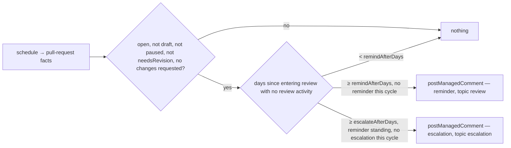

# reviews — when a pull request has waited on its reviewers, say so to the reviewers

Reminds the people whose turn it is, after a pull request has sat ready for review with no review
activity for a configured number of days, and escalates once to a second principal after longer.
Acts on maintainer staleness only: a pull request awaiting review — the `needsReview` meaning, or
ready-for-review mode without `needsRevision` — is the reviewers' wait, and this is the mirror of
`inactivity`, which acts on the contributor's.
Never closes, never labels, never reminds the author. Never touches a draft, a paused item, or a
pull request with changes requested — that clock is `inactivity`'s.
A review by a bot is not a review here: an automated reviewer's approval, request for changes or
comment neither resets the clock nor ends a cycle, so a pull request only bots have looked at is
still waiting.
One reminder and one escalation per review cycle; a review landing starts a fresh cycle.

## What the config looks like

```yaml
capabilities:
  reviews:
    enabled: true
    settings:
      remindAfterDays: 7 # no review activity for this long, counted from entering review
      escalateAfterDays: 21 # optional — a second, stronger ping; must exceed remindAfterDays by MIN_GRACE_DAYS
      notify: reviewersTeam # who the reminder addresses when the pull request names no reviewers
      escalateTo: maintainerTeam # optional — the escalation's addressee
      exemptWhen: [blocked] # meanings that pause the clock

mappings:
  labels:
    needsReview: "status: needs review"
    needsRevision: "status: changes requested"
    blocked: "status: blocked"

principals:
  reviewersTeam: "hiero-ledger/hiero-sdk-python-reviewers"
  maintainerTeam: "hiero-ledger/hiero-sdk-python-maintainers"
```

If the pull request names requested reviewers, the reminder addresses them by login and the team is
not pinged; with none, it addresses `notify`. `escalateAfterDays` without `escalateTo` is reported as
unusable. Days resolve as everywhere: a stated value, else the default; `escalateAfterDays` must
exceed `remindAfterDays` by the platform's minimum grace.

## How it works



| Clock | Starts | Resets | Read from |
|---|---|---|---|
| waiting for review | the pull request entered review — marked ready, or the `needsReview` meaning arrived, or the last human review was dismissed | a review submitted, or a review comment left, by a HUMAN — anyone `isAutomationActor` answers false for; a bot's review or comment is ignored, whatever its verdict | the `review` group: `awaitingReviewSince`, and the review activity as `{ login, at }` entries, so the capability can ask the actor resolver about each |

A pull request with one or more human approvals that GitHub still reports as `REVIEW_REQUIRED` is
**partially approved**: the wait is the same, but the reminder addresses only the requested
reviewers who have not reviewed, names the approvals it has, and says one more pass is what stands
between it and the queue. The count protection requires is stated only when the branch rules can be
read; the boolean is enough to say "more required".

Human reviewer comments reset the clock; the author's own comments and commits do not — a push while
waiting is still waiting — and neither do a bot's reviews or comments, however many. An undetermined
actor (the resolver could not answer) is treated as a bot: unknown never counts as a human review. Reminders are cycle-scoped: a review landing ends the cycle, and the next
wait, if any, earns a fresh reminder.

The reminder, addressed to the requested reviewers:

> 👀 @bob @carol — this pull request has been ready for review for 7 days with no review activity.
> When you have a moment, a first pass would unblock @alice. If it should wait, a comment saying why
> stops these reminders.

The reminder, with no reviewers named:

> 👀 @reviewers-team — this pull request has been ready for review for 7 days with no review
> activity and names no reviewer yet. Could someone pick it up, or assign a reviewer?

The reminder, partially approved (approved by @bob, @carol still requested):

> 👀 @carol — @bob has approved this pull request and branch protection asks for one more review
> before it can merge. It has waited 7 days since that approval; a second pass would let @alice
> merge.

The escalation:

> ⏰ @maintainers-team — this pull request has now waited 21 days for a review. It was reminded on
> **2026-09-17**. A decision either way — review, reassign, or close with a reason — would help
> @alice plan.

## Phases

| Phase | Ships | Needs first |
|---|---|---|
| 1 | the reminder and the escalation | the sweep's `review` group carrying `awaitingReviewSince`, the review activity as `{ login, at }` entries (reviews and review comments, so bots can be filtered by the actor resolver rather than by the sweep guessing), and the requested reviewers' logins — two reads (`GET /pulls/{n}/reviews`, `GET /pulls/{n}/requested_reviewers`) and the GraphQL `reviewDecision` field, none yet in the endpoint matrix; the required-approvals COUNT needs the branch rules read, optional and permission-gated · `mention` accepting several logins as well as a principal |
| 2 (candidate) | a weekly digest to the team of everything waiting | a cross-item read the platform does not have |

## Declaration

| Field | Value |
|---|---|
| `triggers` | `schedule` |
| `facts` / `needs` | `pullRequest`, needing `review` and `readiness` |
| `resolvers` | `isAutomationActor` (exists) |
| `intents` | `postManagedComment` (`notice`; topics `review` and `escalation`) |
| `requiredMappings` | `labels.needsReview` when the meaning is the entry signal; `blocked` only if named in `exemptWhen` |
| Permissions | repository: `pull_requests:read`, `issues:write` · organization: none |
| `operationalNeeds` | schedule: true · durableState: none — cycle scoping is the review's own timestamps · crossItemCoordination: false · externalDelivery: false |

## Verified by

| Scenario | Proves |
|---|---|
| Ready for review, 7 days, no activity, two requested reviewers | one reminder addressing both by login; the team is not pinged |
| Ready for review, 7 days, no reviewers named | the reminder addresses `notify` |
| Human reviewer leaves a comment on day 5 | the clock resets; no reminder |
| A bot review (approval or changes requested) on day 3, nothing else | no reset — the reminder posts on day 7 as if no review had happened |
| Every review on the pull request is a bot's | the pull request is still unreviewed; reminder and escalation both proceed |
| One human approval, `reviewDecision` still `REVIEW_REQUIRED`, one reviewer outstanding | the reminder addresses the outstanding reviewer only, names the approval, asks for one more |
| One human approval, no reviewers outstanding, still `REVIEW_REQUIRED` | the reminder addresses `notify` and says another reviewer must be assigned |
| Approvals satisfy protection (`reviewDecision` `APPROVED`) | nothing — the wait is now the merge, not the review |
| Branch rules unreadable | the reminder says "more required" without a number |
| The actor resolver cannot say whether a reviewer is a bot | treated as a bot — unknown never counts as a human review |
| Author pushes a commit on day 5 | no reset — the wait is the reviewers' |
| Review submitted after the reminder | the cycle ends; a later wait earns a fresh reminder |
| 21 days, reminder standing | one escalation to `escalateTo`, naming the reminder's date |
| 21 days, no reminder was ever posted (a first sweep after a gap) | the reminder posts first; the escalation waits its own grace from that reminder |
| Draft pull request, however old | nothing |
| Changes requested | nothing — that clock is `inactivity`'s |
| Pull request gains `blocked`, `exemptWhen: [blocked]` | the clock pauses |
| Requested reviewer is a bot | addressed to the humans only; if none, to `notify` |
| Redelivered sweep, restart | one reminder, one escalation — identity per item and topic |
| `escalateAfterDays` without `escalateTo` | reported as unusable |
| `remindAfterDays: 7, escalateAfterDays: 7` | reported as unusable — the grace floor |
| `mode: dry-run` | the reminder named as `wouldApply`; nothing posted |
