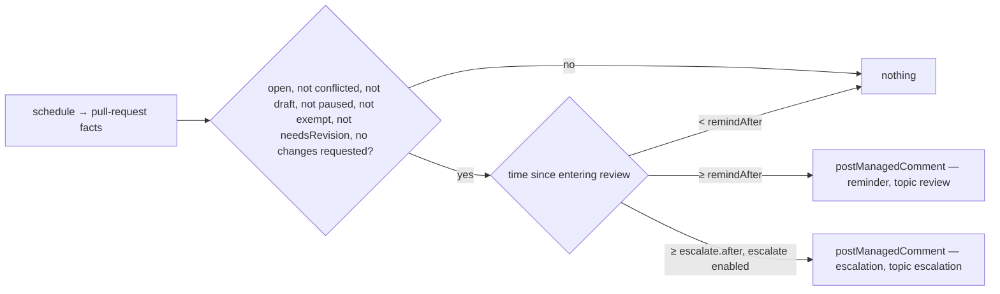

# reviews — when a pull request has waited on its reviewers, say so

Not built: phases 1, 2, 3, 4, 5.

## What the output looks like

Both are addressed by the platform, which prefixes the principal's handle
(`capability/managed.ts` → `addressManagedComment`), so neither body names anybody itself.

The reminder:

> @reviewers-team — 👀 This pull request has been waiting for review for 7 days with no reviewer
> motion. A first pass would unblock @alice. If it should wait, saying why here stops these
> reminders.

The escalation:

> @maintainers-team — ⏰ This pull request has now waited 21 days for a review. A decision either
> way — review, reassign, or close with a reason — would help @alice plan.

Each comment prints its own THRESHOLD rather than a running total. A managed comment is rewritten in
place, so a running total would edit the same comment every day and notify nobody about any of it.

## What the config looks like

```yaml
capabilities:
  reviews:
    enabled: true
    remindAfter: 7d # no review for this long, counted from entering review
    notify: reviewersTeam # who the reminder addresses
    exemptWhen: [readyToMerge] # meanings that pause the clock — each must be mapped below
    escalate: # the second, stronger ping — off unless enabled
      enabled: true
      after: 21d # must exceed remindAfter by MIN_GRACE_HOURS
      to: maintainerTeam

mappings:
  labels:
    needsRevision: "status: changes requested"
    readyToMerge: "status: approved"

principals:
  reviewersTeam: "hiero-ledger/hiero-sdk-python-reviewers"
  maintainerTeam: "hiero-ledger/hiero-sdk-python-maintainers"
```

`notify` is required: a reminder with nobody to address is a comment nobody reads. Being required
means every document that enables this capability states it and declares the principal it names,
`docs/examples/full.yml` included (`design/guides/capability-kits.md` §3). The escalation is an
enabled-block rather than two optional keys, because "a clock without an addressee" is a cross-field
rule the settings toolkit refuses to state and a parked block cannot express (§3.3). Clocks are
durations — a whole number with a unit, `4h` or `14d` — and resolve as everywhere: a stated value,
else the default. `escalate.after` must exceed `remindAfter` by the platform's minimum grace, and
its target is resolved by walking outward from the block, so `after` inside `escalate:` is compared
against the `remindAfter` beside the block (§3.1).

Two things about `exemptWhen` the block above does not show. A meaning named there must be one this
repository has mapped, or the whole file is rejected — that is the settings toolkit's rule for every
meaning list, not this capability's choice. And `blocked` is the one meaning it never needs to name:
`blocked` is the platform's pause, so a pull request carrying it stops every clock whatever
`exemptWhen` says. The key earns its keep on the meanings the platform does NOT pause on, which is
why the example teaches it with `readyToMerge`: a pull request that has been reviewed and waits on a
merge is not the reviewers' wait this capability is about.

## How it works

Reminds the people whose turn it is, after a pull request has sat waiting for review for a
configured length of time, and escalates once to a second principal after longer.
Acts on maintainer staleness only: a pull request awaiting review — ready for review, with no
changes requested and no `needsRevision` — is the reviewers' wait, and this is the mirror of
`inactivity`, which acts on the contributor's.

Never closes, never labels, never addresses the author. Never touches a draft, a paused item, or a
pull request with changes requested — that clock is `inactivity`'s. One reminder and one escalation
per item: a managed comment's identity is per item and topic, so each is posted once and rewritten
in place afterwards.



| Clock | Starts | Resets | Read from |
|---|---|---|---|
| waiting for review | the pull request entered its current mode — marked ready for review, a review was requested, or it was opened | nothing this capability can see | `review.reapableSince` |

The clock is `review.reapableSince`, which the sweep computes as the newest of the pull request's
mode events (`ready_for_review`, `review_requested`, `convert_to_draft`), its newest
changes-requested review, and the moment it was opened. For a pull request that reaches this
capability at all — not draft, no changes requested — that date is the moment it entered review,
which is the clock the design wants.

What it is NOT is a clock a review resets. The `review` group carries no review activity
(`packages/core/src/capability/catalogue.ts`), so a human approval or review comment leaves this
capability's clock exactly where it was, and the reminder keeps standing until the pull request
leaves the waiting state. Everything the wait-resetting story needs is in Phase 2 below. An
approval that does not change the pull request's mode is therefore invisible here; the comment is
updated in place rather than repeated, so the cost of the gap is a stale sentence, never a second
ping.

The author is named in the body and is never the addressee: the reminder is the reviewers' to act
on, and the author is who the wait is costing.

| Phase | Ships | Needs first |
|---|---|---|
| 1 | the reminder and the escalation, on `review.reapableSince`, addressed to a principal | nothing — the `review` group's three reads are rows in `design/findings/endpoint-permission-matrix.md`, so the sweep fills the group. What is missing is the capability itself |
| 2 | the clock a human review resets, and the bot filter | review activity as `{ login, at }` entries on the `review` group — a fact-shape change: the field on both interfaces, every producer's row and every fixture. The endpoint is not the gap: `GET /pulls/{n}/reviews` is a confirmed row and the sweep already sends it |
| 3 | the reminder addressed to the requested reviewers by login | `mention` accepting several logins as well as a principal (`IntentCatalogue`), and `GET /pulls/{n}/requested_reviewers` in the matrix |
| 4 | partial approval — "one more pass" | GraphQL `reviewDecision` on the `review` group, and the branch rules read for the required-approval COUNT, permission-gated |
| 5 (candidate) | a weekly digest to the team of everything waiting | a cross-item read the platform does not have |

| Declaration | Value |
|---|---|
| `triggers` | `schedule` — no webhook carries the timeline this clock is read from |
| `facts` / `needs` | `pullRequest`, needing `review` (the clock and the changes-requested state) and `readiness` (draft). A producer that read less — a webhook — is a `factsUnread` skip |
| `resolvers` | none. `isAutomationActor` is Phase 2's, and it has no input until the record carries review activity |
| `intents` | `postManagedComment` (`notice`; topics `review` and `escalation`) |
| `requiredMappings` | none. `needsRevision` is a guard over what this repository happens to have mapped: unmapped means never observed, never a refused file. `exemptWhen` is the other way round — a meaning listed there and not mapped is `settingInvalid` and the file is rejected, which is the meaning list's own rule (`design/guides/capability-kits.md` §3) rather than a declaration demand |
| Permissions | repository: `pull_requests:read` (the sweep's own reads) and `issues:write` (the comment, `capability/operations/postManagedComment.ts`) · organization: none |
| `operationalNeeds` | schedule: true · durableState: none — one comment per topic per item is the platform's own identity · crossItemCoordination: false · externalDelivery: false |

`sweep` reads `assignees`, `links`, `review` and `readiness` on a pull request, so both needed
groups are on the schedule's row and the declaration boots. `pull_request` reads `readiness` alone,
which is why no webhook trigger is declared.

## Verified by

| Scenario | Proves |
|---|---|
| Waiting for review, 7 days | one reminder, addressed to `notify` |
| Waiting for review, 6 days | nothing — the clock has not run out |
| Waiting 14 days, escalation enabled with `after: 21d` | the reminder alone — the wait between the two clocks is the reminder standing, not a second comment |
| Waiting 21 days, escalation enabled | the reminder and the escalation, two topics, one item |
| Waiting 21 days, escalation not enabled | the reminder alone |
| Draft pull request, however old | nothing |
| Changes requested | nothing — that clock is `inactivity`'s |
| Carrying `needsRevision` | nothing — that clock is `inactivity`'s |
| Pull request gains `readyToMerge`, `exemptWhen: [readyToMerge]` | nothing — the setting pauses a clock the platform would have kept running |
| Pull request gains `blocked`, `exemptWhen: [blocked]` | the clock pauses — but on the platform's own pause, not on the setting |
| Pull request gains `blocked`, `exemptWhen` empty | the clock pauses anyway, which is what proves the row above tests the platform rather than the key |
| Merged pull request, however old | nothing |
| Conflicted projection | nothing — there is no position to judge |
| A review lands and the pull request keeps waiting | the reminder still stands: no fact records the review (Phase 2) |
| Redelivered sweep, restart | one reminder, one escalation — identity per item and topic |
| `escalate.after` equal to `remindAfter` | rejected with the file — the grace floor |
| `escalate` enabled with no `to` | rejected with the file |
| `notify` naming a principal the file does not declare | rejected with the file |
| `mode: dry-run`, reminder alone | `modeRecordsOnly` and one `wouldApply` naming the reminder; nothing posted |
| `mode: dry-run`, both clocks run out | two intents, so `wouldApply` TWICE — one per topic, each after its own verdict; nothing posted |
