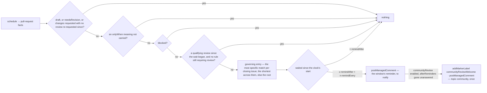

# reviews — when a pull request has waited on its reviewers, say so

Not built: phase 1.

## What the output looks like

The reminder:

> @security-team @reviewers-team — 👀 This pull request has waited 3 days for a review. It closes
> #1632 (Urgent · Bug).

The reminder again, `remindEvery` later, as a NEW comment — a rewrite notifies nobody:

> @security-team @reviewers-team — 👀 This pull request has waited 24 days for a review. It closes
> #1632 (Urgent · Bug).

On a branch whose rule still wants review after one approval, for issues carrying no priority:

> @reviewers-team — 👀 This pull request has waited 7 days for a review. 1 approval so far; the
> branch rule still requires review. It closes #1640 (no priority · Feature).

The community invitation, once, posted with the reminder after `afterReminders` unanswered ones, as
the repository's `communityReviewWelcome` label goes on. Nobody is addressed — a team of outsiders
cannot exist in the organization — so the label is the outreach and the comment is the explanation:

> 🙌 This pull request has waited 28 days for a review. Community reviews are welcome here. It
> closes #1640 (no priority · Feature).

Every reminder after the invitation ends with the same welcome:

> @reviewers-team — 👀 This pull request has waited 28 days for a review. It closes #1640 (no
> priority · Feature). Community reviews are welcome here.

Each comment prints its own THRESHOLD rather than a running total. A change of addressee or of an
issue's priority rewrites the comment it belongs to in place; neither is part of its identity.

## What the config looks like

The smallest policy — one team, the default clock:

```yaml
capabilities:
  reviews:
    enabled: true
    notify: reviewersTeam # required — who the reminder addresses; remindAfter defaults to 7d

principals:
  reviewersTeam: "hiero-ledger/hiero-sdk-python-reviewers"
```

The full policy — the defaults first, then the clocks and teams that follow GitHub's own priority
and type:

```yaml
capabilities:
  reviews:
    enabled: true
    remindAfter: 7d # default 7d — waited this long for a review, counted from entering review
    remindEvery: 21d # default 21d — remind again this long after each reminder, until a review lands
    notify: [reviewersTeam, sdkLeads] # one principal or a list; every name must be declared below
    onlyWhen: [needsReview] # meanings a pull request must carry to be considered; empty = every pull request in review
    communityReview: # default off — absent, or enabled: false, and only owners, members and collaborators count
      enabled: true
      afterReminders: 1 # default 1 — once this many reminders went unanswered: label it and invite the community once; their reviews then restart the clock
    byPriority: # keyed by the Priority field's options, spelled as GitHub shows them
      Urgent:
        remindAfter: 1d
        remindEvery: 3d
        notify: [securityTeam, maintainerTeam] # this entry's addressees, replacing the root list
        byType: # the pair — an urgent bug, as distinct from an urgent anything
          Bug:
            remindAfter: 1h # hours are clocks too; the sweep's cadence (default hourly) is how soon an hour is seen
      Low:
        remindAfter: 60d
    byType: # keyed by issue type names, spelled as GitHub shows them
      Bug:
        remindAfter: 3d

mappings:
  labels:
    needsReview: "status: needs review" # something must APPLY it — a human, or prDashboard's label mode once built
    needsRevision: "status: changes requested"
    communityReviewWelcome: "community review welcome" # required when communityReview is enabled; created in the repository if missing

principals:
  reviewersTeam: "hiero-ledger/hiero-sdk-python-reviewers"
  sdkLeads: "hiero-ledger/hiero-sdk-leads"
  securityTeam: "hiero-ledger/hiero-security"
  maintainerTeam: "hiero-ledger/hiero-sdk-python-maintainers"
```

Priority and type are GitHub's native issue fields, never labels, read from the issues the pull
request closes in this repository — a pull request carries no fields of its own, and one that closes
none runs on the root clocks. An organization spells its own options (Urgent, High, Medium, Low and
Bug, Feature, Task are the defaults, and both are editable), so the keys of `byPriority` and
`byType` are those spellings and there is nothing to map. The price is that a misspelt key never
matches and is never refused — no offline check can know an organization's options — so keys match
case-insensitively and trimmed, `configReport` prints every key the App read, and the reminder
restates the values it saw.

Which entry governs: for each closing issue, the most specific entry it matches — a priority entry's
own `byType` entry, else the priority entry, else the top-level type entry, else the root — and
across several closing issues, the one with the shortest `remindAfter`. That entry's `remindEvery`
and `notify` apply with it, each falling back outward where the entry sets none; entries are never
merged. Above, an urgent bug is reminded about after an hour, an urgent feature after a day, a
medium bug after three days, and anything else after seven.

`notify` is required — a reminder with nobody to address is a comment nobody reads — so every
document that enables this capability states it and declares each name it lists
(`design/guides/capability-kits.md` §3). Clocks are durations, resolved most-specific-first (§3.1),
floored at an hour — the sweep's own cadence, so `0h` is refused and no cadence is "every sweep" —
and honoured at the first sweep after they run out. `blocked` is not the platform's pause, so the
capability honours it itself: a pull request carrying it is never reminded about.

## How it works

Reminds the people whose turn it is, after a pull request has sat waiting for review for a
configured length of time, and again on a cadence for as long as nobody reviews it. The wait is the
reviewers': a pull request offered for review that no reviewer has answered. This is the mirror of
`inactivity`, which acts on the contributor's wait. A repository that wants the two partitioned by
one meaning says so with `onlyWhen: [needsReview]` — `inactivity` already steps aside for anything
carrying it — and owes that label a writer: nothing ships today that applies it, so a mapping alone
would silence this capability, which is why the handoff is a stated setting and never inferred.

Never closes, never sets a position, never addresses the author. Never touches a draft, a paused
item, or a pull request waiting on its author — that clock is `inactivity`'s. Nothing this
capability posts ever stops the clock: only a review does.

**What counts as a review is what GitHub counts, from someone inside the repository:** a submitted
review — an approval, a request for changes, or a review comment, including a single inline comment,
which GitHub wraps in a review of state `COMMENTED` — whose author GitHub labels an owner, an
organization member, or a collaborator (`author_association` on the review itself; triage permission
is a collaborator). Not the author, not a bot, and — until the community is invited — not a
contributor or an unaffiliated account: on a public repository anyone can submit a review, GitHub
shows it and counts it for nothing, and by default neither does this. No role is read — the label
rides on the review. A comment in the conversation is not a review and moves nothing; a pending
review is invisible to everyone but its writer; a dismissed review was still given.

**What a review does depends on GitHub's own review decision.** Where a branch rule requires
reviews — two approvals, a code owner's — GitHub computes `reviewDecision`, and the capability reads
no rule and no CODEOWNERS file: while the decision is "review required", a qualifying review
RESTARTS the clock rather than stopping it, and the reminder restates how many approvals stand (per
reviewer, their latest deciding review); "approved" stops it; "changes requested" is the author's
wait. Where no rule requires reviews the decision is null, whatever reviews exist, and a qualifying
review stops the clock.

**The community is a repository's opt-in, and a stage, not a default.** With `communityReview`
enabled, a pull request whose reminders have gone unanswered `afterReminders` times earns, with the
next reminder, one invitation — topic `community`, addressed to nobody — and the
`communityReviewWelcome` label; from then, a review from anyone but the author or a bot RESTARTS
the clock for that pull request — never stops it, on any branch, because only someone inside can
merge — and every later reminder carries the welcome. The comment explains in the
thread; the label is what reaches anyone else, through a search, its own page, or a chat
integration filtered on it. The label is on exactly while the invitation stands: it comes off once
any review has restarted or stopped the clock since it went on or the pull request leaves the
reviewers' wait, and
goes back on if the clock restarts and the reminders run unanswered again; a human who takes it off
is obeyed. It is a MARKER, not a position — it sits beside `needsReview` the way `blocked` does
(D28). Counting reminders rather than days is what makes the stage follow the priority: on the
`Urgent` entry above the community is asked on day 4, on `Low` on day 81, with one number. A
community review satisfies no rule and merges nothing, so it buys time and the approval is still
owed: the maintainers are reminded again after `remindAfter` if nobody inside answers. Community
reviews quieten the reminders without shrinking the backlog — a repository that enables this has
changed the signal, not the wait.



| Clock | Starts | Stops | Read from |
|---|---|---|---|
| waiting for review | the newest of: opened, marked ready for review, a review requested — a re-request after changes were requested puts the ball back with the reviewers — and, while the decision is "review required", the newest qualifying review | a qualifying review after the start where no rule requires review; the decision "approved" where one does. A commit does not restart it: a push while nobody asked for changes is the author working ahead, and the reviewers are re-asked by a review request, not by a push | `review.awaitingReviewSince` · `review.lastReviewAt` · `review.decision` · `review.approvals` |

Windows open at the clock's start plus `remindAfter`, then every `remindEvery`. Each window's
reminder is a new comment whose topic is the window's opening instant — never an ordinal, which a
restarted clock would repeat and so rewrite in silence — and that instant is the intent's occasion
(D190), so two sweeps with nothing changed build the same effect id. A pull request that reaches
the capability several windows in earns the current window's reminder alone; a changed cadence
recomputes the windows, and one already posted is never posted again. Explanation summaries:
"Reminded the reviewers about a pull request waiting on them.", "Invited the community to review
this pull request.", "Marked this pull request as welcoming community review." and its removal.

| Declaration | Value |
|---|---|
| `triggers` | `schedule` — no webhook carries the timeline or the reviews this clock is read from |
| `facts` / `needs` | `pullRequest`, needing `review` (the clock, the last review, the decision), `readiness` (draft) and `links` (the closing issues' priority and type). A producer that read less — a webhook — is a `factsUnread` skip; `sweep` reads all three |
| `resolvers` | none — reviewers' bot flags are on each review as the sweep reads it, and a bot-authored pull request is reminded about like any other: it waits the same |
| `intents` | `postManagedComment` (`notice`; topics the window instant and `community`; `mention` one principal or several) · `addMarkerLabel` and `removeMarkerLabel` (`communityReviewWelcome`) |
| `requiredMappings` | `communityReviewWelcome` when `communityReview` is enabled — the stage cannot label with no spelling to write. `needsRevision` is a guard over what the repository happens to have mapped; `onlyWhen` naming an unmapped meaning is the meaning list's own refusal |
| Permissions | repository: `pull_requests:read`, `issues:read` (the closing issues' fields) and `issues:write` (the comments and the label) · organization: none |
| Platform needs | durableState: none — one comment per topic per item is the platform's own identity · crossItemCoordination: false · externalDelivery: false |

| Phase | Ships | Needs first |
|---|---|---|
| 1 | everything above | **Four fields on the `review` group**, a fact-shape change from reads the sweep already makes: `awaitingReviewSince`, folded from `ready_for_review` and `review_requested` on the timeline call that fills `reapableSince` (`packages/runtime/src/adapter/reads/facts.ts`, `readReapableSince`); `lastReviewAt` and `approvals`, from the reviews call that fills `changesRequested`; `decision`, from the GraphQL query that reads the closing issues — the first three under their existing rows in `design/findings/endpoint-permission-matrix.md`. **Two fields on `LinkedIssue`**, `priority` and `type`: the same `closingIssuesReferences` query asks `reviewDecision`, `issueType { name }` and the Priority value, and the changed query is a lab probe before a matrix row — which grant answers `issueFieldValues`, and whether a field edit delivers a webhook. **A list of teams on one comment**: `mention` widens to a string or a list, joined in `addressManagedComment`, and the toolkit gains a `principals()` reader — one constructor, its rule stated in `design/guides/capability-kits.md` §3. **A marker meaning**: `communityReviewWelcome` in `MEANING_FACTS` with a new flow, `marker`, which the projection carries beside the position instead of refusing as a second one and `meaningsOf` reports; `addMarkerLabel` and `removeMarkerLabel` over the add and remove endpoints the matrix already confirms; and one probe — whether adding a label the repository lacks creates it, which the documentation does not say. If not, `POST /repos/{o}/{r}/labels` needs its own matrix row and a create before the first add |

Not planned: addressing the reviewers GitHub requested, reading a rule's required count, business-day
clocks, and a weekly digest — each a read the platform does not have, and none needed for the job.

## Verified by

| Scenario | Proves |
|---|---|
| Ready 7 days, no review | one reminder, addressed to `notify`, no author named, each closing issue restated with its priority and type |
| Ready 6 days | nothing — the clock has not run out |
| `notify` lists two principals | one reminder, both handles prefixed, one effect id |
| Opened as a draft, marked ready 3 days ago, `remindAfter: 7d` | nothing — the clock runs from ready, not from opened |
| Ready 10 days ago, a review re-requested 2 days ago | nothing — a review request restarts the wait |
| Ready 10 days ago, a commit pushed yesterday, nothing requested | the reminder — a push does not restart the reviewers' wait |
| No branch rule; an insider approved, asked for changes, or left one inline comment after the wait began | nothing — each is a review GitHub counts |
| No branch rule; that review was later dismissed | nothing — it was still given |
| Rule wants two approvals; one insider approved 7 days ago | the reminder — the clock restarted at that approval, and the body says 1 approval so far |
| Rule wants two approvals; two insiders approved | nothing — GitHub says approved |
| Rule wants a code owner; a non-owner insider approved 7 days ago | the reminder — GitHub still says review required |
| Rule dismisses stale approvals; a push after the approval | the reminder in time — GitHub says review required again |
| One approval of two restarts the clock; 7 more days pass | a NEW reminder comment — the window instant, not an ordinal, is the identity |
| The author replied inline, creating a `COMMENTED` review of their own | the reminder — the author's review is not a reviewer's |
| A bot submitted a review; or anyone commented in the conversation | the reminder — neither is a reviewer's review |
| A collaborator with triage permission left a review comment | nothing — a collaborator at any level is inside |
| An account with no affiliation approved | the reminder — GitHub counts that approval for nothing, and by default so does this |
| A review submitted while the pull request was still a draft | the reminder — it predates the wait |
| Changes requested, nothing since | nothing — the wait is the author's, `inactivity`'s clock |
| Changes requested, then a review re-requested, no review since | the reminder — the re-request put the ball back with the reviewers |
| Ready 27 days, `remindEvery: 21d` | the first reminder alone — the second window opens at 28 |
| Ready 28 days, `remindEvery: 21d` | a second reminder, a NEW comment saying 28 days; the first stands |
| Ready 49 days when the capability is first enabled, or after a restart | the current window's reminder alone, once — windows slept through are not posted |
| `remindEvery` shortened between sweeps | the newly opened window posts once; nothing already posted is posted again |
| `afterReminders: 1`, the second reminder is due, no counting review | the label goes on and one invitation is posted with that reminder, addressed to nobody |
| `afterReminders: 1` on an `Urgent` pull request, `remindAfter: 1d`, `remindEvery: 3d` | the invitation on day 4 — the stage follows the entry's cadence |
| `afterReminders: 0` | the invitation with the first reminder |
| An insider's review lands before the second reminder | no invitation — the community is asked only when nobody inside answered |
| A community review the day before the invitation | the reminder — it did not count yet |
| A community review after the invitation, no branch rule | the clock restarts and the label comes off; the maintainers are reminded again `remindAfter` later |
| A community review after the invitation, a rule wanting an approval | the same, and the reminder says 0 approvals so far — it satisfies no rule |
| The label goes on beside `needsReview` | no conflict — a marker is not a position |
| The clock restarts on a protected branch and the reminders run unanswered again | the label goes back on; no second invitation |
| A human removes the label while the invitation stands | it stays off — the human change survives |
| The repository has no label spelled as mapped | it is created on first use, or the probe says the App must create it first |
| `communityReview` enabled with no `communityReviewWelcome` mapping | rejected with the file |
| Closes an Urgent Bug, `Urgent.byType.Bug: 1h`, ready 1 hour, sweep fires | the reminder — the pair entry governs, and the `Urgent` entry's cadence and teams with it |
| Closes an Urgent Feature, `Urgent: 1d`, `Bug: 3d` | the `Urgent` entry — no pair entry matches, and priority beats a top-level type |
| Closes an Urgent issue and a Low issue | the `Urgent` entry — the shortest clock across every closing issue |
| Closes a Medium Bug, `Medium` unset, `Bug: 3d`, waited 3 days | the reminder on the type entry |
| The `Urgent` entry sets no `notify` | the root teams |
| Closes no issue, or issues with neither field set, or issues in another repository | the root clocks and teams; "no priority" printed |
| `byPriority` key spelled unlike any option the organization has | never matches, never refused — `configReport` names the key |
| Key `urgent` against the option `Urgent` | matches — case and surrounding space are not spelling |
| A closing issue's priority changes after the reminder | the same comment, rewritten with the new value; the clock it governs may shorten |
| `onlyWhen: [needsReview]`, pull request not carrying it | nothing — the stated handoff |
| `onlyWhen` empty, `needsReview` mapped but never applied, ready 7 days | the reminder — a mapping alone silences nothing |
| Authored by a dependency bot, ready 7 days | the reminder — a waiting pull request is a waiting pull request |
| Carrying `blocked` | nothing — a human said wait |
| Merged or closed pull request, however old; or a conflicted projection | nothing — never reaches the capability, or has no position to judge |
| Redelivered sweep, restart, or two sweeps with nothing changed | one reminder per window — identity per item and window, occasion at the window's start |
| `notify` absent, or naming an undeclared principal, or `onlyWhen` naming an unmapped meaning | rejected with the file |
| `remindEvery: 0h`, or `remindAfter: 0h` | rejected with the file — the hour floor |
| Enabled on a repository with forty pull requests already waiting | each earns its current window's reminder, as many per sweep as the write cap allows, the rest on the next firing |
| `mode: dry-run` | `modeRecordsOnly` and one `wouldApply` per intent; nothing posted, nothing labelled |
