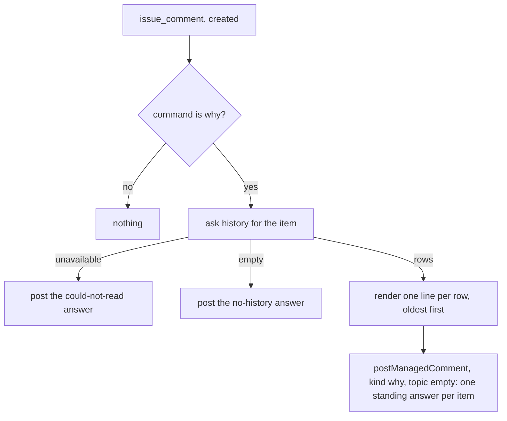

# why — when someone asks, say what the platform did to this item and why

Not built: phases 1, 2.

## What the output looks like

The answer on an item with a history, one standing comment rewritten on every ask:

> 👋 @alice — here is what I have done on this pull request, oldest first.
>
> - 12 Sep, 09:53 UTC — `inactivity` warned: this pull request has been in draft without
>   development activity; the close follows the grace.
> - 12 Sep, 14:29 UTC — `inactivity` closed this pull request.
> - 12 Sep, 14:32 UTC — `inactivity` decided nothing: a person reopened it, and a human change is
>   never fought.
>
> The rules that fired live under `capabilities.inactivity` in this repository's automation
> configuration; a maintainer changes them there.

The answer on an item with no history:

> 👋 @alice — I have not decided anything about this issue in the last 30 days.

The answer when history exists but the platform could not read it:

> 👋 @alice — I could not read my own record of this issue just now; ask again in an hour.

Every line interpolates only what the `history` resolver returns: the instant, the deciding
capability's name, and the sentence that capability wrote when it decided (the decision row's
`detail`, which is the capability's own summary) or the act's kind. A refusal's code is rendered
through the same words `docs/troubleshooting.md` locks. Nothing names a label spelling, a login other
than the asker's, or a configuration line.

## What the config looks like

The only policy is on or off; the command word is a mapping, as every command is:

```yaml
capabilities:
  why:
    enabled: true
mappings:
  commands:
    why: "/why" # the word a person types; unmapped means the capability never wakes
```

How far back an answer looks is a duration on the capability, defaulting to thirty days:

```yaml
capabilities:
  why:
    enabled: true
    lookback: 30d # answers cover decisions and acts within this window; at most 20 of each
```

## How it works

Acts on: an `issue_comment` whose created comment is the mapped `why` command, on an issue or a pull
request. Never acts on: edits, comments carrying any other word, sweeps, and anything in `observe`
or `dry-run` mode, where the answer is recorded and not posted, like every managed comment.



| Declaration | Value |
|---|---|
| `triggers` | `issue_comment` (created) |
| `facts` / `needs` | `issue` and `pullRequest`, needing `command`. The `issue_comment` producer reads `command` on an issue; on a pull request it produces no record today — phase 1 below |
| `resolvers` | `history` — the item's decision rows and facts within the lookback, newest first, capped at 20 of each; answered by the shell from its own ledger on both the live and the credential-free path, never by GitHub |
| `intents` | `postManagedComment`, kind `why`, topic `""`: one comment per item and purpose, rewritten in place (D145) |
| settings | `enabled`; `lookback`, a `duration` |
| `requiredMappings` | `commands: ["why"]` |

| Phase | Ships | Needs first |
|---|---|---|
| 1 | the answer on issues | `why` in `COMMANDS` (a registry row); `why` in `MANAGED_COMMENT_KINDS` (a registry row); the `history` resolver (a registry row and its shell answer, no confirmed endpoint needed) |
| 2 | the answer on pull requests | the `issue_comment` producer emits a `pullRequest` record when the issue carries `pull_request`, with `command` and `readiness` read and `review`, `assignees`, `links` unread — a fact-shape change: a producers row and every fixture that asserts the refusal today |

Gaps named by cost: two registry rows and one resolver for phase 1; one fact-shape change for
phase 2, which also lets the mapped `working` command reach a pull request by webhook.

## Verified by

| Scenario | Proves |
|---|---|
| a created comment with the mapped word on an issue with rows | one `why` comment, oldest first, each line from a row's own sentence |
| the same word in an edited comment | nothing |
| any other mapped command | nothing |
| the word unmapped in `mappings.commands` | the capability never wakes; the config report says why |
| an item with no rows in the lookback | the no-history answer, and no second comment on a second ask |
| a second ask a day later | the same standing comment rewritten, never a second one (D145) |
| `history` answers `unavailable` | the could-not-read answer; nothing else recorded |
| a row whose detail carries a mention or markdown | rendered inert; no mention fires, no link forms |
| `dry-run` | the comment recorded as `wouldApply`, nothing posted |
| kill switch active | refused `killSwitch`, nothing posted |
| twenty-one decisions in the window | twenty rendered, the oldest dropped, the comment says it was cut |
| a comment on a pull request (phase 2) | a `pullRequest` record with `command` read and the review groups unread; the answer posts |
