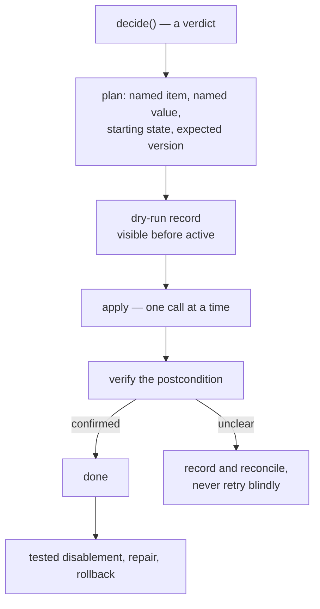

# The effect write path

> **Not built — build guide.** No code applies a repository change. What the safety engine already
> enforces is [`../contracts/safety.md`](../contracts/safety.md); everything below is the half that
> cannot be decided from a single request.

- The clock-triggered destructive door DOES exist — `packages/core/src/safety/destructive.ts`.
- Its warning, grace and cancellation gates are tested.
- But **no catalogued operation reaches it**: `decide()` produces no destructive request.
- The door is therefore unreachable in the running system.
- The gates below are requirements on a future executor, not live behaviour.

## Ground rules

Five write rules the engine cannot judge — requirements on the executor and adapter, not on a verdict.

| Rule | Requirement | Why not a verdict |
|---|---|---|
| Name the change | Name the exact item and value | Only the adapter's call proves it |
| Verify | Read back and confirm the state | Needs a second call |
| Reconcile | Record the unclear, never retry blind | Needs the response and record |
| Tested reversal | Disablement, repair, rollback paths | Process evidence, not runtime |
| Dry-run first | Appear in dry-run before going active | A rollout property, two runs |

- The adapter removes only the named values it manages — never every label under a prefix.
- The request is a promise; the call is the proof.
- Every operation needs its tested disablement, repair, and rollback path.
- Dry-run must show the operation before it becomes active in a new environment.

## Clock-triggered destructive actions

- A clock-triggered action never occurs on its first stale observation.
- The capability requests a warning; the platform records it before the grace period begins.
- The warning states the observed inactivity and the earliest action time.
- It states the command or action that cancels the plan, and what reverses it later.

Before the final action, the executor confirms all five facts.

- The item is still in the expected state.
- The affected person has not provided qualifying activity.
- The warning remains valid.
- The grace period has elapsed.
- No newer human action cancelled the plan.

- The warning factory copies the exact request it authorizes into a frozen primitive snapshot.
- Snapshot fields: action class, capability, dated-cause timestamp, item, change.
- It retains no request, target, or `Date` reference that later mutation could change.
- The final evaluator rejects a warning from another request, one recorded before its causal
  observation, or one whose earliest action time is shorter than the full grace period (D60).
- That much is implemented.
- Missing: a capability producing such a request, a store for the warning, an executor acting on it.

## Candidate Hiero profile actions

Candidate policy from the audited automation, for repositories that ask — never platform defaults.

| Candidate action | Capability | Candidate default | Reversal |
|---|---|---|---|
| Release a stalled assignment | `inactivity` | warn 7 days, unassign 21 | someone assigns again |
| Close a stalled PR needing revision | `inactivity` | warn 10 days, close 60 | reopen the PR |
| Lock a new issue for moderation | `intake` | immediate, only if enabled | maintainer unlocks |

- The contributor or a maintainer may assign the issue again.
- A maintainer or the author reopens the pull request when repository policy allows it.
- Locking is immediate only where the repository enabled moderation; a maintainer approves and unlocks.
- The configuration schema must set safe minimums.
- It must prevent a zero-day or negative grace period.
- `destructive.ts` enforces a `MIN_GRACE_DAYS` floor of 1, the weakest defensible reading.
- The number is a register decision, recorded as `FINDING(safety-grace-floor)` so it is never skipped.

## Pause and cancellation

- A repository may configure a mapped `blocked` meaning for a workflow profile.
- When present, the platform stops capability writes for that item.
- That half is built and reports `itemBlocked`.
- The profile must still decide whether removing the pause resets or resumes a clock.
- Global, installation, repository, and capability kill switches cancel new work.
- The engine reads one boolean.
- The executor must define how pending work is closed, retained, or reconciled after a switch fires.

## Multi-call effects

- One operation changing a label, assignee and comment uses several GitHub calls.
- The App cannot treat them as one transaction.
- The effect plan names the starting state and expected version of the facts it relies on, the call
  order, and the valid state after each partial step.
- It names safe retries, how a concurrent human change takes priority, how the final postcondition
  is verified, and how a restart finds and either continues or cancels the operation.
- The recovery experiment must stop the process after every call, with a concurrent human edit.
- No multi-call operation enters a real repository until the executor can tell an App-created
  partial state from a similar human-created one.

## Rollout requirements

- No destructive action runs in the first technical MVP.
- A destructive capability requires a separate review and personal-sandbox failure injection.
- It requires a Hiero Hackers sandbox soak, a consenting repository, and a practiced rollback.
- The old and new automation must never write the same managed state during migration.

## Verification

| Layer | Runs | Proves |
|---|---|---|
| Unit tests | CI | Plan shape, postcondition, reconciliation branches |
| Failure injection | Personal sandbox | Every call boundary survives a stopped process |
| Concurrency drill | Personal sandbox | A human edit mid-operation wins, and is detected |
| Sandbox soak | Hiero Hackers sandbox | Dry-run output matched what the active run did |

## Done when

- One reversible operation applies, verifies, and rolls back under failure injection.
- An unclear outcome produces a reconciliation record rather than a retry.
- Dry-run output for a new environment lists the operation before any active run performs it.
- A capability reaches `evaluateDestructive` with a stored warning, closing the gap this file names.

## Questions that remain open

- Maintainers must decide which destructive capabilities they want.
- The configuration design must decide safe timing floors and cancellation commands.
- The storage experiment must decide where warning and pending-effect records live.
- The effect executor must define rollback when GitHub returns an unclear result.
- Each profile must decide how a mapped pause affects clocks.
- The earlier proposal preferred a reset on unpause; maintainers have not ratified that policy.
- The project must define the clean observation period required before a destructive pilot.
