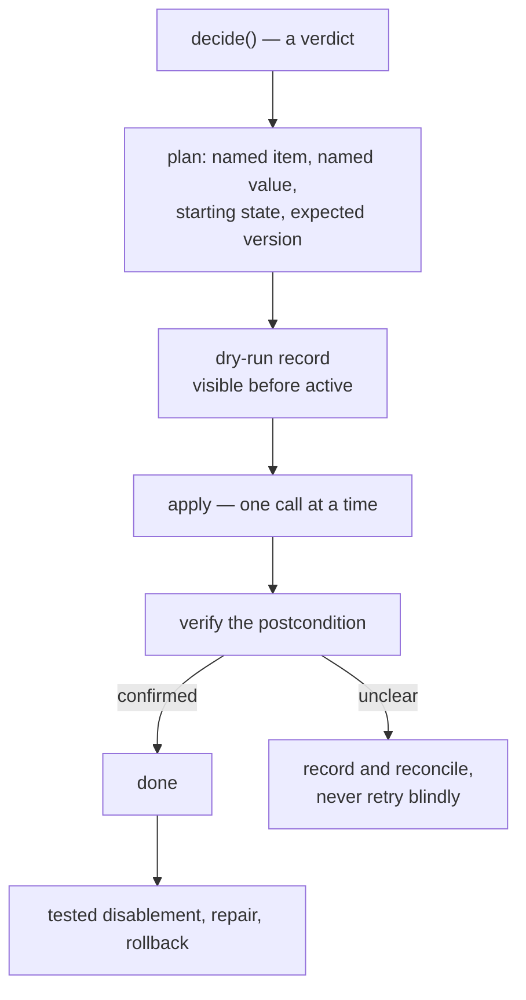

# The effect write path

> **Not built — build guide.** No code applies a repository change. What the safety engine already
> enforces is [`../contracts/safety.md`](../contracts/safety.md); everything below is the half that
> cannot be decided from a single request.

The clock-triggered destructive door DOES exist — `packages/core/src/safety/destructive.ts`, with its
warning, grace and cancellation gates tested — but **no catalogued operation reaches it**: `decide()`
produces no destructive request, so the door is unreachable in the running system. The gates below are
therefore requirements on a future executor, not a description of live behaviour.

## Ground rules

The five write rules the engine cannot judge. Each is a requirement on the executor and the adapter,
not on a verdict.

| Rule | Requirement | Why it cannot be a verdict |
|---|---|---|
| Name the change | The adapter names the exact item and value it may change. It removes only the named values it manages — never every label under a namespace prefix. | The request is a promise; only the adapter's call proves it. |
| Verify the postcondition | The adapter reads back and confirms the requested state after the write. | Needs a second call. |
| Reconcile the unclear | An unclear outcome is recorded and reconciled, never retried blindly. | Needs the response, and the recovery record. |
| Tested reversal | Every operation has a tested disablement, repair, and rollback path. | Process evidence, not a runtime fact. |
| Dry-run first | The operation appears in dry-run output before it becomes active in a new environment. | A property of the rollout, spanning two runs. |

## Clock-triggered destructive actions

A clock-triggered action never occurs on its first stale observation. The capability requests a
warning, and the platform records the warning before the grace period begins.

Before the final action, the executor confirms that the item is still in the expected state, the
affected person has not provided qualifying activity, the warning remains valid, the grace period has
elapsed, and no newer human action cancelled the plan.

The warning states the observed inactivity, the earliest action time, the command or action that
cancels the plan, and the action that reverses it later.

The warning factory copies the exact request it authorizes into a frozen primitive snapshot: action
class, capability, dated-cause timestamp, item, and change. It retains no request, target, or `Date`
reference that later mutation could change. The final evaluator rejects a warning from another request
and rejects a warning recorded before its causal observation or with an earliest action time shorter
than the full grace period (D60).

That much is implemented. What is missing is a capability that produces such a request, a store for
the warning, and an executor that acts on the verdict.

## Candidate Hiero profile actions

From the audited automation. Candidate policy for repositories that request the related capabilities —
not platform defaults.

| Candidate action | Capability | Current candidate default | Reversal |
|---|---|---|---|
| The App releases a stalled issue assignment. | `inactivity` | The App warns after 7 days and may unassign after 21 days. | The contributor or a maintainer assigns the issue again. |
| The App closes a stalled pull request that needs contributor revision. | `inactivity` | The App warns after 10 days and may close after 60 days. | A maintainer or author reopens the pull request when repository policy allows it. |
| The App locks a new issue pending moderation. | `intake` | The App acts immediately only when the repository enabled moderation. | A maintainer approves and unlocks the issue. |

The configuration schema must set safe minimums and must prevent a zero-day or negative grace period.
`destructive.ts` enforces a `MIN_GRACE_DAYS` floor of 1 as the weakest defensible reading; the number
is a register decision, recorded as `FINDING(safety-grace-floor)` so it cannot be silently skipped.

## Pause and cancellation

A repository may configure a mapped `blocked` meaning for a workflow profile. When present, the
platform stops capability writes for that item — that half is built and reports `itemBlocked`. The
profile must still decide whether removing the pause resets or resumes a clock. The earlier proposal
preferred a reset, but maintainers have not ratified that policy.

Global, installation, repository, and capability kill switches cancel new work. The engine reads one
boolean; the executor must define how pending work is closed, retained, or reconciled after a kill
switch activates.

## Multi-call effects

An operation that changes a label, assignee, and comment uses several GitHub calls, and the App cannot
treat them as one transaction. The effect plan must name the starting state and expected version of the
facts it relies on, the call order, the valid state after each partial step, safe retries, how a
concurrent human change takes priority, how the final postcondition is verified, and how a restart
finds and either continues or cancels the operation.

The recovery experiment must stop the process after every call and must include a concurrent human
edit. A multi-call operation cannot enter a real repository until the executor can distinguish an
App-created partial state from a similar human-created state.

## Rollout requirements

No destructive action runs in the first technical MVP. A destructive capability requires a separate
review, personal-sandbox failure injection, a Hiero Hackers sandbox soak, a consenting repository, and
a practiced rollback.

The old and new automation must never write the same managed state during migration.

## Verification

| Layer | Runs | Proves |
|---|---|---|
| Unit tests | CI | Plan shape, postcondition comparison, reconciliation branches |
| Failure injection | Personal sandbox | Every call boundary survives a stopped process |
| Concurrency drill | Personal sandbox | A human edit mid-operation wins, and is detected as such |
| Sandbox soak | Hiero Hackers sandbox | Dry-run output matched what the active run then did |

## Done when

- One reversible operation applies, verifies, and rolls back under failure injection.
- An unclear outcome produces a reconciliation record rather than a retry.
- Dry-run output for a new environment lists the operation before any active run performs it.
- A capability reaches `evaluateDestructive` with a stored warning, closing the gap this file names.

## Questions that remain open

- Maintainers must decide which destructive capabilities they want.
- The configuration design must decide safe timing floors and cancellation commands.
- The storage experiment must decide where warning and pending-effect records live.
- The effect executor must define rollback when GitHub returns an unclear result.
- Each profile must decide how a mapped pause affects clocks.
- The project must define the clean observation period required before a destructive pilot.
