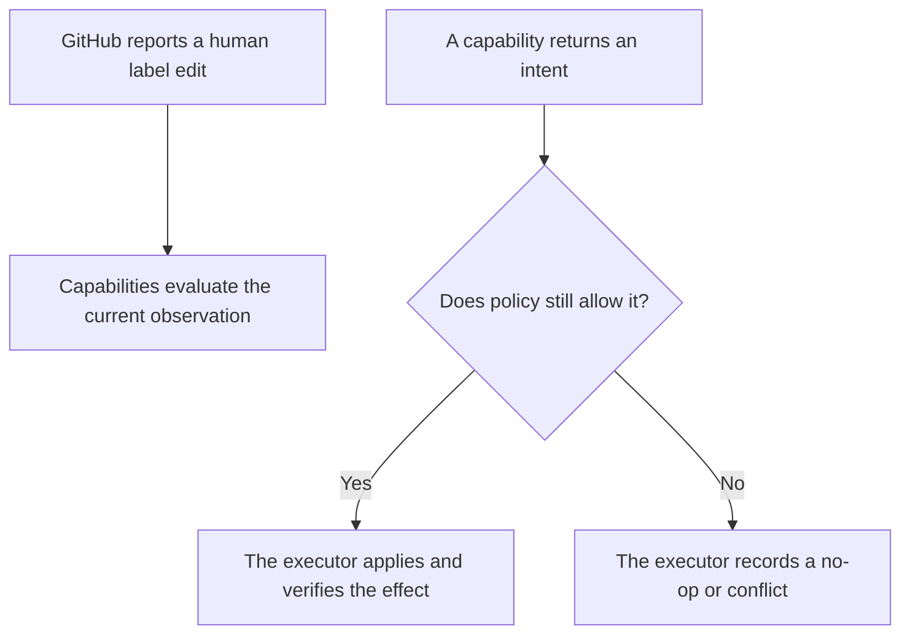

# Candidate Rules for Human Workflow Edits

> **Partly built.** `packages/core/src/workflow/project.ts` projects mapped labels and preserves conflicts;
> `packages/core/src/safety/rules.ts` enforces unknown/newer-human ordering as a refusal. Applying,
> verifying, recovering, and explaining a GitHub write remain future work.

- Candidate behavior for a repository that chose a profile with mapped position labels.
- These rules do not apply where a repository has not enabled that profile.
- Maintainers must approve the rules before the App writes any mapped position.
- The App treats a newer human decision as more important than an older automation decision.
- It leaves every unrelated label alone.

## 1. Human edits and capability requests follow different rules

- A person with repository permission may place an item directly into any configured position.
- A repository may enable one capability only and perform every earlier step by hand.
- The App must not force a human to walk through positions belonging to disabled capabilities.
- A capability may request only an intent its declaration allows.
- The platform then checks observation, configuration, actor permissions, and safety policy.
- A capability cannot use the adapter to bypass these checks.

## 2. The default rule preserves newer human intent

- The default policy must not remove a position a human applied after the intent's causal fact.
- Example: a stale scheduled evaluation must not undo a maintainer's deliberate move.
- Enforceable only when the intent carries a dated cause and the adapter has ordering evidence.
- A webhook delivery time is not enough — delivery can be delayed or reordered.
- Useful evidence: label event · command comment · review timestamp · repository-owned version.
- Without reliable ordering evidence, the safe default is a conflict and no change.
- One managed explanation is added or updated only when a maintainer can act on the conflict.
- The repository must also have enabled that output.
- Otherwise the conflict stays in operator diagnostics, with no repository comment.
- A repository may still choose a stricter policy later.
- Any strict gate must be configured, explained, and tested as a separate policy.
- It must not appear as an undocumented platform default.

## 3. Keep the first conflict policy small

The first version does not automatically repair combinations of mapped positions. It follows four rules.

1. It leaves unknown and unrelated labels alone.
2. It does not guess which position a person intended.
3. It does not replace a newer human choice with an older automation decision.
4. It changes a mapped position only for an enabled capability with a current, configured reason,
   and only while every write precondition still holds.

- When these rules cannot prove a write is safe, the App returns a conflict and changes nothing.
- The App owns only the exact labels listed in the selected mapping.
- It does not own a prefix such as `status:`.
- It must never search for a prefix and remove every matching label.
- That could destroy repository-specific information.

## 4. An interrupted App effect is different from a human edit

An operation needing several GitHub calls can stop halfway. The App may resume it only by proving
all four facts.

1. The saved operation identifies repository, item, capability, intent, expected and desired state.
2. The observed partial state matches a completed step in that exact operation.
3. No newer human edit, command, configuration revision, or safety fact changes the decision.
4. Repeating the remaining call is idempotent or has a verified precondition.

- Example: an assignment adds an assignee, then fails before updating the mapped position.
- Without enough operational state to prove these facts, the platform must not guess.
- It reports the partial result and waits for a person or a later safe reconciliation.
- The SQLite journal and delivery store are chosen and built. The missing part is the executor that binds a
  saved effect to fresh GitHub state and either resumes or surfaces it without guessing.

## 5. A blocked item requires an explicit policy

- The Hiero contribution profile includes the internal `blocked` meaning.
- Its expected label is `status: blocked`.
- A repository may map that meaning to an existing label instead.
- Normal event processing never invents or creates a new blocking label.
- The current platform rule pauses **every capability write** while `blocked` is present (`itemBlocked`).
- Stage-four review may reject that universal rule, but a profile cannot currently select named capabilities.
- Under the implemented pause the App performs no item-level capability writes while the block is present.
- That includes conflict repairs and managed-comment updates.
- Operator alerts and security controls may still run: they protect the installation, not the item.

## 6. Managed explanations must be precise and quiet

- When configured, an explanation states what the App observed and what it did or refused to do.
- It states what a maintainer can do next.
- The App updates its existing comment instead of repeating the same message.
- Marker recognition must include App authorship, so a fake managed comment cannot be created.
- The App must not comment when no action is useful.
- Removing all mapped positions returns an item to manual management, so silence is the default reply.

## 7. Capabilities must tolerate manual entry points

- Every capability is tested as if all its input facts were created manually.
- It must not depend on an earlier capability having run.
- Example: inactivity observes a manually added in-progress mapping, importing no assignment code.
- Compatibility tests may enable several capabilities together.
- They prove that declared intents and mappings do not conflict.
- They do not give one capability permission to call another.

## 8. Required tests

The conformance suite for a position-writing capability must cover at least these cases.

1. A newer human position survives an older scheduled or webhook-driven intent.
2. An unknown repository label is never read as a position and is never removed.
3. More than one mapped position causes no automatic repair in the first version.
4. A conflict produces at most one actionable managed explanation and no repeated comments.
5. A missing assignee, pull request, review, or other precondition is not invented automatically.
6. A disabled capability reads and writes nothing beyond event routing and configuration checks.
7. A redelivered event produces the same final state, with no duplicate comments or side effects.
8. A partial multi-call effect resumes only when its saved evidence is still current.
9. A configuration change between evaluation and execution invalidates the old intent.
10. Coexistence with an older bot does not create two writers for the same mapped label.

## 9. Migration requires one writer for each managed output

- Maintainers disable the older writer before the App manages a label or comment it also writes.
- Actor detection reduces accidental conflicts; it does not replace an ordered migration.
- The rollout plan names old writer, new writer, handover step, and rollback step per output.
- If a maintainer renames a mapped label, the capability stops label-changing work.
- It reports the broken mapping instead.
- The App does not recreate the old label, guess the new name, or change existing items.
- Work resumes after maintainers update the mapping and complete any required migration.
- Intents created under the old configuration revision are no longer valid.

## 10. Open decisions

- Whether stage four ratifies the implemented all-capability pause or introduces a narrower policy.
- Which adapter observations supply reliable ordering evidence; timeline cost itself was measured by
  protocol 6.4 and recorded in D9.
- How the future executor uses the built journal and GitHub re-read to recover multi-call effects.
- Automatic conflict repair stays deferred until a selected capability demonstrates a need.
- Detailed conflict categories can be added later on the same evidence.
- These decisions should be tested in a Hiero Hackers sandbox first.
- Only then do they become a promise to another Hiero repository.
- These rules stay hypotheses: GitHub does not make ordinary labels mutually exclusive.
- Repositories may want different conflict policies.
