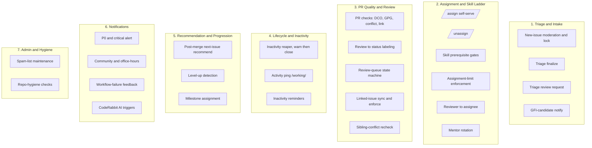
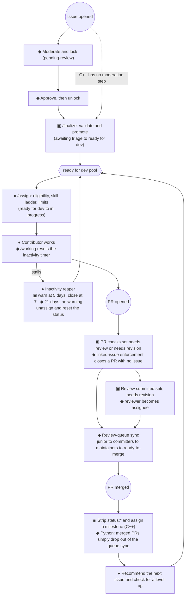

# Cross-SDK Service and Label Architecture

> **This is the Phase 2 synthesis.** It is a cross-SDK view of the maintainer automation: what each SDK
> offers, how the services group together, how an issue or PR moves through them, and a proposed
> normalized label taxonomy. It draws on `audit/services-cpp.md`, `audit/services-python.md`,
> `audit/labels-cpp.md`, and `audit/labels-python.md`. It lines up with `planning/goals.md`
> (decoupled by function, config-driven, opt-in).
>
> **Scope:** maintainer automation only. CI, build, release, and security are a project non-goal
> (`goals.md`, Non-goals), so they appear only in Appendix Z, just so the picture is complete.

## 1. The service groups, from the top down

Both SDKs solve the same broad set of problems, but they build them in very different ways. C++ is a hub
and spoke off one config file. Python is roughly 40 small, focused workflows. If you set the architecture
aside and group by what the service actually does, the whole surface falls into seven groups. Those groups
are the natural unit for the per-feature toggles the app is heading toward.

The repo-hygiene checks (broken links, test-file naming) sit close to CI, so they are deprioritized in
line with the maintainer's steer.

## 2. The same capabilities, compared across both SDKs

Each row is one capability, the kind of thing that could become a toggle. The marks show which SDK has it.
🟢 both · 🔵 C++ only · 🟣 Python only · ⚪ retired.

| Group | Capability | C++ | Python | Status | Notes |
|---|---|:--:|:--:|:--:|---|
| 1. Intake | New-issue moderation and lock until approved | | ✅ | 🟣 | `moderate-new-issues` plus `approved-issues` |
| 1. Intake | Triage finalize (`/finalize`: validate, retitle, promote) | ✅ | | 🔵 | validated against the central config |
| 1. Intake | Triage review request (ping the triage team on a PR) | | ✅ | 🟣 | `request-triage-review` |
| 1. Intake | GFI-candidate notification | | ✅ | 🟣 | `bot-gfi-candidate-notification` |
| 2. Assign | Self-serve `/assign` with eligibility gates | ✅ | ✅ | 🟢 | C++ uses central limits; Python uses per-tier handlers plus the spam list |
| 2. Assign | `/unassign` | ✅ | ✅ | 🟢 | C++ reverts the status label; Python is assignee-only |
| 2. Assign | Skill-ladder prerequisite gating | ✅ | ✅ | 🟢 | C++ uses `skillPrerequisites`; Python uses the advanced and intermediate guards, which unassign on a fail |
| 2. Assign | Assignment-limit enforcement | ✅ | ✅ | 🟢 | C++ uses `maxOpenAssignments` and `maxGfiCompletions`; Python uses spam-list caps |
| 2. Assign | Reviewer becomes PR assignee | | ✅ | 🟣 | `on-review` |
| 2. Assign | Mentor rotation on assignment | | ✅ | 🟣 | chained inside the GFI handler, via `mentor_roster.json` |
| 3. PR | PR quality checks (DCO, GPG, conflict, issue-link) plus a dashboard | ✅ | partial | 🟢 | C++ has a unified dashboard; Python only enforces the linked issue, by closing the PR |
| 3. PR | Auto-assign the PR author | ✅ | | 🔵 | part of PR Open Checks |
| 3. PR | Review result becomes a status label | ✅ | | 🔵 | the fork-safe relay sets `needs revision` |
| 3. PR | Review-queue state machine (`queue:*`) | | ✅ | 🟣 | `review-sync` on a `*/30` cron |
| 3. PR | Linked-issue label sync (issue and PR) | | ✅ | 🟣 | the fork-safe relay, additive only |
| 3. PR | Linked-issue enforcement (close PRs with no linked issue) | | ✅ | 🟣 | C++ checks and labels for this but never closes |
| 3. PR | Sibling-conflict recheck on merge | ✅ | | 🔵 | re-evaluates the other open PRs |
| 4. Life | Inactivity reaper (warn, then close or unassign) | ✅ | ✅ | 🟢 | C++ warns at 5 days and acts at 7; Python acts at 21 days with no warning |
| 4. Life | Activity ping `/working` (resets the timer) | | ✅ | 🟣 | read by the reaper and the reminder |
| 4. Life | Inactivity reminders (issue with no PR, inactive PR) | | ✅ | 🟣 | comment-only, a step before unassigning |
| 5. Prog | Post-merge next-issue recommendation | ✅ | ✅ | 🟢 | both walk a skill ladder |
| 5. Prog | Level-up detection and congratulation | ✅ | ✅ | 🟢 | |
| 5. Prog | Milestone assignment on merge | ✅ | | 🔵 | on the linked issues or the PR |
| 6. Notify | P0 or critical issue alert | | ✅ | 🟣 | on `priority: critical` |
| 6. Notify | Community and office-hours reminders | | ✅ | 🟣 | fortnightly crons |
| 6. Notify | Workflow-failure feedback on a PR | | ✅ | 🟣 | reacts to 7 named checks |
| 6. Notify | CodeRabbit AI plan and review triggers | | ✅ | 🟣 | matches the goals.md idea that AI should be complementary |
| 7. Admin | Spam-list maintenance | | ✅ | 🟣 | hourly cron plus a tracking issue |
| 7. Admin | Slash-command dispatcher (one shared parser) | ✅ | | 🔵 | architectural; Python dispatches per workflow instead |
| 7. Admin | Repo-hygiene checks (broken links, test naming) | | ✅ | 🟣 | close to CI, so deprioritized |
| Retired | Merge-conflict bot, auto-draft, draft explainer and reminder, missing or unassigned linked issue, verified commits, conventional title, standalone GFI-notify and mentor | | archived | ⚪ | the 10 files in Python's `workflows/archive/`, to fold in or drop |

How to read the table. The 🟢 rows (assignment, `/unassign`, skill gating, limit enforcement, inactivity
reaping, recommendation) are the common core. Both SDKs implement them, and they only differ in policy and
shape. These are the strongest candidates for the first version of the app: high value, and already proven
twice. The 🔵 and 🟣 rows exist in only one SDK, so they become independent opt-in toggles. The ⚪ rows tell
us what not to carry forward.

## 3. The end-to-end maintainer-automation flow

This is how a contribution moves through the services from start to finish. The journey is shared, but each
SDK fills in different stops along the way. C++ is `▣`, Python is `◆`, and both is `●`.

The label-level state machines behind these stops are written up in `audit/labels-cpp.md` (the issue and
PR `status:` machines) and `audit/labels-python.md` (the moderation and review-queue machines).

## 4. A proposed normalized label taxonomy

The shared app needs one authoritative taxonomy that takes in both SDKs and clears up the four Python
drift sets (detailed in `audit/labels-python.md`). The principles: one canonical string per idea, lower
case in the shape `group: value`, one config file as the source of truth (the C++ model), and every
namespace treated as a managed set so that the prefix operations stay safe.

| Namespace | Canonical values | What it takes in and cleans up |
|---|---|---|
| `status:` (work lifecycle) | `awaiting triage`, `ready for dev`, `in progress`, `blocked`, `needs review`, `needs revision`, `ready to merge` | the C++ status set plus Python's `status: ready-to-merge` (note the hyphen becomes a space) |
| `skill:` (the ladder) | `good first issue`, `beginner`, `intermediate`, `advanced` | removes the bare `beginner` (drift C) and the title-case `Good First Issue` inconsistency (drift D); `Good First Issue Candidate` becomes `skill: good first issue candidate` |
| `priority:` | `critical`, `high`, `medium`, `low` | removes `Priority: Critical` (drift B) |
| `queue:` (the optional review-routing feature) | `junior-committer`, `committers`, `maintainers` | Python-only; stays a feature-scoped namespace, kept separate from `status:` |
| `notes:` (admin and automation bookkeeping) | `automated`, `spam`, `spam-list-update`, `broken markdown links`, `mentor-duty` | pulls Python's inline `notes:` literals into the config |
| `lifecycle:` (the intake gate) | `pending-review`, `approved` | Python moderation; a candidate to fold into `status:` as `status: pending review` |
| `meta:` | `open to community review`, `discussion` | Python markers, set by people or bots and otherwise static |

A quick summary of the drift fixes, which is the concrete normalization work the schema has to encode:

| Drift | What exists today | The canonical choice |
|---|---|---|
| A | `Good First Issue Candidate` and `good first issue candidate` | one cased string, matched without regard to case |
| B | `priority: critical` and `Priority: Critical` | `priority: critical` |
| C | `skill: beginner` and bare `beginner` | `skill: beginner` |
| D | a shared constant and a hand-typed copy of `Good First Issue` | one constant, with no inline copies |

The big lesson to carry over from C++: because it has one config file and never types a label out by hand,
it has zero drift. Rebuilding that single-source-of-truth model in the shared schema is what mechanically
stops Python's drift from coming back.

## 5. What to support going forward (a wishlist of toggles)

These are independent, config-gated features, ordered "common core first" in line with `goals.md` Goal 3:

1. **Assignment and the skill ladder** (🟢): `/assign`, `/unassign`, the prerequisite gates, and limit
   enforcement.
2. **Inactivity reaping** (🟢), using the C++ "warn, give a grace period, then act" policy as the safe
   default (`goals.md` Goal 5).
3. **Post-merge recommendation and level-up** (🟢).
4. **PR quality checks plus review-to-status labeling** (🟢 and 🔵): DCO, GPG, conflict, and issue-link
   feeding the `status:` labels.
5. **Intake and triage** (🔵 and 🟣): `/finalize`, moderation and lock, and triage review request, each as
   its own toggle.
6. **Review-queue routing** (🟣): the `queue:*` state machine as an opt-in feature namespace.
7. **Linked-issue sync and enforcement** (🟣): additive sync and close-on-unlinked as two separate toggles.
8. **Notifications** (🟣): P0 alert, reminders, workflow-failure feedback, and CodeRabbit AI hooks, each
   one independent.
9. **Admin** (🟣): spam-list maintenance and mentor rotation.

What to leave out: the repo-hygiene and CI-adjacent checks, and the 10 retired Python workflows. Do not
port those.

## Appendix Z: out of scope (a non-goal)

CI, build, release, and security stay as native Actions in each repo, and the app does not absorb them
(`goals.md`, Non-goals). They are listed once here so the picture is complete. In both SDKs the build,
test, lint, and publish workflows touch no labels (this was verified; see `audit/labels-cpp.md` Appendix C
and `audit/labels-python.md` Appendix D). They are left out of all the classification, flow, and taxonomy
work in this audit.
