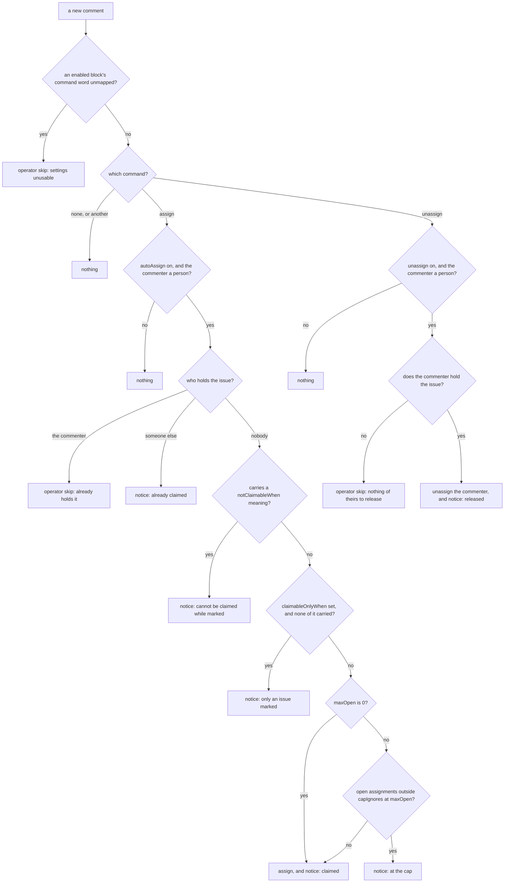

# assignment — let a contributor claim work, and release it again

Not built: phases 2–4

## What the output looks like

Every comment is one managed notice per person per issue: kind `notice`, topic the commenter's
login. A claim, a refusal and a release to the same person rewrite that one comment in place. The
examples are `messages.ts`'s own sentences, for a commenter `alice`.

Claim accepted, with the `unassign` block on:

> ✅ Hi @alice — you are assigned to this issue. Thank you for picking it up! If you need to step
> away, comment this repository's unassign command.

Claim accepted, with the `unassign` block off:

> ✅ Hi @alice — you are assigned to this issue. Thank you for picking it up!

Already claimed — each holder is named through `inert()`, a zero-width space after the `@`, so the
refusal pings nobody but the commenter:

> Hi @alice — this issue is already assigned to @​bob, so it cannot be claimed.

Refused — the issue carries a `notClaimableWhen` meaning (two or more read `blocked` and
`awaitingTriage`):

> Hi @alice — this issue cannot be claimed while it is marked `blocked`.

Refused — the issue carries none of the `claimableOnlyWhen` meanings (two or more read `ready` or
`inProgress`):

> Hi @alice — only an issue marked `ready` can be claimed in this repository, and this one is not
> yet.

Refused — at the cap, with the `unassign` block on:

> Hi @alice — you already have 2 open assignments, and this repository's limit is 2. Release one
> with this repository's unassign command, and you can claim this issue.

Refused — at the cap, with the `unassign` block off:

> Hi @alice — you already have 2 open assignments, and this repository's limit is 2.

Released, nobody else assigned:

> @alice has been unassigned from this issue at their request. The issue is open for anyone to pick
> up.

Released, someone else still assigned:

> @alice has been unassigned from this issue at their request.

No sentence prints a command's spelling: the view carries mapped names only (contract.md §2), so a
comment says "this repository's unassign command". A meaning is named, never its label.

## What the config looks like

Claim and release on any open issue, at the default cap:

```yaml
capabilities:
    assignment:
        enabled: true
        autoAssign:
            enabled: true
        unassign:
            enabled: true

mappings:
    commands:
        assign: "/assign"
        unassign: "/unassign"
```

Claim only issues marked ready, never a blocked or untriaged one, with blocked work left out of the
count:

```yaml
capabilities:
    assignment:
        enabled: true
        autoAssign:
            enabled: true
            claimableOnlyWhen: [ready] # any-of; empty = any open issue
            notClaimableWhen: [blocked, awaitingTriage] # deny wins over claimableOnlyWhen
            capIgnores: [blocked] # an assignment carrying one of these does not count
            maxOpen: 3 # default 2; 0 = uncapped
        unassign:
            enabled: true

mappings:
    labels:
        ready: "status: ready for dev"
        blocked: "status: blocked"
        awaitingTriage: "status: needs triage"
    commands:
        assign: "/assign"
        unassign: "/unassign"
```

Claim without a cap, and no self-release — a maintainer releases through GitHub's own control:

```yaml
capabilities:
    assignment:
        enabled: true
        autoAssign:
            enabled: true
            maxOpen: 0

mappings:
    commands:
        assign: "/assign"
```

A command counts only as the first word of a line, outside a code block — fenced, or indented four
spaces or a tab — in a newly created comment. The cap counts open issues in this repository the commenter is assigned to (D57).

## How it works

A contributor claims an issue with this repository's assign command and releases their own claim
with its unassign command. A team member never needs either: GitHub's assignee control is their
ungated path, and the capability never counter-writes what a person did there. No role is read, so
a maintainer who types the command is gated like anyone.

The command speaks for whoever typed it — `facts.command.by`, never the delivery's sender — and a
bot's command does nothing. The guards run in this order:



Each refusal posts a notice and claims nothing absent. A claim is one `assign` carrying its notice,
and a release one `unassign` carrying its own: the platform posts the notice after the act, and only
once the issue's assignees read back with the act done. GitHub answers `201` for a login it silently
declined to assign (6.16), so a declined claim ends `postconditionUnconfirmed` and is never
announced. The assign claims every `notClaimableWhen` meaning absent, so a deny label added before
the write lands stops it, and its notice with it. A
`maxOpen` of 0 never asks for the commenter's open assignments. A resolver nobody could answer — who
is a bot, who holds the issue, how many the commenter holds — ends the evaluation in an operator
skip: nothing is assigned, nothing is released, and the commenter sees no comment.

There is no `requiredMappings`: a command word has no default spelling, so requiring one would
refuse every file that enables the capability before it mapped a word, and a block that is off
needs no word at all. Instead, while an enabled block's word is unmapped, every comment on every
issue produces an operator skip naming the dotted path —
`capabilities.assignment.autoAssign.enabled: the assign command needs mappings.commands.assign, and
this repository has not mapped it`. The file parses, so that skip is the only way the
misconfiguration surfaces.

**The assignee list is not a claimed fact.** Two contributors whose evaluations both read no holder
both assign: no `ClaimedFacts` field carries assignees, and nothing re-reads them at apply time.
Closing that is a fact-shape change — an assignee claim, and the apply-time read that checks it.

| Declaration | Value |
|---|---|
| `triggers` | `issue_comment` |
| `facts` / `needs` | `issue`, needing `command` — only the `issue_comment` producer reads it, and the sweep answers it unreadable |
| `resolvers` | `isAutomationActor` · `assigneesOf` · `openAssignments` |
| `intents` | `postManagedComment` · `assign` · `unassign` |
| `requiredMappings` | none — each enabled block demands its command word through the guard above |
| Permissions | repository: `issues:read`, `issues:write` · organization: none |
| Platform needs | durableState: none · crossItemCoordination: the cap counts across issues, read through `openAssignments` · externalDelivery: none |

| Phase | Ships | Needs first |
|---|---|---|
| 1 | the assign and unassign commands, claimability meanings, `maxOpen` and `capIgnores` | built |
| 2 | skill gates (a tier unlocks after enough completions of the tier below, a tier's own `maxOpen`, a support team cc'd on a claim) · `maxPerDay` · `minAccountAge` · `reclaimCooldown` | the `principal` settings constructor · a completed-count-by-skill resolver, repo-local · recent-claim times and App-release events (timeline reads, or the durable-state candidate) · account age on the actor |
| 3 | position pairing — a claim writes `inProgress`, a release writes `ready`, when those meanings are mapped | the two-write recovery record; the `ready`-ownership conversation with triageQueue |
| 4 | next-issue recommendation on merge — designed as its own capability, `merged.md` | demand evidence first; unranked |

Phase 2's completions are counted in this repository: closed issues carrying the tier's skill label
that the contributor was assigned to. An issue with no skill label is gated only by the cap; one with
two resolves to the higher tier.

## Verified by

Each built row names the test that proves it, as file › title; `·` separates two tests.

| Scenario | Proves | Test |
|---|---|---|
| `/assign` on an open, claimable issue | assigned, one claim notice | `capability.test.ts` › `/assign` on an open, claimable issue |
| `/assign` on an issue without the `claimableOnlyWhen` meaning | refused with the meaning named; the count is never asked | `capability.test.ts` › `/assign` on an issue without the `claimableOnlyWhen` meaning |
| `claimableOnlyWhen` names two meanings, the issue carries one | assigned — any-of | `capability.test.ts` › `claimableOnlyWhen` is any-of: one listed meaning is enough |
| At the cap, but one assignment sits in `needsReview` | the claim succeeds — `capIgnores` skipped it | `capability.test.ts` › At the cap, but one assignment sits in `needsReview` |
| Assigned to a `blocked` issue, `blocked` in `capIgnores` | does not count toward the cap; remove it from the set and it does — the meaning-set decides | `capability.test.ts` › Assigned to a `blocked` issue, `blocked` in `capIgnores` |
| Maintainer natively assigns someone past the cap | it counts; their next `/assign` is refused — native bypasses the gates, never the arithmetic | `capability.test.ts` › Maintainer natively assigns someone past the cap |
| Skill or block label added after a claim | nothing — an `issues` delivery stops at `factsUnread` and asks nothing, so gates run at claim time and this capability never releases | `engine-matrix.test.ts` › never evaluates on an `issues` delivery: a label or an assignee changed by hand |
| Issue carrying both `ready` and `blocked` | not claimable — deny wins; the assign, which carries its notice, claims `blocked` absent | `capability.test.ts` › Issue carrying both `ready` and `blocked` |
| Issue carrying a `notClaimableWhen` meaning and none of `claimableOnlyWhen` | the deny notice, never the not-yet one — deny is asked first | `capability.test.ts` › denies before it asks for a required meaning |
| Issue carrying two `notClaimableWhen` meanings | both named — `blocked` and `awaitingTriage` | `capability.test.ts` › names two denying meanings as `a` and `b` |
| Every refusal, with `notClaimableWhen` set | claims nothing absent; only the assign claims the deny set | `capability.test.ts` › claims nothing absent on any refusal, and the deny set on a claim |
| Second `/assign` by the same person | an operator skip, no second comment — they already hold it | `capability.test.ts` › Second `/assign` by the same person |
| A second contributor's `/assign` after the first claim landed | the already-claimed notice, the holder named and not pinged | `capability.test.ts` › A second contributor's `/assign` after the first claim landed |
| `/assign` on a held issue that is no longer claimable | the commenter's own: an operator skip; someone else's: the already-claimed notice — holders are asked before claimability | `capability.test.ts` › tells nobody when the commenter already holds it · tells the commenter it is already claimed when someone else holds it |
| `/assign` by a bot | nothing, and only `isAutomationActor` is asked | `capability.test.ts` › `/assign` by a bot |
| `/assign` in a PR comment | nothing — the delivery is malformed, `commentUnreadable`, so no record reaches a capability | `issue-comment.test.ts` › a comment on a pull request is consumed and unreadable, not ignored |
| A count or holder list nobody could answer | an operator skip, never an assignment (unknown ≠ under the cap) | `capability.test.ts` › A count or holder list nobody could answer · assigns nobody when the holders cannot be read |
| `maxOpen: 0` | assigned past any number held, and `openAssignments` never asked | `capability.test.ts` › asks no count when the cap is 0, and assigns past any number held |
| Maintainer assigns via the UI over every gate | untouched — the `issues` delivery stops at `factsUnread`, so nothing counter-writes | `engine-matrix.test.ts` › never evaluates on an `issues` delivery: a label or an assignee changed by hand |
| A claim GitHub takes | assigned, read back on the issue's assignees, and only then the notice | `apply.test.ts` › assigns, proves it on the list, and only then posts the notice the assign carries |
| A claim GitHub declines while answering `201` | `postconditionUnconfirmed`; the notice is never posted (6.16) | `apply.test.ts` › never announces an assign GitHub declined while answering 201 (6.16) |
| A refusal, then a claim, by one person | one comment, rewritten — the claim's notice carries the refusal's identity | `engine-matrix.test.ts` › rewrites one comment per person: a refusal and the claim after it share an identity |
| A release | one named login off, through the release endpoint, read back gone, then the notice | `apply.test.ts` › releases one login through the release endpoint, proves it gone, then posts the notice |
| A release the issue still shows | never announced | `apply.test.ts` › never announces a release the list still shows |
| `/unassign` by a non-assignee | an operator skip, nothing released | `capability.test.ts` › `/unassign` by a non-assignee |
| `/unassign` naming someone else | only the commenter's own claim ever releases — self-only is definitional; reaping stays inactivity's own `unassign` (P3) | `capability.test.ts` › `/unassign` naming someone else |
| A maintainer types `/assign` at the cap | refused like anyone — no role exemptions exist; the sidebar is their ungated path | `capability.test.ts` › A maintainer types `/assign` at the cap |
| An edit adds `/assign` to an old comment | never executed — only a created comment issues a command | `issue-comment.test.ts` › an edited or deleted comment is read, and issues nothing |
| `/assign` in a code block, fenced or indented, or quoted | never executed — only the first word of a line outside code counts | `commands.test.ts` › reads nothing inside %s · reads nothing on a line indented by %s, which is code · refuses a command that is not a line's first token |
| Contributor with open assignments in a sibling repo | uncounted — the count is asked by login alone, and lists this repository's issues only (D57) | `capability.test.ts` › Contributor with open assignments in a sibling repo · `item-resolvers.test.ts` › answers each open assignment with the meanings its labels projected to |
| Released by inactivity, then `/assign` again | a fresh claim — only who holds the issue now is read, and assignment decides alongside inactivity exactly as alone | `capability.test.ts` › `/assign` on an open, claimable issue · `engine-matrix.test.ts` › each capability's decision is identical no matter which others are enabled |
| `autoAssign` or `unassign` off | its command does nothing and asks nothing | `capability.test.ts` › does nothing, and asks nothing, while autoAssign is off · does nothing, and asks nothing, while unassign is off |
| An enabled block's command word unmapped | every comment is an operator skip naming the dotted path, one issuing no command too, whichever word is missing; a block that is off demands nothing | `capability.test.ts` › skips with the dotted path when an enabled block's word is unmapped · skips every comment while a word is unmapped, one that issues nothing too · catches an unmapped assign word as well as an unmapped unassign one · demands no word of a block that is switched off |
| A login spelt in another case | the same person — holders are compared case-insensitively | `capability.test.ts` › reads a login the same whatever its case |
| A claim without `issues:write` | the assign refused `permissionMissing` (rule 2); nothing is approved, so nothing is written | `engine-matrix.test.ts` › refuses the claim permissionMissing without issues:write, and approves nothing |
| A claim under `mode: dry-run` | the assign, notice and all, recorded as `wouldApply`; nothing is approved, so nothing is written | `engine-matrix.test.ts` › records a dry-run claim as wouldApply, and writes nothing |
| At a tier's `maxOpen`, under the default cap (phase 2) | refused — the tier override governs | not built |
| Issue closed as not-planned (phase 2) | not a completion; the gate count is unchanged | not built |
| `/unassign` then `/assign` the same day (phase 2) | `maxPerDay` counts the earlier claim; releasing is not a refund | not built |
| `/assign` from a 2-day-old account, `minAccountAge: 7d` (phase 2) | refused, naming the age rule | not built |
| Reaped for inactivity, `/assign` the same issue next day (phase 2) | refused for `reclaimCooldown` — a different issue claims fine | not built |
| Skill-unlabelled issue (phase 2) | caps apply, the gate does not | not built |
| Claim at a tier with `supportTeam` (phase 2) | the claim notice cc's the team — one comment, no roster, no rotation | not built |
