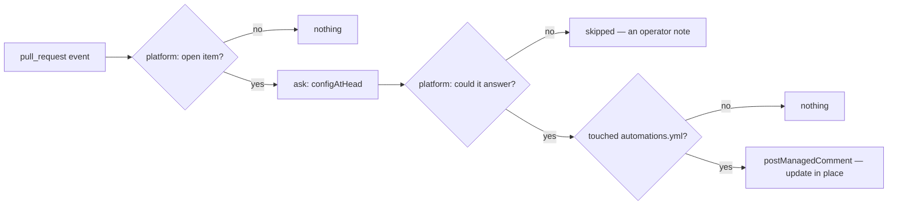

# configReport — one comment on a pull request that changes `automations.yml`, saying what the App would read from it

## What the output looks like

One comment per pull request, updated in place. When the file parses:

> ### `automations.yml` — what this pull request would mean
>
> The file at `sha256:5a3e898528ce` parses. This is what the App would read from it.
>
> **Mode** — dry-run
>
> **Capabilities**
>
> - intake — on
>   - announce: true
>   - labels it may set
>     - status: triage — awaitingTriage; defined #fbca04 if the repository lacks it
> - prDashboard — on, no settings
> - configReport — on, no settings
> - inactivity — on
>   - exemptBlocked: true
>   - remindAfter: 336
>   - reapAfter: 504
>   - issues
>     - enabled: true
>     - remindAfter: 504
>     - reapAfter: 720
>
> **Mappings**
>
> - labels
>   - awaitingTriage: status: triage
>   - blocked: status: blocked
> - commands
>   - working: /working
> - alerts
>   - p0: P0-🔥
>
> **Principals**
>
> - maintainerTeam: hiero-sdk-js-maintainers
>
> Read on the default branch, this changes nothing until it merges.

Trimmed above at `inactivity`'s ladders, which go three levels deeper; nothing else is elided. A
capability the file switched off is named on one trailing line rather than expanded.

**A clock is shown as the hours it RESOLVED to, not as the `14d` the file wrote.** The report
renders `{ enabled, settings }` and nothing else: a capability cannot know the shipped declarations
(D150), so this one cannot tell a duration from a count and has no written form to print back. The
fix is a field the resolver's answer would have to carry, which is a platform change.

When it does not parse:

> ### `automations.yml` — what this pull request would mean
>
> The file at `sha256:2e2637a3a3f5` is rejected, so the App would read no configuration from it at
> all — one error anywhere rejects the whole document.
>
> - line 20 — capabilities.intake.annouce: capability "intake": unknown setting "annouce"
>   \(it declares: announce\)
> - line 32 — capabilities.inactivity.remindAfter: must be a duration: a whole number
>   of hours or days, written "4h" or "14d"
>   - and 3 places that inherit it
>
> Read on the default branch, this changes nothing until it merges.

The backslashes in the first line are the escaping, verbatim: the parser quoted the file's own
misspelling back, so the whole message is rendered inert. `settingInvalid`'s message opens with the
path it already carries, and that prefix is dropped rather than printed twice (D77).

## What the config looks like

```yaml
schemaVersion: 1
mode: dry-run # disabled | observe | dry-run | active — rehearse, then arm

capabilities:
  configReport:
    enabled: true # explicit true only; reads no settings
```

The block holds `enabled` and nothing else. The spec is empty — the same written answer `prDashboard`
gives, not a forgotten file: there is no policy to state, because what the comment says is decided
entirely by what the pull request's file says. No mappings are required either: the capability
speaks no meanings.

Behind the mode ladder with no exemption, like every other capability. `observe` records the
intent, `dry-run` names the comment it would post, `active` posts it. A report on a configuration
is still a write to a pull request, and there is no reason for it to be the one write the ladder
does not judge.

## How it works

Acts on: pull requests that are open and that change `automations.yml` at the repository root.
Never acts on: closed or merged pull requests, which the platform withholds from a capability that
did not declare `closed: true` (D59); pull requests that leave the file alone; and the file itself —
the App holds `contents: read` and cannot change its own configuration.

Two rules a reader must not miss. **The head sha is a report input only.** The content of
`automations.yml` at a pull request's head is written by whoever opened the pull request, fork
included; it is parsed by the same hardened parser the default branch goes through, rendered with
the platform's escaping, and it never becomes the repository's configuration. **The comment is a
comment, not a check run.** It blocks nothing and merges nothing; `checks: write` stays withheld
(`design/findings/endpoint-permission-matrix.md`, the ceiling), and the trigger for reopening that
question is a maintainer asking for a merge-blocking status.



Both guards above the "touched" question are the platform's. A closed or merged pull request never
reaches this capability, and an unanswerable resolver ends the evaluation with an explanation the
platform writes — an operator note, never a silent pass (D51). The one guard left here is the
"touched" question itself, and the resolver answers it, so it is asked above that guard rather than
after it. It hands back the ALREADY PARSED result: the platform parses, because a
capability cannot know which declarations the shell ships, and a document judged against a shorter
list would call a capability unknown that this App does run.

Errors are listed in document order — by the line each path resolves to, with the whole-document
ones first and the ones no line could be found for last. A path is a hint for annotation; the code
and the path are the contract (`design/contracts/config-schema.md` §2).

**The cascade.** One unreadable capability-wide value surfaces once per level that inherits it
(D147). An error whose path ends in the same key as an error at an enclosing level is a
CONSEQUENCE of that one, not a separate mistake, so it is collapsed into a single trailing line
under the error it followed from. A maintainer fixing the first fixes all of them.

**Every string that came from the file is rendered inert** — keys, label spellings, alert names,
principals, and the parser's own messages, which quote the file's words back. The helper is
`inert()` from `capability/facts.ts`, the one `prDashboard` renders commit text with: one line, every
active markdown character backslash-escaped, every `@` broken so no mention notifies anybody. The
file in a pull request is attacker-controlled text in exactly the way a commit message is.

Two renderings are deliberately absent, and each is a platform limit rather than a choice.
**A capability's required mappings are not shown**, because they live on the DECLARATION and a
capability may not see the shipped declarations — a `ConfigResult` carries the document's
`mappings:` section and each capability's `{ enabled, settings }`, and nothing about what any of
them demands. The mappings section is therefore rendered once, on its own, rather than per
capability. **No fenced code block** carries the tree: `inert()` escapes with backslashes, which a
fence would display rather than resolve, and a fence is itself escapable by a YAML block scalar
carrying a newline. The tree is a nested list, which is a tree that escaping works inside.

| Declaration | Value |
|---|---|
| `triggers` | `pull_request` — the question is about one pull request's proposed file |
| `facts` / `needs` | implied by the trigger: one `pullRequest` record, needing no group. The report is rendered from the resolver's answer alone; a group declared but unread would only make this capability skip deliveries it can answer |
| `resolvers` | `configAtHead` — it answers both halves at once, whether the pull request touched the file and what the touched file parses to, so it is asked above the "touched" guard |
| `intents` | `postManagedComment` (`summary`) — one comment per pull request, updated in place |
| `requiredMappings` | none. The comment renders the document's own `mappings:` section back; it demands nothing of it |
| Permissions | repository: `pull_requests:read` and `contents:read` (the file list, the head sha, the file), `issues:write` (the comment) · organization: none |

## Verified by

| Scenario | Proves |
|---|---|
| A pull request that leaves `automations.yml` alone | nothing is said, and no comment is asked for |
| The resolver could not answer | the platform ends the evaluation and explains it under this capability's name, never a pass (D51) |
| A merged pull request | the platform says nothing, the capability is never woken, and the resolver is never asked (D59) |
| A clean file | mode, every capability with its resolved settings, and the file's mappings |
| A rejected file | every error as `line N — path: message`, in document order |
| Five errors from one bad capability-wide value | the cascade collapses to the enclosing error plus "and N places that inherit it" |
| A key named `@everyone`, and one holding `*` | every file-derived string renders inert |
| The pull request DELETES the file | the parser's no-file result, rendered as the empty configuration |
| `dry-run` | the comment is named as `wouldApply` and nothing is written |
