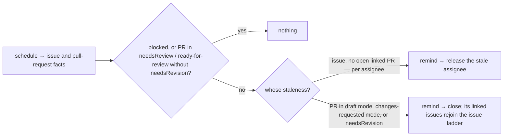

# inactivity — remind about stalled work, then release it

Not built: phase 4.

## What the output looks like

One reminder, one action; each names the reason, the fix, and the date.

Issue reminder:

> ⏰ Hi @alice — you are assigned to this issue, but there is no pull request after 14 days. Still
> working on it? Comment `/working` to let us know development is active, otherwise this
> assignment will be released on **2026-09-21**.

Issue release:

> This assignment was released after 21 days of inactivity. The issue is open for anyone to pick
> up — you are welcome to `/assign` it again when you have capacity.

Pull request reminder, naming its reason (one per reapable state):

> ⏰ Hi @alice — this pull request has had **changes requested** without development activity for
> 14 days. Push a commit or comment `/working` to let us know you are working on it, otherwise
> the pull request will be closed on **2026-11-07**.

> ⏰ Hi @alice — this pull request has carried the **status: changes requested** label without
> development activity for 14 days. Push a commit or comment `/working` to let us know you are
> working on it, otherwise the pull request will be closed on
> **2026-11-07**.

Pull request close:

> This pull request was closed after 60 days of inactivity.

A level with no `reap` block reminds in the same words and promises nothing, because nothing
follows:

> ⏰ Hi @alice — you are assigned to this issue, but there is no pull request after 14 days. Still
> working on it? Comment `/working` to let us know development is active.

## What the config looks like

```yaml
capabilities:
  inactivity:
    enabled: true
    exemptBlocked: true # the blocked mapping skips every warning and action
    remindAfter: 14d # default — any ladder or reason may override
    reap: # the release clock every level inherits; consent is each acting level's own
      after: 21d # reap = release the assignment (issues) · close (PRs)
    issues: # warns, then unassigns assigned issues with no open PR
      enabled: true
      reap: # omit this block and the ladder reminds and never releases
        enabled: true
    pullRequests: # any PR, linked or not — warns, then closes
      enabled: true
      reap: # a section, not a block: only the reasons below act, so only they consent
        after: 60d # ladder override
      reapWhen: # reminders and actions apply only to PRs in:
        draft: # GitHub draft mode
          enabled: true
          reap:
            enabled: true # inherits the ladder's 60d
        changesRequested: # GitHub review state
          enabled: true
          reap:
            enabled: true
        needsRevision: # the label pr-dashboard's label mode applies for DCO, GPG, linked-issue and assignment failures
          enabled: true
          remindAfter: 2d # reason override — quality failures reap fast
          reap:
            enabled: true
            after: 5d

mappings:
  labels: # needed only by the label-based reasons and exemptions — native draft and changes-requested modes work unmapped
    needsReview: "status: needs review"
    needsRevision: "status: changes requested"
    blocked: "status: blocked" # read only when exemptBlocked is true
  commands:
    working: "/working" # the one clock reset; spelling is the repo's
```

Every clock is a DURATION, written as a whole number with a unit — `4h` or `14d`, and nothing else.
They resolve most-specific-first: reason → ladder → capability default, and `reap.after` walks that
same chain through each level's own `reap:`. On every level that CONSENTS, `reap.after` must exceed
that level's own `remindAfter` by the platform's minimum grace (`MIN_GRACE_HOURS`), and may not be
shorter than the platform's smallest reap (`MIN_REAP_HOURS`). The two levels that only pass the
clock down — the root and the `pullRequests` ladder — are judged by neither rule: a default nobody
acts on refuses nothing, and the clock it hands on is measured where it lands.
Every clock is per assignee: a reminder names only the assignee whose clock it is, and only those
whose own clock is stale reach the ladder at all.

**The release is opt-in on every level that acts.** The `issues` ladder and the three `reapWhen`
reasons are those four, and one whose `reap` block is absent, or states anything but
`enabled: true`, reminds and never acts: the reminder is posted as the capability's own comment and
it promises nothing, because nothing is going to happen. That is how a repository says "tell them,
but never close it". The root's `reap:` and the `pullRequests` ladder's are sections rather than
blocks — each states a clock the levels below inherit, and neither closes anything itself, so an
`enabled` there would be a switch nothing reads.

**The fastest you can close is `remindAfter: 0h` with `reap: { enabled: true, after: 2h }`** —
warned on the first sweep that sees the item, released two hours later, because the platform will
not act on a warning it has not yet posted and waited out, and two hours is the shortest reap it
allows. The slowest is `36500d`, a century, which is the longest wait any clock spells.

## How it works

Clocks reset on development activity only: a commit resets a pull request's clock, a `/working`
comment resets any clock. Nothing else does.

Reminds and acts on contributor staleness only:

- assigned issues with no open pull request
- pull requests where the ball is with the contributor — linked or not, assigned or not: in draft
  mode, in changes-requested mode (a review asked for changes), or carrying the `needsRevision`
  label — which, with pr-dashboard's label mode, may also indicate persistent DCO, GPG, linked-issue
  and assignment failures

Never acts on maintainer staleness or paused work:

- a pull request in `needsReview`, or in ready-for-review mode without the `needsRevision` label —
  that wait is the maintainers'
- anything carrying the `blocked` meaning
- a closed issue or a merged pull request, which never reaches this capability at all: the platform
  wakes it for open items only, because it declares no `closed: true` (D59)



| Target | Remind | Act | Guard |
|---|---|---|---|
| assigned issue, no open linked PR | its resolved `remindAfter`, naming the assignee whose clock it is | unassign that assignee at their own resolved `reap.after` | the platform's grace: it posts the reminder, records what it promised, and refuses the release until that promise has run with no development activity |
| PR in a `reapWhen` state | its reason's resolved `remindAfter` | close at the reason's resolved `reap.after` — the close alone, because an intent names its own item; each linked issue then has no open pull request, so the issue ladder above governs its assignees on the next sweep | the same grace; **a PR in `needsReview`, or ready-for-review without `needsRevision`, is never touched** — maintainer staleness, not the contributor's |
| either, with no `reap` block on the level | the same reminder, promising nothing | nothing — the reminder is the whole of it | none needed: there is no act to hold, so the comment is the capability's own rather than the platform's |

The PR ladder judges the pull request alone, and acts on the pull request alone: an intent names
the item its record carries, so a close never releases an assignment on a linked issue. Closing
removes that issue's open linked pull request, which is what was silencing the issue ladder, so the
next sweep warns and then releases each stale assignee on the issue ladder's own clock.

The clock starts when an item enters a reapable state — assignment for an issue; draft,
changes-requested or `needsRevision` for a PR — and resets on development activity only: a commit
for a pull request, a `/working` comment from the person on the clock for either. Ordinary
comments and reviews do not reset. Reminders are cycle-scoped: a re-assignment or a reopened PR
starts a fresh warn-then-act cycle, and an old reminder never authorizes a new act — the act is
dated at the clock's start, so a reset mints a different effect and the old warning is asked
nothing. Every action recomputes at apply time against live state: a commit, a `/working`, or a
state change between sweep and write refuses the act.

All three reasons act. Each one CLAIMS the evidence it read — the label reason its meaning, the
two native reasons their mode — and the platform re-reads that evidence before it closes anything:
a pull request marked ready for review, or a change request a later review lifted, refuses the
close the same way a label somebody removed does. Protocol 8.3 ran the close path armed on
2026-09-12: warning, grace, close on a draft claim, notice, and a human reopen left alone.

| Declaration | Value |
|---|---|
| `triggers` | `schedule` — no webhook resets a clock; the sweep reads the timeline instead |
| `facts` / `needs` | `issue` and `pullRequest`, needing `assignees` (each with `assignedAt` and last `/working`), `links`, `review` (changes requested, `reapableSince`, last commit) and `readiness` (draft). The fifth group, `command`, is the issue's and this capability does not read it. A producer that reads less — a webhook — is a `factsUnread` skip |
| `resolvers` | `isAutomationActor` — the entry carries the links, so no per-item question is asked; quality-failure detection is pr-dashboard's job, arriving as `needsRevision` |
| `intents` | `postManagedComment` · `releaseAssignment` · `closePullRequest`. Every act claims what it saw: the assignee ladder and the label reason claim meanings and closure, and each mode reason claims its own `pullRequestMode` |
| `requiredMappings` | none — the label reason demands `needsRevision` in a guard, only where it is switched on |
| Permissions | repository: `issues:read`, `pull_requests:read`, `issues:write`, `pull_requests:write` — the close's own, and the only write on the pull surface · organization: none |

| Phase | Ships | Needs first |
|---|---|---|
| 1 | reminders only — both ladders, comment-only | nothing: the sweep driver, the commands mapping family and the `review` group's three reads all ship. Unproven end to end — no sweep has run against a live repository |
| 2 | issue release — unassign after grace | nothing: the release is a confirmed endpoint, a body-carrying `DELETE …/issues/{n}/assignees` under Issues W, and `design/guides/grace.md` wires the destructive gate to the sweep path |
| 3 | PR close after grace | nothing to build: `closePullRequest` is the catalogue's first close, destructive-gated, and `PATCH …/pulls/{n}` is a confirmed endpoint under Pull requests W. Owed rather than needed first — the armed FX-gate run (protocol 8.2), which nobody has made on this path |
| 4 (candidate) | stale unassigned triage/ready issues — remind, optionally close | an issue-closure operation and a policy conversation; unranked |

## Verified by

| Scenario | Proves |
|---|---|
| `/working` after the reminder | clock resets; the act is refused at apply time |
| A commit to the PR after the reminder | clock resets; the act is refused at apply time |
| Ordinary comments and reviews after the reminder | no reset — chatter is not progress, and reviews are the maintainers' motion |
| Reminder posted, labels then change the workflow position | destructive gate refuses — cause drift |
| Draft PR marked ready for review between the warning and the close | the close is refused `preconditionStale` — the claimed mode no longer holds |
| A later review lifts the change request between the warning and the close | the same refusal, on the reviews list the sweep itself folds |
| PR stale for a year in `needsReview` | untouched — the wait is the maintainers' |
| Stale draft PR with `reapWhen.draft` not enabled | untouched — reaping is opt-in per reason |
| Ladder enabled with no `reap` block | reminded on its own clock, never released; the reminder promises no date |
| A parked `reap` block beside an enabled ladder | the same: `enabled: false` is a release kept for later, not one running |
| `needsRevision` override of `2d`/`5d` | the quality-failure PR reaps on the fast clock; an ordinary stale PR keeps the ladder's `60d` |
| Review flips a PR `needsReview` → `needsRevision` | its clock starts; the reverse flip stops it |
| pr-dashboard labels a failing PR `needsRevision` | the reaper's clock runs on it — detection is composed, not duplicated |
| Item gains the `blocked` meaning mid-cycle | all clocks pause, including linked PRs |
| Draft PR marked ready for review, no `needsRevision` | leaves the reapable state; its clock stops |
| Two assignees, one recent | only the stale one is released |
| Issue gains an open linked PR | the issue ladder falls silent; the PR ladder governs |
| Reaper closes a PR | the pull request closes; its linked issues' assignees are the issue ladder's on the next sweep |
| Unlinked PR stale in draft mode | reminded and closed like any other; nothing to release |
| Redelivered sweep / restart between remind and act | one reminder, one act — journal + managed identity |
| Released then re-assigned | a fresh cycle; the old reminder does not suppress the new one |
| Kill switch mid-grace | the act is refused and recorded |
| `mode: dry-run` | the exact unassign/close is named as `wouldApply`; nothing written |
