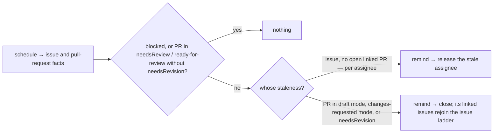

# inactivity — remind about stalled work, then release it

Reminds after inactivity, then acts after continued inactivity: releases stale assignments and closes stale pull requests.
Clocks reset on development activity only: a commit resets a pull request's clock, a `/working`
comment resets any clock. Nothing else does.

Reminds and acts on contributor staleness only:
- assigned issues with no open pull request
- pull requests where the ball is with the contributor — linked or not, assigned or not: in draft
  mode, in changes-requested mode (a review asked for changes), or carrying the `needsRevision`
  label — which, with pr-quality's label mode, may also indicate persistent DCO, GPG, linked-issue
  and assignment failures

Never acts on maintainer staleness or paused work:
- a pull request in `needsReview`, or in ready-for-review mode without the `needsRevision` label —
  that wait is the maintainers'
- anything carrying the `blocked` meaning

## What the output looks like


One reminder, one action; each names the reason, the fix, and the date.

Issue reminder:

> ⏰ Hi @alice — you are assigned to this issue, but there is no pull request after 14 days. Still
> working on it? Comment `/working` to let us know development is active, otherwise this
> assignment will be released on **2026-09-21**.

Issue release:

> This assignment was released after 21 days of inactivity. The issue is open for anyone to pick
> up — you are welcome to `/assign` it again when you have capacity.

Pull request reminder, naming its reason (one per reapable state):

> ⏰ Hi @alice — this pull request has had **changes requested** without development activity for
> 14 days. Push a commit or comment `/working` to let us know you are working on it, otherwise
> the pull request will be closed and the assignment released on **2026-11-07**.

> ⏰ Hi @alice — this pull request has carried the **status: changes requested** label without
> development activity for 14 days. Push a commit or comment `/working` to let us know you are
> working on it, otherwise the pull request will be closed and the assignment released on
> **2026-11-07**.

Pull request close:

> This pull request was closed after 60 days of inactivity.

## What the config looks like

```yaml
capabilities:
  inactivity:
    enabled: true
    settings:
      exemptBlocked: true # the blocked mapping skips every warning and action
      remindAfterDays: 14 # defaults — any ladder or reason may override
      reapAfterDays: 21 # reap = release the assignment (issues) · close (PRs)
      issues: # warns, then unassigns assigned issues with no open PR
        enabled: true
      pullRequests: # any PR, linked or not — warns, then closes
        enabled: true
        reapAfterDays: 60 # ladder override
        reapWhen: # reminders and actions apply only to PRs in:
          draft: # GitHub draft mode
            enabled: true
          changesRequested: # GitHub review state
            enabled: true
          needsRevision: # the label pr-quality's label mode applies for DCO, GPG, linked-issue and assignment failures
            enabled: true
            remindAfterDays: 2 # reason override — quality failures reap fast
            reapAfterDays: 5

mappings:
  labels: # needed only by the label-based reasons and exemptions — native draft and changes-requested modes work unmapped
    needsReview: "status: needs review"
    needsRevision: "status: changes requested"
    blocked: "status: blocked" # read only when exemptBlocked is true
  commands:
    working: "/working" # the one clock reset; spelling is the repo's
```

Days resolve most-specific-first: reason → ladder → capability default. At every level,
`reapAfterDays` must exceed `remindAfterDays` by the platform's minimum grace (`MIN_GRACE_DAYS`).
Every clock is per assignee: a reminder names only the assignee whose clock it is, and only those
whose own clock is stale reach the ladder at all.


## How it works



| Target | Remind | Act | Guard |
|---|---|---|---|
| assigned issue, no open linked PR | its resolved `remindAfterDays`, naming the assignee whose clock it is | unassign that assignee at their own resolved `reapAfterDays` | the platform's grace: it posts the reminder, records what it promised, and refuses the release until that promise has run with no development activity |
| PR in a `reapWhen` state | its reason's resolved `remindAfterDays` | close at the reason's resolved `reapAfterDays` — the close alone, because an intent names its own item; each linked issue then has no open pull request, so the issue ladder above governs its assignees on the next sweep | the same grace; **a PR in `needsReview`, or ready-for-review without `needsRevision`, is never touched** — maintainer staleness, not the contributor's |

The PR ladder judges the pull request alone, and acts on the pull request alone: an intent names
the item its record carries, so a close never releases an assignment on a linked issue. It does not
have to. Closing removes that issue's open linked pull request, which is what was silencing the
issue ladder, so the next sweep warns and then releases each stale assignee on the issue ladder's
own clock — judged against the issue's own facts rather than the pull request's.

The clock starts when an item enters a reapable state — assignment for an issue; draft,
changes-requested or `needsRevision` for a PR — and resets on development activity only: a commit
for a pull request, a `/working` comment from the person on the clock for either. Ordinary
comments and reviews do not reset. Reminders are cycle-scoped: a re-assignment or a reopened PR
starts a fresh warn-then-act cycle, and an old reminder never authorizes a new act — the act is
dated at the clock's start, so a reset mints a different effect and the old warning is asked
nothing. Every action recomputes at apply time against live state: a commit, a `/working`, or a
state change between sweep and write refuses the act.

## Phases

| Phase | Ships | Needs first |
|---|---|---|
| 1 | reminders only — both ladders, comment-only | the sweep that emits issue and pull-request facts (store schedules exist; the shell driver does not) · the commands mapping family (shared with assignment) |
| 2 | issue release — unassign after grace | the assignee write family (the destructive gate is wired to the sweep path — `design/guides/grace.md`) |
| 3 | PR close after grace | a `closePullRequest` operation — the catalogue's first close, destructive-gated (D61 review) |
| 4 (candidate) | stale unassigned triage/ready issues — remind, optionally close | an issue-closure operation and a policy conversation; unranked |

## Declaration

| Field | Value |
|---|---|
| `triggers` | `schedule` — no webhook resets a clock; the sweep reads the timeline instead |
| `facts` / `needs` | `issue` and `pullRequest`, needing every group: `assignees` (each with `assignedAt` and last `/working`), `links` (the issue's open pull requests; the pull request's linked issues with their own assignees' clocks) and `review` (draft, changes requested, `reapableSince`, last commit). A producer that read less — a webhook — is a `factsUnread` skip. No group for the App's own standing reminder: the platform holds that record itself |
| `resolvers` | `isAutomationActor` — the entry carries the links, so no per-item question is asked; quality-failure detection is pr-quality's job, arriving as `needsRevision` |
| `intents` | `postManagedComment` · `releaseAssignment` · `closePullRequest` |
| Permissions | repository: `issues:read`, `pull_requests:read`, `issues:write`; phase 3 adds `pull_requests:write` · organization: none |
| `operationalNeeds` | schedule: true · durableState: required — the reminder and its cause must survive restarts · crossItemCoordination: false · externalDelivery: false |

## Verified by

| Scenario | Proves |
|---|---|
| `/working` after the reminder | clock resets; the act is refused at apply time |
| A commit to the PR after the reminder | clock resets; the act is refused at apply time |
| Ordinary comments and reviews after the reminder | no reset — chatter is not progress, and reviews are the maintainers' motion |
| Reminder posted, labels then change the workflow position | destructive gate refuses — cause drift |
| PR stale for a year in `needsReview` | untouched — the wait is the maintainers' |
| Stale draft PR with `reapWhen.draft` not enabled | untouched — reaping is opt-in per reason |
| `needsRevision` override of 2/5 days | the quality-failure PR reaps on the fast clock; an ordinary stale PR keeps the ladder's 60 |
| Review flips a PR `needsReview` → `needsRevision` | its clock starts; the reverse flip stops it |
| pr-quality labels a failing PR `needsRevision` | the reaper's clock runs on it — detection is composed, not duplicated |
| Item gains the `blocked` meaning mid-cycle | all clocks pause, including linked PRs |
| Draft PR marked ready for review, no `needsRevision` | leaves the reapable state; its clock stops |
| Two assignees, one recent | only the stale one is released |
| Issue gains an open linked PR | the issue ladder falls silent; the PR ladder governs |
| Reaper closes a PR | the pull request closes; its linked issues' assignees are the issue ladder's on the next sweep |
| Unlinked PR stale in draft mode | reminded and closed like any other; nothing to release |
| Redelivered sweep / restart between remind and act | one reminder, one act — journal + managed identity |
| Released then re-assigned | a fresh cycle; the old reminder does not suppress the new one |
| Kill switch mid-grace | the act is refused and recorded |
| `mode: dry-run` | the exact unassign/close is named as `wouldApply`; nothing written |
