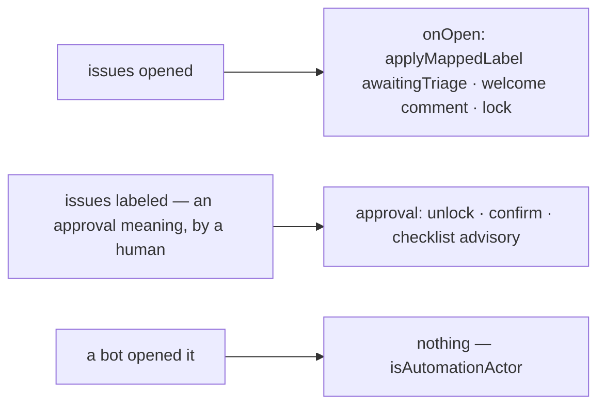

# intake — walk a new issue from its opening to triaged, ready work

Not built: phases 2, 3.

## What the output looks like

On open, when locking is enabled:

> 👋 Hi @alice — thanks for opening this issue! To keep triage orderly, new issues are locked
> until a maintainer reviews them (cc @maintainers). You don't need to do anything — we'll
> unlock and follow up here, usually within a few days.

On approval:

> ✅ This issue was approved and is open for discussion. Thanks for the report, @alice!

On approval, when the triage checklist is incomplete:

> ✅ Approved and unlocked. For the triage checklist, this issue is still missing: a skill label
> · a priority label. (cc @maintainers)

## What the config looks like

Python-shaped — quarantine on open, release on approval:

```yaml
capabilities:
  intake:
    enabled: true
    onOpen:
      label: true # applies the awaitingTriage mapping
      welcome: true
      lock: true # locked until approval
    approval:
      when: [ready] # a human applying any of these meanings releases the issue
      unlock: true
      confirm: true

mappings:
  labels:
    awaitingTriage: "status: pending-review"
    ready: "status: ready for dev"

principals:
  maintainerTeam: "hiero-ledger/hiero-website-maintainers"
```

C++-shaped — no lock; the approval doubles as the finalize check, advising on the repository's
triage requirements:

```yaml
capabilities:
  intake:
    enabled: true
    onOpen:
      label: true
      welcome: false
    approval:
      when: [ready]
      confirm: true
      checklist: # advisory — named in the confirmation when missing
        skillTier: true # any tier from mappings.skills
        issueType: true # a native issue type, or any label from mappings.types

mappings:
  labels:
    awaitingTriage: "status: awaiting triage"
    ready: "status: ready for dev"
  skills:
    goodFirstIssue: "skill: good first issue"
    beginner: "skill: beginner"
    intermediate: "skill: intermediate"
    advanced: "skill: advanced"
  types: # only for label-based repos (solo-style: Bug, enhancement, Documentation…)
    bug: "Bug"
    enhancement: "enhancement"
    docs: "Documentation"
```

The third policy is no policy: a repository that doesn't triage simply never enables intake —
issues arrive unmarked and the community works on them as it sees fit:

```yaml
capabilities:
  intake:
    enabled: false # Default
```

Every other capability composes without it: assignment with `claimableOnlyWhen: []` claims untriaged issues, inactivity reads native draft and review modes, and nothing anywhere assumes an intake flow ran.

Stations are opt-in per key; a repository may run label-only, welcome-only, or the full
quarantine. `approval.when` names mapped meanings — the humans who can apply those labels are the
authorization, so no role is ever read. The checklist is advisory: a missing item is named in the
confirmation comment, never enforced by refusing the human's approval.

## How it works

Two optional stations on every new issue's front door. **On open**: mark it awaiting triage,
welcome the author, and optionally lock it until a maintainer approves. **On approval**: a human
with label rights applies the configured approval meaning — that label application *is* the
authorized command, since GitHub only lets triage-and-up apply labels — and the capability
unlocks, confirms, and advises on anything the repository's triage checklist still misses.

Reports and housekeeping only: it never rewrites a contributor's title or body, never decides an
issue is invalid, and never fights a label a human set.



The approval reacts to the *meaning arriving* on the issue, whoever applied it — GitHub's own
permission model is the gate. Removing the approval label again is a human decision the
capability observes and does not counter: nothing re-locks automatically. The welcome and
confirmation comments are managed — one each, per issue, updated not repeated. A locked issue's
welcome must be posted before the lock lands, in that order, so the author can read why.

| Declaration | Value |
|---|---|
| `triggers` | `issues` (opened, labeled) |
| `facts` / `needs` | `issue`, needing no group. The `issues` producer reads no group on an issue record and makes no pull-request record, so a declaration needing none is the only one that boots on this trigger |
| `resolvers` | `isAutomationActor` — declared, and asked about the AUTHOR, which is the bot guard the flowchart draws. It costs no call: every App actor carries the `[bot]` suffix, so the answer is the login |
| `intents` | `applyMappedLabel` · `postManagedComment` (both declared) · `lockIssue` / `unlockIssue` (in `IntentCatalogue` with operations of their own; undeclared here until phase 2) |
| Permissions | repository: `issues:read`, `issues:write` (covers locking) · organization: none |
| `operationalNeeds` | schedule: false · durableState: none · crossItemCoordination: false · externalDelivery: false |

| Phase | Ships | Needs first |
|---|---|---|
| 1 | onOpen label + welcome, approval confirm | nothing new — issue facts, `applyMappedLabel` and `postManagedComment` all exist |
| 2 | lock and unlock | the lock state on the observation — a fact-shape change, not a registry row. The two write verbs ship: `lockIssue` and `unlockIssue` are operations and `IntentCatalogue` keys |
| 3 | the checklist advisory | issue type and native field values (e.g. `Priority`) on the observation, also a fact-shape change · the `skills` family read (shared) · a `types` mapping family (open-keyed) for label-based repos |

## Verified by

| Scenario | Proves |
|---|---|
| Issue opened, full quarantine config | labeled, welcomed, then locked — in that order |
| Approval meaning applied by a maintainer | unlocked, confirmed, checklist advisory if items missing |
| Approval label applied then removed by a human | nothing re-locks; the removal stands |
| Issue opened by a bot | untouched, and silently — a machine's issue is not a problem to report |
| The actor lookup cannot answer who opened it | nothing happens and the skip says so: unknown is not "a person" (D51) |
| Redelivered `opened` event | one welcome, one lock — journal + managed identity |
| Approval applied before the sweep ever locked (race) | confirm still posts; unlock is a no-op the read-back proves |
| `onOpen.lock: true` while phase 2 verbs are absent | rejected with the file, not silently ignored |
| Checklist enabled with `skillTier` but no skills mappings | rejected with the file, not silently ignored |
| Welcome edited by a human | the edit survives — identity, not body, is the match |
| `mode: dry-run` | the exact label/lock/comment named as `wouldApply`; nothing written |
