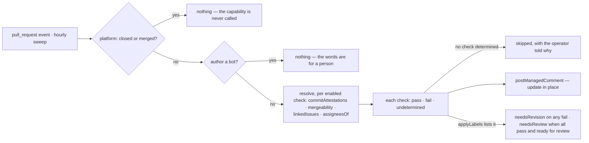

# prDashboard — one dashboard comment that tells a contributor what stops their pull request from being ready to review

## What the output looks like

> Hey @contributor 👋 Thanks for the PR!
>
> ✅ **DCO sign-off** — Every commit carries a sign-off.
>
> ❌ **GPG signature** — These commits have no verified signature:
> `abc1234` fix: handle empty payload
> See the guide: (configured link)
>
> ✅ **Merge conflicts** — This branch merges cleanly.
>
> ✅ **Issue link** — Linked to #1632, #1640.
>
> ❌ **Assignment** — You are not assigned to #1640.
>
> This repository requires all of these checks to pass before review.

A check GitHub could not answer renders undetermined — never pass or fail — and withholds the
all-clear; with nothing linked, the assignment check fails and says what to do first:

> ⏳ **Merge conflicts** — GitHub has not said yet whether this branch merges cleanly.
>
> ❌ **Assignment** — No issue is linked, so we cannot tell whether you are assigned to it. Link the issue this pull request closes to check assignment.
>
> ⏳ A check could not run this time. It runs again on the next update to this pull request.

When every enabled check passes, the closing line is `✅ Every check passes.` A row names at most
twenty commits or issues and counts the rest. Commit shas and subjects are escaped and `@mentions`
broken before rendering (they are attacker-controlled); the guide is the maintainer's own text.

## What the config looks like

Proposed `automations.yml` block:

```yaml
schemaVersion: 1
mode: dry-run # disabled | observe | dry-run | active — rehearse, then arm

capabilities:
  prDashboard:
    enabled: true # explicit true only; anything else is off
    checks: # a check runs only with an explicit enabled: true
      dcoSignoff:
        enabled: true
        guide: "https://github.com/<org>/<repo>/wiki/Signing-Guide" # optional; shown on failure
      gpgSignature:
        enabled: true
        guide: "https://github.com/<org>/<repo>/wiki/Signing-Guide"
      mergeConflicts:
        enabled: true
      linkedIssues:
        enabled: true
        guide: "https://github.com/<org>/<repo>/wiki/Linked-Issues"
        assignedIssues: # sub-check — the dependency is the structure
          enabled: true
          guide: "https://github.com/<org>/<repo>/wiki/Assignment"
    applyLabels: [needsRevision, needsReview] # the positions the verdict may set; each mapped below

mappings:
  labels: # read only in label mode
    needsReview: "status: needs review"
    needsRevision: "status: needs revision"
```

A trimmed setup — two checks, comment only (unused sections simply absent):

```yaml
schemaVersion: 1
mode: active

capabilities:
  prDashboard:
    enabled: true
    checks:
      dcoSignoff:
        enabled: true
      mergeConflicts:
        enabled: true
```

All five checks and `applyLabels` are in the shipped spec. `applyLabels` lists the positions the
verdict may set: a listed position the file has not mapped is refused with the file, and one
prDashboard never sets (anything but the two) is reported on the operator surface at every
evaluation. `docs/capabilities.md` is generated from the spec and is always the shipped list.

Rules: a check runs only when its `enabled` is explicitly `true` — the platform's own consent rule,
one level down; omitted or `false` means off, and a kept block with `enabled: false` is a check
parked, not a check running. `assignedIssues` nests inside `linkedIssues`, so its dependency is
structural — anywhere else it is an unknown key. A missing guide renders without the link.
`needsRevision` follows any failure; `needsReview` only when every enabled check passes on a pull
request marked ready for review — never on a draft, never while a check is undetermined. The label
moves along the workflow map's edge; a pull request the map cannot move (already there,
a conflicted position) keeps its position, and the operator is told. `needsReview` is asked only
from no position or `needsRevision`: a pull request a maintainer moved to `readyToMerge` is theirs,
and passing checks never pull it back.

## How it works

A comment containing a dashboard reporting on basic quality checks that a maintainer specifies as
essential. Updates in-place as the PR changes, and on every hourly sweep — so a base branch that
moved, or an assignment made on the issue, is reflected within the hour without a pull request
event. Advisory only: it explains, it never closes (closing stale work belongs to the inactivity
capability).



One guard is the platform's: a closed or merged item never reaches a capability that has not
declared `closed: true`. One is the capability's own: a bot-authored pull request gets no
dashboard, because the rows ask a person to sign off, link and self-assign. Each check reads its resolver through `platform.resolve` rather than
`ask`, because a read GitHub could not answer is that check's undetermined row, not the whole
dashboard's silence — `mergeable` is `null` for a while after every push. Each undetermined row
puts one explanation on the operator surface; a dashboard with no determined row is skipped
outright (D198).

| Check | Pass | Fail | Undetermined |
|---|---|---|---|
| DCO sign-off | every non-merge commit `signedOff` | failing commits listed | commit list unreadable, or at GitHub's 250 ceiling |
| GPG signature | every commit `verified`, merges included | failing commits listed | commit list unreadable |
| Merge conflicts | `mergeable: true` | `mergeable: false` | GitHub has not resolved it |
| Issue link | ≥1 linked issue, listed | none found | resolver failed |
| Assignment | author assigned to every linked issue | unassigned issues listed, or nothing linked to check against | the links or any assignee list unreadable |

| Declaration | Value |
|---|---|
| `triggers` | `pull_request` (opened, edited, synchronize, reopened, ready_for_review) · `schedule` — the hourly sweep re-evaluates every open pull request; the sweep's own reads are shared, and each pull request costs the resolvers it asks (commits, mergeability, links, one read per linked issue), bounded by the sweep's allowance |
| `facts` / `needs` | a `pullRequest` record with the `readiness` group (draft or ready), which the `pull_request` producer reads |
| `resolvers` | `isAutomationActor` (the author; no request) · `linkedIssues` · `commitAttestations` (read once for both commit checks) · `mergeability` · `assigneesOf` (one read per linked issue; an ISSUE number) — every read a confirmed matrix row (protocol 6.9) |
| `intents` | `postManagedComment` (`summary`) · `applyMappedLabel` (`needsReview`/`needsRevision`) |
| `requiredMappings` | none — `applyLabels` demands the mapping of each position it lists |
| Permissions | repository: `pull_requests:read`, `issues:read`, `issues:write` · organization: none |

| Phase | Ships | Needs first |
|---|---|---|
| 1 | the dashboard comment — DCO · GPG · merge conflict · linked issue(s) · assigned to all linked issues — built | nothing |
| 2 | labels, opt-in — `needsRevision` if any check fails · `needsReview` when all pass and the PR is marked ready for review — built | nothing |
| 3 | recheck after the base moves — the hourly sweep, not fan-out — built | nothing. A push-triggered recheck (the sweep row made due by a `push` to the base) is the refinement, once the read side's schedule lands; `mergeable` as a fact would make the merge row free on the sweep |

## Verified by

| Scenario | Proves |
|---|---|
| Redelivered event | one dashboard, updated, never duplicated |
| Human edits the comment | the next evaluation restores the dashboard: the body is the platform's (D145), so the edit does not survive |
| Hostile commit message | renders inert |
| `mergeable` never resolves | undetermined shown, no all-clear, no label |
| >250 commits (REST cap) | both commit checks undetermined, not pass |
| Two commit checks enabled | the commits are read once |
| Merge commit without a sign-off | exempt from DCO, judged for a signature |
| No enabled check could run | nothing posted; the operator sees each reason and the skip |
| Assignment with nothing linked | fails, saying to link the issue first; asks no assignee read |
| Missing `issues:write` | `forbidden`, not retried |
| Newer human label change | `conflict`; the human change survives |
| Draft PR | dashboard posts; `needsReview` is never written |
| A disabled check | its section is absent — not shown as pass |
| A repository that enables no check | the capability is silent, and asks no resolver |
| A configured guide | it renders on that check's failure and nowhere else |
| A check the App does not run | the file is refused at that check's own path, not ignored |
| Failing check later fixed | dashboard updates; label swaps `needsRevision` → `needsReview` |
| `assignedIssues` outside `linkedIssues` | unknown key, reported — the nesting is the dependency |
| >20 failing commits | twenty named, the rest counted |
| Bot-authored pull request | silent; nothing else is asked |
| Base branch moves after the dashboard | the next sweep rechecks the merge row within the hour |
| Author assigned to the linked issue after the dashboard | the next sweep updates the assignment row; no pull request event is needed |
| Sweep and delivery both evaluate one pull request | one dashboard: the managed identity is per item, and a matching body is `already` |
| An issue linked twice, or a pull request among the links | one assignee read per issue; nothing read for the pull request |
| Any check fails, `needsRevision` listed | the position moves to `needsRevision` along the map's edge |
| Every check passes on a ready pull request | `needsReview`; from `needsRevision`, by `revisionResolved` |
| A position the map cannot move | left alone; the operator is told |
| Maintainer moved it to `readyToMerge`, every check passes | left alone; a failure still moves it to `needsRevision` |
| Assignee login differs from the author's in case | counted as assigned |
| `applyLabels` names an unmapped position | the file is refused |
| `applyLabels` names a position never set | reported; the listed ones still set |
