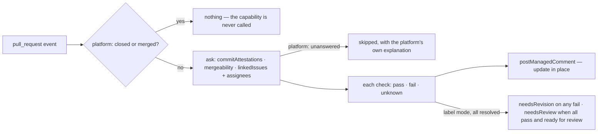

# prQuality — one dashboard comment that tells a contributor what stops their pull request from being ready to review

Not built: phases 2, 3, and four of phase 1's five checks.

## What the output looks like

> Hey @contributor 👋 Thanks for the PR!
>
> ✅ **DCO Sign-off** — All commits have valid sign-offs.
>
> ❌ **GPG Signature** — These commits have no verified signature:
> `abc1234` fix: handle empty payload
> See the Signing Guide (configured link).
>
> ✅ **Merge Conflicts** — No merge conflicts detected.
>
> ✅ **Issue Link** — Linked to issues #1632 and #1640
>
> ❌ **Assignment Check** — You are not assigned to #1640
>
> ⏳ All checks must pass before this PR is ready for review.

Unknown checks render as undetermined — never pass or fail — and withhold the all-clear. Commit
text is escaped and `@mentions` broken before rendering (it is attacker-controlled).

## What the config looks like

Proposed `automations.yml` block:

```yaml
schemaVersion: 1
mode: dry-run # disabled | observe | dry-run | active — rehearse, then arm

capabilities:
  prQuality:
    enabled: true # explicit true only; anything else is off
    checks: # a check runs only with an explicit enabled: true
      dcoSignoff:
        enabled: true
        guide: "https://github.com/<org>/<repo>/wiki/Signing-Guide" # optional; shown on failure
      gpgSignature:
        enabled: true
        guide: "https://github.com/<org>/<repo>/wiki/Signing-Guide"
      mergeConflicts:
        enabled: true
      linkedIssues:
        enabled: true
        guide: "https://github.com/<org>/<repo>/wiki/Linked-Issues"
        assignedIssues: # sub-check — the dependency is the structure
          enabled: true
          guide: "https://github.com/<org>/<repo>/wiki/Assignment"
    applyLabels: true # requires mappings.labels below

mappings:
  labels: # read only in label mode
    needsReview: "status: needs review"
    needsRevision: "status: needs revision"

principals:
  maintainerTeam: "hiero-ledger/hiero-sdk-python-maintainers" # pinged on App-side errors
```

A trimmed setup — two checks, comment only (unused sections simply absent):

```yaml
schemaVersion: 1
mode: active

capabilities:
  prQuality:
    enabled: true
    checks:
      dcoSignoff:
        enabled: true
      mergeConflicts:
        enabled: true

principals:
  maintainerTeam: "hiero-ledger/hiero-sdk-python-maintainers"
```

Only `linkedIssues` is in the shipped spec. A check the App cannot evaluate is not declared and
then ignored — it is absent, so the block above is the page's target and not today's schema, and a
file naming one of the other four is refused as `unknownKey` at that check's own path.
`docs/capabilities.md` is generated from the spec and is always the shipped list.

Rules: a check runs only when its `enabled` is explicitly `true` — the platform's own consent rule,
one level down; omitted or `false` means off, and a kept block with `enabled: false` is a check
parked, not a check running. `assignedIssues` nests inside `linkedIssues`, so its dependency is
structural — anywhere else it is an unknown key. `applyLabels: true` requires the two mappings; the
label reflects the enabled checks only. A missing guide or maintainer principal renders without the
link or the ping.

## How it works

A comment containing a dashboard reporting on basic quality checks that a maintainer specifies as
essential. Updates in-place as the PR changes — and when `main` moves, once phase 3 lands.
Advisory only: it explains, it never closes (closing stale work belongs to the inactivity
capability).



Two of those guards are the platform's and none of the capability's. A closed or merged item never
reaches a capability that has not declared `closed: true`; the engine passes it by in silence. A resolver that cannot answer ends the evaluation as skipped, with an explanation the
platform writes — the shipped single check therefore has no `unknown` row to render, and the one
guard left in `capability.ts` is the check's own `enabled`.

| Check | Pass | Fail | Unknown |
|---|---|---|---|
| DCO sign-off | every non-merge commit has `Signed-off-by:` | failing commits listed | commit list unreadable |
| GPG signature | every commit `verification.verified` | failing commits listed | commit list unreadable |
| Merge conflicts | `mergeable: true` | `mergeable: false` | GitHub never resolves it |
| Issue link | ≥1 linked issue | none found | resolver failed |
| Assignment | author assigned to every linked issue | unassigned issues listed | resolver failed |

| Declaration | Value |
|---|---|
| `triggers` | `pull_request` (opened, edited, synchronize, reopened, ready_for_review) |
| `facts` / `needs` | both implied by the trigger: a `pullRequest` record, needing no group. Phase 2's draft/ready state is the `readiness` group, which the `pull_request` producer already reads — the declaration will name it, the platform already reads it |
| `resolvers` | `linkedIssues` (declared; read confirmed) · `mergeability` (in the catalogue, read CONFIRMED — undeclared here, and the merge-conflict check is unwritten) · `commitAttestations` and `assigneesOf` (in the catalogue, reads confirmed by protocol 6.9 — undeclared here, and their three checks are unwritten). `assigneesOf` answers an ISSUE number: the cited row is `GET /issues/{n}`, which is what the linked-issue assignment check asks about |
| `intents` | `postManagedComment` (`summary`) · `applyMappedLabel` (`needsReview`/`needsRevision`, phase 2) |
| `requiredMappings` | none — the shipped check writes no label |
| Permissions | repository: `pull_requests:read`, `issues:read`, `issues:write` · organization: none |

| Phase | Ships | Needs first |
|---|---|---|
| 1 | the dashboard comment — DCO · GPG · merge conflict · linked issue(s) · assigned to all linked issues. The linked-issue row ships, with its `checks` block and its guide | four checks WRITTEN, and nothing else. The reads behind `commitAttestations` and `assigneesOf` are matrix rows and both resolvers answer; `mergeability` is in the catalogue and its read is confirmed, so the cost is code |
| 2 | labels, opt-in — `needsRevision` if any check fails · `needsReview` when all pass and the PR is marked ready for review | the `readiness` group on this declaration — a registry row, since the `pull_request` producer already reads it · mappings + the `applyLabels` setting |
| 3 | sibling-conflict recheck after merges | cross-item fan-out, which the platform does not have |

## Verified by

| Scenario | Proves |
|---|---|
| Redelivered event | one dashboard, updated, never duplicated |
| Human edits the comment | edit survives until facts change |
| Hostile commit message | renders inert |
| `mergeable` never resolves | unknown shown, no all-clear, no label |
| >250 commits (REST cap) | renders unknown, not pass |
| Missing `issues:write` | `forbidden`, not retried |
| Newer human label change | `conflict`; the human change survives |
| Draft PR | dashboard posts; `needsReview` is never written |
| A disabled check | its section is absent — not shown as pass |
| A repository that enables no check | the capability is silent, and asks no resolver |
| A configured guide | it renders on that check's failure and nowhere else |
| A check the App does not run | the file is refused at that check's own path, not ignored |
| Failing check later fixed | dashboard updates; label swaps `needsRevision` → `needsReview` |
| `assignedIssues` outside `linkedIssues` | unknown key, reported — the nesting is the dependency |
