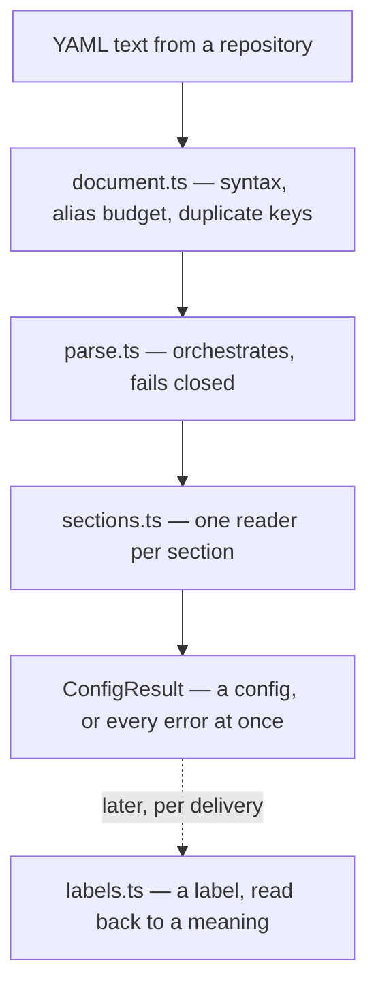

# config/ — what a repository asked for

Six files turning a YAML file in someone's repository into a `RepositoryConfig` the rest of the
platform can trust, or into every reason it was rejected. The rules being implemented live in
[`design/spec/config-schema.md`](../../../../design/spec/config-schema.md) §2–§4; this directory is those
rules as code.

Two properties hold throughout, and most of the design follows from them:

- **Nothing here throws, and nothing does I/O.** Every rejection is a returned value. The shell
  reads the bytes; this layer is pure text-in, result-out.
- **It fails closed, whole-file.** One error anywhere yields no configuration at all — never a
  partial one (D38). But every error is collected first, so a maintainer with three mistakes is
  told about all three rather than made to fix them one push at a time.

## The path a file takes

`document.ts` is the only file that knows YAML exists, which is where the `yaml` dependency stays
quarantined. Everything after it works on a plain value.

`labels.ts` is not part of the parse at all — it runs much later, once per webhook delivery,
turning the repository's label strings back into platform meanings for the normalizer.

## The files

| File | The question it answers |
|---|---|
| [`schema.ts`](schema.ts) | What words may a configuration use, and what shape may it have? The vocabulary, `RepositoryConfig`, and the options a caller supplies. |
| [`results.ts`](results.ts) | What comes back, and how is it built? The error types with the one constructor that makes them. |
| [`sections.ts`](sections.ts) | Is each section well formed, and what does it contribute? One function per section, each total and independent. |
| [`parse.ts`](parse.ts) | Given an already-parsed value, is the whole thing acceptable? Runs the sections and assembles or rejects. |
| [`document.ts`](document.ts) | Is this *text* even a YAML document? Syntax, the alias budget, and the duplicate-key trap. |
| [`labels.ts`](labels.ts) | Which meaning, if any, does this repository label carry? |
| [`index.ts`](index.ts) | The barrel, so consumers name the concern rather than the file. |

## Three prefixes, three jobs

The names carry the distinction, so you can tell what a function does before reading it (D103).

- **`parse*`** — the two entry points, and the only things that turn one representation into
  another. `parseConfigDocument` takes text; `parseConfig` takes an already-parsed value.
- **`read*`** — one per document section, in `sections.ts`. Each returns a `Checked<T>`: a value
  *or* problems, never both, so a value that exists is known good without consulting a list
  somewhere else.
- **`check*`** — returns problems only, for the sections that contribute nothing to the result
  (`checkTopLevelKeys`, `checkSchemaVersion`).

One thing still worth saying out loud: **`readMappings` is in `sections.ts`, not `labels.ts`.**
It validates the `mappings:` block of a document. `labels.ts` answers the opposite question —
given a label on the wire, which meaning is it? Same word, two directions.

## Where the rules are enforced, not just stated

The vocabularies here are locked to the documents that describe them:
[`packages/dev/checks/test/docs.test.ts`](../../../dev/checks/test/docs.test.ts) asserts that
`docs/configuration.md`'s tables match `TOP_LEVEL_KEYS`, `REPOSITORY_MODES` and
`ConfigErrorCode` in both directions, and
[`packages/dev/checks/test/examples.test.ts`](../../../dev/checks/test/examples.test.ts) parses every
shipped example in `docs/examples/` through the real entry point on each run. A rejection
corpus covering every error code lives in
[`packages/core/test/config/documents.ts`](../../test/config/documents.ts), exhaustive by a
mapped type — adding a code fails compilation until a document reaches it.
