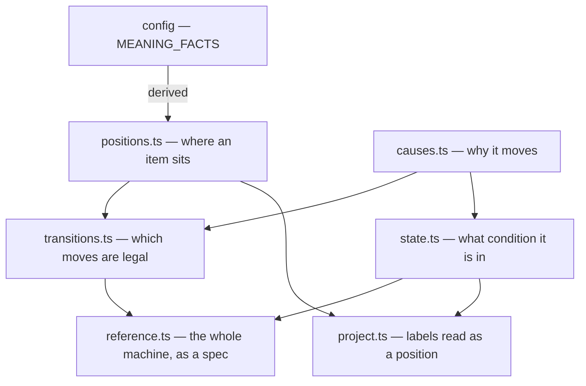

# workflow/ — what states exist, and how they move

The state machine from [`design/core/taxonomy.md`](../../../../design/core/taxonomy.md) §4–§5,
as code. Two flows — issues and pull requests — each with its own positions, its own causes, and
its own edge table.

**Half the vocabulary is derived and half is owned**, which is worth knowing before you read
anything here. Positions come from `config`'s facts table and are only split by flow. Causes,
closure and item state exist nowhere else.

## The files

| File | The question it answers |
|---|---|
| [`positions.ts`](positions.ts) | Where does an item sit in its flow? **Derived** from config — adding a meaning is a change there, not here. |
| [`causes.ts`](causes.ts) | Why does an item move? Scoped per flow, so a pull-request cause on an issue is a compile error. |
| [`state.ts`](state.ts) | What condition is it in — paused, closed, and why? |
| [`transitions.ts`](transitions.ts) | Which moves are legal? The two diagrams as edge tables, and `canTransition*`, the question asked of them. **The one production path** — `capability/intent.ts` screens every requested position change through it. |
| [`reference.ts`](reference.ts) | Given a state and a move, what does the item look like afterwards? The whole state machine — **nothing in production calls it**. |
| [`project.ts`](project.ts) | How does a set of observed labels become one position? |
| [`index.ts`](index.ts) | The barrel. |

## Three things modelled orthogonally, on purpose

`blocked` is a **pause flag**, not a position: an item keeps its position while paused, and
unblocking restores it unchanged (D28). Closure is a **recorded reason**, not a position: a closed
item keeps its labels, and `merged` stays distinguishable from `closedByHuman` because downstream
policy branches on it (D47). Both would become mappable if modelled as meanings — and then a merged
pull request still carrying `needs review` would project as a conflict.

A **conflict** is the third: more than one own-flow position is refused, never repaired (D35). A
conflicted item has no `WorkItemState`, so it cannot reach the walk at all. The no-write rule is
structural rather than a check anyone remembers to make.

## What keeps this honest

[`packages/dev/checks/test/doc-drift.test.ts`](../../../dev/checks/test/doc-drift.test.ts) parses the state
diagrams out of the design document and asserts the edge tables match them **edge for edge, in both
directions**. The tables are the design, transcribed — and a transcription with nothing checking it
is how a missing edge once survived in both artifacts at once (D48).

`reference.ts` has **no production callers, deliberately**. It is the executable taxonomy spec: a
test oracle today, and the adapter's read-back conformance checker when that lands (D93). Its name
and header say so, because the previous arrangement hid that spec in the same file as the
directory's most-used function (D105).

## The cost this directory chooses

Almost everything here exists twice, once per flow: meanings, causes, edges, both predicate pairs,
the legality check, the projection, and now the reference walk. **Eight pairs, deliberately** —
entity-scoping makes a pull-request cause on an issue a COMPILE error rather than a runtime
rejection (D50). The alternative is one flat vocabulary and a check nobody sees until it fires.
Read the repetition as a decision, not an accident.
