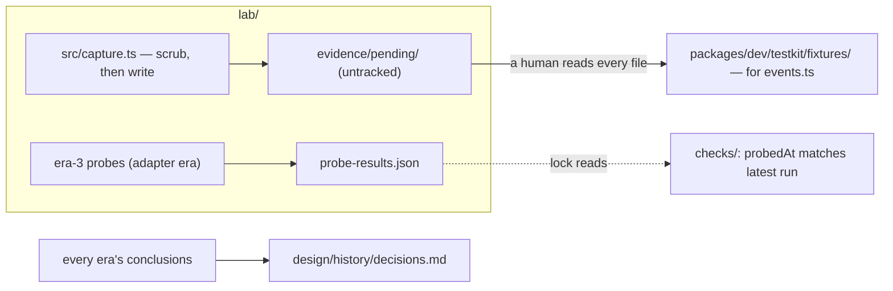

# The lab

The standing instrument for one job: **facts about GitHub's behaviour that only contact with
GitHub can verify.** Tests verify our code; the lab verifies our beliefs about someone else's
system. Conclusions never live here — they migrate to `design/` as decision rows (D32), and the
protocols stay here with the instrument that executes them.

Three eras (D87, D88):

1. **Feasibility (July 2026, closed — reopened once, runner retired)** — protocols 6.1–6.7 below.
   Frozen as methods; their conclusions are in the register, which is the whole of what the era
   produced. **6.8 reopened it**: D123 records the `readLinkedIssues` measurement that supplied its
   missing matrix row and closes that. An era closes when its gate closes, not when its questions
   run out — and when it closes its instrument goes with it, which is what "the harness is
   disposable" meant. The throwaway `harness/` that executed 6.1–6.8 was never tracked, so no
   clone ever had it; a protocol naming `harness/src/…` names the method, not a file to run.
2. **Capture (first run complete; extend with new observation kinds)** — protocol 7.1: scrubbed webhook
   payloads for the `events.ts` normalizer.
   `src/scrub.ts` is the rules, `src/capture.ts` the receiver, and nothing unscrubbed can reach a
   tracked path by construction.
3. **Conformance (when the adapter ships)** — scheduled probes re-verify the perishable facts in
   `packages/core/src/github/` and stamp a tracked result file a `checks/` lock reads.

Tracked: `protocols/`, `src/`, `test/`. Never tracked: `harness/` (era 1's private evidence
archive, and the retired runner where a machine still has one), `evidence/` (capture staging),
`.env` — enforced by `packages/dev/checks/test/never-tracked.test.ts`, not just `.gitignore`. The
lab tracks no evidence: reviewed captures go straight into the testkit as fixtures, conclusions go
to the register, and everything else stays local.

## The road ahead



Next, in order, each on its trigger:

- [x] **7.1 first capture run (2026-08-07)** — five scrubbed issue/pull-request fixtures promoted;
      the catalogue is the shopping list.
- [x] **Reviewed captures land directly in `packages/dev/testkit/fixtures/`** — no waypoint: the
      capture trigger IS the normalizer trigger, and fixtures reach the packages that need them
      through the testkit's export, so they travel into every mutation sandbox that consumes them.
- [ ] **Era-3 conformance probes + schedule** — when the adapter ships. Re-verify `BODY_PATTERNS`
      and rate-limit semantics; stamp `probe-results.json`; add the `checks/` lock that reads it.

---

## Era 1 — the feasibility experiments (frozen record)

The falsification experiments of the platform's feasibility phase: a throwaway
development GitHub App run against a **personal sandbox repository**,
producing the evidence the stage-three exit gate required. The design's
assumptions met real GitHub API behavior here for the first time.

## Capture run

Copy `.env.example` to `.env` and fill in the values:

```bash
cp packages/dev/lab/.env.example packages/dev/lab/.env
```

Then run the capture receiver:

```bash
pnpm --filter @hiero-hackers/automation-lab capture
```

## Ground rules

- **Personal sandbox only** (P8, D22 — both `supported`). The App installs
  on a personal scratch repository, never on a Hiero or Hiero Hackers
  repository. The org sandbox is ring one and comes later, with its owner
  and entry criteria recorded first.
- **The harness is disposable; the evidence is the product.** Nothing in
  `harness/` was the future platform, and the runner is retired now that its
  gate is closed. Every API interaction was captured as structured JSON so
  observations carry their own citations, and that archive is what survives.
- **Bounded hostility.** A run that provokes failures (secondary rate limits,
  forged webhooks) is capped in whatever instrument executes it; we measure
  GitHub's behavior, we do not hammer GitHub's infrastructure.
- **Fork code is never executed with App write credentials** (protocol 6.6).

## The experiments

| Protocol | Experiment | Register rows it feeds |
|---|---|---|
| [`protocols/6.1-installation-auth.md`](protocols/6.1-installation-auth.md) | 6.1 | permission matrix, diagnostics |
| [`protocols/6.2-webhook-delivery.md`](protocols/6.2-webhook-delivery.md) | 6.2 | P9, D1, D18, Q15 |
| [`protocols/6.3-configuration.md`](protocols/6.3-configuration.md) | 6.3 | D31, Q14 |
| [`protocols/6.4-adapter.md`](protocols/6.4-adapter.md) | 6.4 | D9, D20, Q10, Q16 |
| [`protocols/6.5-recovery-storage.md`](protocols/6.5-recovery-storage.md) | 6.5 | D1, D13, D24, D27, Q15 |
| [`protocols/6.6-forks.md`](protocols/6.6-forks.md) | 6.6 | permission matrix, Q11 |
| [`protocols/6.7-read-after-write.md`](protocols/6.7-read-after-write.md) | 6.7 | D46, read-back freshness rule |
| [`protocols/6.8-linked-issues.md`](protocols/6.8-linked-issues.md) | 6.8 | D123, Q16 — gates the `linkedIssues` resolver |

Run order: 6.1 and 6.2 first (the substrate), then 6.3 (reuses the
`core/` validator), 6.4, then 6.5 with the largest time budget — it
produces a *decision*, not just measurements — then 6.6 and 6.7. Protocol 6.8 is the later reopening
recorded by D123.

## Exit-gate artifacts

The stage-three gate closes when these are filled with observations and
the affected register rows are updated:

- [`endpoint-permission-matrix.md`](../../../design/findings/endpoint-permission-matrix.md) — one
  row per operation: endpoint, permission, observed behavior.
- [`storage-decision.md`](../../../design/findings/storage-decision.md) — the three recovery
  sources compared against the five operational needs.
- Each protocol's own **Observations** section, with delivery ids and
  response excerpts as citations.

Closing the gate is a pull request that flips D1, D9, D13, D18, D24, and
D27 to evidence-backed statuses and answers Q10, Q15, and Q16.

## Evidence provenance

The raw evidence logs (`harness/evidence/*.jsonl`) are held privately —
they embed complete webhook payloads, including commit-author email
addresses — and are available to gate reviewers on request. Citation
ids in the protocol documents (`…T19-45-…#14`) resolve into that
private archive; a dangling citation in a published document is
expected, not an error. The protocol documents themselves contain no
secrets, credentials, tunnel URLs, or personal identifiers and are
safe to publish.
