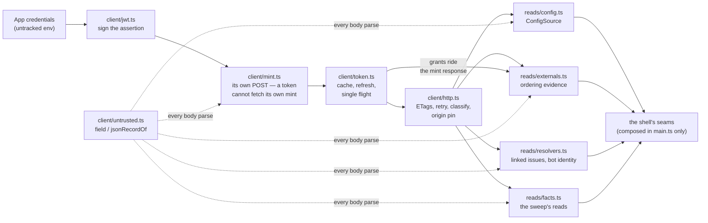

# adapter/ — the only place that talks to GitHub

**The only place in the platform that talks to GitHub.** Everything else decides; this asks and
answers. It sits on `core/` and on nothing else, and exactly one file outside it — the shell's
composition root — ever names it. Green tests mean agreement with the fixtures, not live GitHub;
the provenance table below records what was actually measured. The operation list and its costs are
[`design/findings/endpoint-permission-matrix.md`](../../../../design/findings/endpoint-permission-matrix.md).

## What is here today

Three directories, one per job (D176): `client/` talks to GitHub, `reads/` reads it, `writes/`
changes it. The reads name the client, the writes name the client and the reads, and the client
names neither — which is why the admission gate holds the confirmed endpoint shapes itself.
`packages/dev/checks/test/adapter-layering.test.ts` is the lock.

| File | The question it answers |
|---|---|
| `client/jwt.ts` | What proves we are the App? |
| `client/token.ts` | What token may we call with, right now? |
| `client/contract.ts` | What shapes and spellings does every GitHub exchange use? |
| `client/endpoints.ts` | Which write endpoints did the matrix confirm, and what does each one stale? |
| `client/admission.ts` | May this request be sent, and what permission does it need? |
| `client/http.ts` | How does one admitted request travel, and come back classified? |
| `client/mint.ts` | How is a token minted when no token exists yet? |
| `client/untrusted.ts` | How are GitHub's bytes read without trusting them? |
| `reads/config.ts` | Which configuration is on the repository's default branch? |
| `reads/externals.ts` | Which of core's external facts does GitHub answer, live? |
| `reads/resolvers.ts` | How are the two catalogued resolver questions answered? |
| `reads/facts.ts` | What are a repository's open items, and what does each one's record say? |
| `writes/writes.ts` | How does one write travel, and what does its answer mean? |
| `writes/readback.ts` | Did the write land — is the postcondition observably true? |
| `writes/operations/` | Which endpoints does one write operation reach, and how does it build them? |

Every outside dependency — fetch, the clock, the mint call — is injected, so no test reaches the
network. The client exposes only the REST and GraphQL reads this stage has proved, pins credentials to GitHub's
HTTPS API origin, and refuses to follow redirects. Each file's header carries its own detail; read
them in the table's order.

## The four rules every file here holds to

| Rule | Consequence |
|---|---|
| Nothing throws across a seam | Every failure is a typed value — a `ConfigLoadOutcome`, an ordering of `"unknown"`. That is why one bad delivery can never wedge the queue |
| Unknown is never absence (D51) | A failed read must never become a default, and the decision layer refuses to act on unknown — so a failed read can never fake a fact |
| Fail closed on identity | Configuration is read at the repository's default branch and nowhere else. The contents API serves fork-authored content at a pull request's head sha (experiment 6.6), so reading a head sha would let a fork rewrite the rules that judge it |
| The shell changes only when a seam's contract does (D122) | A new live read lands behind a seam that already exists; the only shell edit an adapter operation may need is composition in `main.ts` |

## The trap this package exists around

**An expired token and a wrong private key return byte-identical 401 bodies** (`"Bad credentials"`,
observed 2026-07-23). Nothing in the response distinguishes them, so `isPastExpiry` is the local
fact `classifyFailure` needs to tell an expiry apart from a credential fault. A token cache that
only reacted to 401s would classify every expiry as a bad key.

## Provenance, and how each fact goes stale

Dated measurements of a live system; D40 makes re-probing standing rather than occasional. Rows
without a probe date hold **documented** knowledge — things GitHub publishes and would announce
changing — so they are here for coverage, not for the quarterly pass.

| Fact | Where it lives | Probed by | Date | Goes stale when | First symptom |
|---|---|---|---|---|---|
| JWT span ≤ 600 s from `iat` | `ASSERTION_LIFETIME_SECONDS` | GitHub's docs | documented | the cap changes | every mint 401s at once — loud |
| RS256, backdated `iat` | `jwt.ts` | GitHub's docs | documented | the signing scheme changes | every mint rejected — loud |
| Installation token TTL is 1 h | `REFRESH_SKEW_SECONDS`, `MINT_FLOOR_SECONDS` | matrix row, mint response | 2026-07-23 | GitHub shortens the TTL | **quiet if shortened below ~2 min**: the floor would serve genuinely dead tokens |
| Expiry and bad key share a 401 body | `isPastExpiry`, and core's `classifyFailure` | experiment 6.1 | 2026-07-23 | GitHub distinguishes them | quiet — we keep using a local fact that became unnecessary |
| `permissions` is `{scope: level}` | `grantsFromPermissions` | mint response | 2026-07-23 | a level outside `read`/`write` enters the ceiling | **quiet**: the grant is dropped, and a capability refuses citing a permission the installation actually holds |
| REST request version is `2026-03-10` | `GITHUB_API_VERSION` | GitHub's version docs | documented | the version approaches sunset | response carries `deprecation`/`sunset`, then calls return 410 |
| Authenticated conditional GET returning 304 costs no primary quota | `http.ts` ETag cache | GitHub's best-practice docs, experiment 6.4 | documented + 2026-07-23 | GitHub changes conditional accounting | rate usage rises on unchanged reads |
| Mint answers 201 with `token`, `expires_at`, `permissions` | `mint.ts` | experiment 6.1, matrix row | 2026-07-23 | the response shape changes | unreadable token/expiry is transient; missing permissions grant nothing |
| Contents API wraps a file as `{type, encoding, content, sha}` — base64 inline, `encoding: "none"` past 1 MB | `config.ts` decode | GitHub's contents docs | documented | the envelope or the 1 MB behavior changes | **quiet-ish**: healthy configs read as defective (fail-closed records) or unrecognized (retries) |
| Timeline entries name `event`, a typed `actor`, second-precision `created_at`; pages ascend | `externals.ts` six-kind filter | GitHub's timeline docs, matrix row | documented + 2026-07-23 | the shape or the kinds change | missing actor/date on a counted event is unknown; **quiet**: new kinds remain uncounted |
| `closingIssuesReferences(excludeUserLinked: true)` returns same-repository closing references without manual links; both grants must be present before trusting an empty result | `resolvers.ts` linked issues | D123, protocol 6.8, matrix row, [GitHub's GraphQL reference](https://docs.github.com/en/graphql/reference/pulls) | documented + 2026-08-29 | the field, grant behavior, or hidden-target behavior changes | GraphQL errors, malformed data, or missing grants answer unknown; cross-repository support stays closed |
| The reviews list, the timeline on a pull request number, and the commits page are readable under `pull_requests: read` — and the timeline under `issues: read` alone as well | `facts.ts` `CONFIRMED_SWEEP_READS`, `resolvers.ts` `CONFIRMED_RESOLVER_READS` | protocol 6.9, matrix rows | 2026-09-12 | GitHub moves the timeline behind `issues` only, or changes what a grant reaches | 403 on a sweep read — loud, and the group answers `unread` rather than guessing |
| `verification.verified` is false for a commit authored through the contents API under a USER token | `resolvers.ts` commit attestations | protocol 6.9, matrix row | 2026-09-12 | GitHub signs user-token API commits | **quiet**: a GPG check would pass commits nobody signed |
| Installation identities use App bot logins such as `name[bot]` | `resolvers.ts` automation actor | [GitHub's App identity guide](https://docs.github.com/en/apps/oauth-apps/building-oauth-apps/differences-between-github-apps-and-oauth-apps) | documented | the login convention changes | App actors are mistaken for people or people for App actors |

**The quiet rows are the ones that matter.** A wrong JWT bound fails loudly within minutes; a TTL
that shrank, a grant level silently dropped, or a timeline shape that drifted keeps every test
green while the running system misbehaves — and the timeline row is the worst of the three, because
its failure direction is writing over human edits. `MINT_FLOOR_SECONDS` is *derived* from the TTL
row — its safety argument is "an hour is far longer than a minute", and it stops being sound the
day that stops being true.

**Cadence:** quarterly for the dated rows, plus ad-hoc whenever a first-symptom column shows up in
operator reports. **Owner:** unassigned, the same unfilled row as its sibling in `core/`.

## Live rehearsal

On 2026-08-30, a locally signed reconstruction of sandbox pull request #2 ran through live config,
installation grants, timeline evidence, and linked-issue reads. The canonical dry-run report recorded
`newerHumanChange`; D93 records the proof and its limits.

## What keeps it honest

`pnpm --filter @hiero-hackers/automation-runtime test` typechecks and runs the suite. CI holds no
credential and neither does this package: every credential is untracked environment, supplied to
the composition root. Test fixtures are built lazily, never at collection time — the reason lives
in `test/adapter/harness.ts`'s header (D89).
