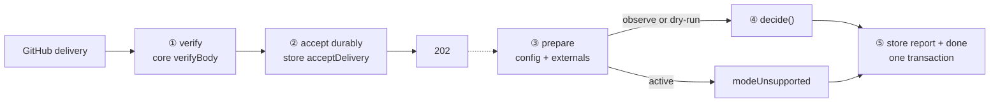

# shell/ — transport, not decisions

The transport package (D93). A webhook delivery goes in; a persisted report comes out; every decision
in between belongs to core's one verb. The shell's entire contribution is **order**:

> verify before accept, accept before ack, decide before act, commit the canonical outcome atomically.



## The five stations, and who owns each

| Step | File | Owned by |
|---|---|---|
| ① Verify the signature before anything else | [`inbound/receiver.ts`](inbound/receiver.ts) | core's `verifyBody` — the receiver never parses what it has not verified |
| ② Persist durably, only then `202` | [`inbound/receiver.ts`](inbound/receiver.ts) → [`compose/shell.ts`](compose/shell.ts) | the store's `acceptDelivery` (P9): a crash after the ack loses nothing |
| ③ Prepare: config text → `parseConfigDocument`, externals assembled | [`inbound/deliveries.ts`](inbound/deliveries.ts), [`decide/config.ts`](decide/config.ts), [`decide/externals.ts`](decide/externals.ts) | core's config layer; a broken config becomes `configRejected`, while `active` becomes `modeUnsupported` before `decide()` in any composition that wires no write path — the default |
| ④ Decide with one verb | [`decide/item.ts`](decide/item.ts) | core's `decide()`; the shell cannot assert a world — `DerivedWorld` has no public constructor |
| ⑤ Commit completion | [`inbound/deliveries.ts`](inbound/deliveries.ts) → store's `completeDelivery` | store verifies delivery identity and claim ownership, then marks the delivery done in one transaction; what was decided is already `decision` rows (D173) |

## Why a delivery goes into the database and comes back out

The two lanes never speak directly: the receiver's only output is a durable row, and the
delivery lane's only input is that row — inside the same process. If that looks over-engineered,
price every crash:

| A crash… | Costs |
|---|---|
| before the durable row | nothing — no 202 was sent, so GitHub redelivers |
| after the 202 | nothing — the row waits; the next drain (or next start) finds it |
| mid-decision | nothing — the claim stales after 15 minutes and is reclaimed |
| mid-effect, once a call was sent | nothing lands twice — the send stays open, and the sweep reads GitHub back before it ever resends |

The counterfactual is the reason: handle a delivery in memory and there is a window between the
202 and the finished work where a crash loses it **permanently** — and experiment 6.2 measured
GitHub's own delivery ledger recording exactly such a lost delivery as *successfully delivered*.
No sweep or redelivery button would ever find it. The accept-before-ack ordering (P9), the claim
token, and the stale rule exist to make that window's width zero; D18's one-process,
business-hours posture is safe *because* anything a crash leaves mid-flight is repaired by a
later pass.

The configuration file lives at **`automations.yml` in the repository root** (D93): it configures the
automation platform, not GitHub, and everywhere else in the design GitHub is an adapter detail — a
`.github/` home would say otherwise at the most user-visible spot.

## Every stub is a named hole the read-only adapter fills

The stubs have the shape of the truth ([`decide/externals.ts`](decide/externals.ts)), and the adapter fills
each behind its existing seam. With App credentials in the environment (`APP_ID`,
`INSTALLATION_ID`, `PRIVATE_KEY_PATH`), `main.ts` composes the live fill — one conditional, the one
D93 promised; all three variables are required together and a missing key file fails before
listening. Without them the stubs run, which is CI's permanent path.

| Named hole | Live fill | Status |
|---|---|---|
| `fileConfigSource` (operator's local copy) | fetch `automations.yml` at the default branch | **filled** (#133) |
| `installationGrants: ["issues:write"]` | the installation's live grant list, riding the mint response | **filled** (#134) |
| `latestHumanChangeAt: () => null` | timeline evidence per item (D119) | **filled** (#134) |
| no `resolve` | `linkedIssues` / `isAutomationActor` lookups | **filled** (#136) |

The ordering stub's `() => null` and not `() => "unknown"` deliberately: `"unknown"` is a safe conflict and
would refuse every write, burying dry-run's real findings under a uniform refusal. On the
credential-free path, dry-run reports **overstate** what would apply.

## Running against the sandbox

```
WEBHOOK_SECRET=…            # the sandbox App's webhook secret
REPO_OWNER=owner-sandbox    # required without App credentials: the repository the local file serves
REPO_NAME=automation-sandbox
APP_ID=…                    # optional App credentials; provide all three together
PRIVATE_KEY_PATH=…
INSTALLATION_ID=…
APP_SLUG=…                  # optional; the App's URL slug. Arms the write path
PORT=8790                   # optional
HOST=127.0.0.1              # optional; omit to use Node's default bind host
CONFIG_FILE=…               # credential-free fallback; default <state home>/automations.yml
STORE_PATH=…                # optional; default <state home>/shell.sqlite
TICK_SECONDS=60             # optional; the reconciliation tick: requeue, recover, drain, fire
SWEEP_CADENCE_HOURS=1       # optional; arms the fact sweep and sets how often a repository is read
SWEEP_WRITE_CAP=20          # optional; how many writes one sweep firing may send
SWEEP_READ_BUDGET=2000      # optional; how many requests one sweep firing may spend reading
KILL_SWITCH=1               # optional; refuse everything, loudly — including armed writes
SUSPENDED=1                 # optional; accept every delivery, decide and send nothing (D171)
XDG_STATE_HOME=…            # optional; where the state home lives
```

**`APP_SLUG` is the only thing that arms writes, and it is not a fourth credential.** The triad buys
reads; writing needs one thing more, because a read-back that cannot tell this App's own comment from
a person's cannot recognise what it wrote — which is the check that stops a duplicate comment and
stops the platform editing someone else's writing. The slug becomes the bot login `<slug>[bot]`, and
`APP_ID` supplies the other half of the identity. Credentials with no slug boot exactly as they do
today; a slug with no credentials, or one that cannot spell a login (empty, spaced, bracketed), fails
closed before the process listens. The `startup` line carries `writes: "armed" | "absent"`, so which
composition is running is readable before any delivery arrives.

**`SWEEP_CADENCE_HOURS` is the same shape for the other lane.** Absent, this process reads a
repository only when GitHub speaks first, and a capability that runs on a clock is configured and
never woken; present, a due `sweep:` schedule row is claimed on the reconciliation tick and becomes
one fact record per open item. It needs the credential triad for the reason the slug does — a
cadence is an instruction to READ GitHub — and the `startup` line carries
`sweep: "armed" | "absent"` beside `writes`.

**One firing writes at most `SWEEP_WRITE_CAP` times, twenty by default.** A webhook writes for one
item and a firing writes for every one, so the cap is the sweep's: an approved act it holds back is
refused `sweepWriteCap`, is journalled nowhere, and is decided again next firing from the same cause.
The `sweepFinished` line carries `writes` and `heldBack`, so a repository the cap is starving says so
every firing.

`KILL_SWITCH=1` refuses at the decision gate as it always has, and an armed write path meets it again
between deciding and applying: the applier re-checks it before every send and before every resend, so
the standing gate stops effects a decision already approved.

The **state home** is `$XDG_STATE_HOME/sdk-automations`, or `~/.local/state/sdk-automations` when that
variable is unset or relative. It is deliberately outside the package: in a container
`packages/runtime/data/` is an image layer, and a redeploy would take the canonical reports with it.

```bash
pnpm --filter @hiero-hackers/automation-runtime start
```

`GET /healthz` answers `200 ok` for platform liveness probes; every other GET is still 405.

Everything the process does after it is alive is one JSON line per event ([`log.ts`](log.ts)):
`at`, `event` from a closed vocabulary, and that event's own fields, with `deliveryId` on every line
about one delivery — so `grep` on a GUID returns its whole passage. Lines an operator should notice
go to stderr and the rest to stdout. The refusals to boot are the exception, and stay human sentences:
they precede the process being alive, and have no delivery to name.

Point the existing smee channel at it and open an issue on the sandbox. What each delivery decided
is `decision` rows in `shell.sqlite`, and the completion line names the kind it finished as. Startup
still starts draining pending SQLite deliveries before listening. `pnpm shell:explain` prints an
item's rows; no operator surface renders a whole pass as one document.

`data/` is never tracked (see the root `.gitignore`), the same rule as
`packages/dev/lab/evidence/`. It is no longer the default home, but it stays covered: an operator who
points `STORE_PATH` back at it is still writing raw payloads and real repository names.

## Deliberately out of the first slice

- **The scheduler beyond one repository** — the fact sweep is built ([`sweep/sweep.ts`](sweep/sweep.ts)), and it
  is a second caller of `decide()` rather than a second pipeline: a due `sweep:` row becomes one fact
  record per open item, and each record goes through the same box's mode gate, applier and
  decision rows. `SWEEP_CADENCE_HOURS` is what arms it, and it needs the App credentials for the same
  reason `APP_SLUG` does — a cadence with nothing to read GitHub with is half a configuration. Every
  due row fires, and the repository a firing reads comes from that row's id. The three reads
  `design/guides/sweep.md` §1 once marked unconfirmed are cited (6.9, 2026-09-12), so the
  pull-request `review` group is read and the ladder decides.
- **Config schema migration** — live and local reads intentionally share today's schema; migrations
  remain separate work.
- **Active mode by default** — with no `APP_SLUG` in the environment, `main.ts` wires no applier and
  `mode: active` still ends as `modeUnsupported` before a decision. That record now means what it
  says: *this composition wires no write path*, not *no write path exists*. The write path is built
  — [`effects.ts`](effects.ts) is the vocabulary, defining what one call is and the payload
  a resend reads; [`apply/operations/`](apply/operations/index.ts) is one module per operation,
  each planning, spelling, sending and proving its own calls; and [`apply/`](apply/apply.ts)
  drives them: lease, journal before send, an apply-time re-gate against a live read, and a
  read-back that proves each call landed — and `APP_SLUG` is what arms it (see below). Running a
  repository in `active` for the first time is its own reviewed step.
- **Any installation list** — the process serves the installation (D169), and a repository serves
  itself by delivering: the payload names it, that name selects the seams the pass runs on, and the
  first delivery declares its sweep row. Nothing enumerates what the installation covers, so a
  repository that has never delivered is a repository this process has never heard of.

The capture receiver in `packages/dev/lab/src/capture.ts` was this package's embryo: same verify-first line,
same 202 — it just wrote a file where the shell continues through canonical SQLite completion.
