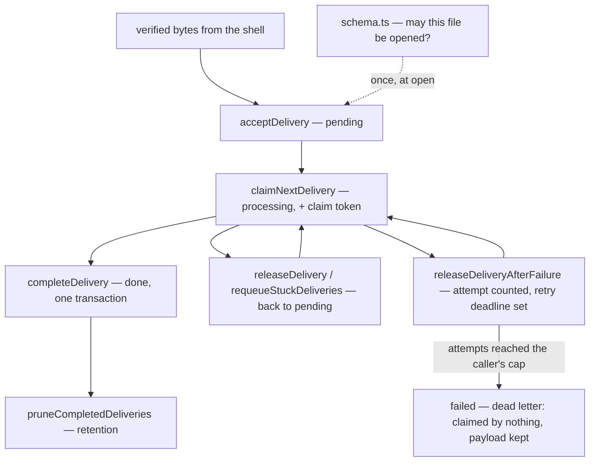

# store/ — the owned operational store

The single-file SQLite store decided by protocol 6.5 and amended by D110 —
`design/findings/storage-decision.md` — **ratification pending** under the
stage-four review. One file, two modules over one connection: the inbox is a
queue whose rows move state in place, the ledger is appended and folded
(D164). `Store` itself owns only the file.

Two properties hold throughout, and most of the design follows from them:

- **The store never reads the clock.** Every timestamp is caller-supplied and
  validated as exactly the `Date.toISOString()` shape (millisecond-precision
  UTC `Z`). One constant-width format means lexicographic order is
  chronological order, which every `<=` comparison relies on; anything else
  (offsets, mixed precision) throws instead of misordering silently.
- **It fails closed on anything it does not recognize.** A declared schema
  version above the current one, an unversioned file holding anything at all,
  a delivery whose GUID is reused with different bytes — each is refused
  rather than interpreted.

## What it owns, and what it does not

**Owns:** the durable state transitions — which row may move to which state,
under which write lock, on whose claim token — and the version contract that
decides whether a database file may be opened at all.

**Does not own:** the payload's meaning. The store does not parse JSON,
inspect repositories, verify signatures, normalize events, log bodies, or
scrub payloads. The payload is an opaque byte array at this boundary. It also
owns no policy: callers must supply retention windows, lease durations and
requeue thresholds.

## The path a delivery takes

That is the whole of `inbox.ts`. The other half has no such path, because it
has no states: an effect's history is a list of facts, appended one at a time
and never rewritten, and where the effect stands is FOLDED from them on every
read rather than stored (D161). `record` appends, `stateOf` folds, `open`
lists the sends nothing has closed, and retention takes whole settled effects
rather than single facts. The effect leases and the schedule rows live beside
the facts because they are the same half's concern: what one worker may start
now, and when the clock says to start it.

## The questions, and where each is answered

| The question | Answered in |
|---|---|
| Which owned database format is this, and how does it reach the current version safely? | [`schema.ts`](schema.ts) |
| Who owns the file — its pragmas, its version, and the two modules over it? | [`store.ts`](store.ts) |
| Which durable delivery transition may commit now? | [`inbox.ts`](inbox.ts) |
| Which fact may be appended, what do the facts add up to, and who holds the lease and the clock? | [`ledger.ts`](ledger.ts) |
| Where does an effect stand, given its facts, and is that history possible? | [`fold.ts`](fold.ts) |
| What are a delivery, a fact and a scheduled row? | [`deliveries.ts`](deliveries.ts), [`facts.ts`](facts.ts), [`schedules.ts`](schedules.ts) |
| What must an argument be before a statement runs? | [`guards.ts`](guards.ts) |

[`index.ts`](index.ts) is the barrel, so consumers name the concern rather than
the file inside it.

## The tables

| Table | Role | Evidence status |
|---|---|---|
| `seen_delivery` | atomic webhook acceptance and work queue: opaque GUID, event name, exact payload bytes, SHA-256 digest, receipt/terminal times, claim state, and the failed-attempt count with its retry deadline | GUID dedup was decided in 6.5; durable intake semantics are exercised by this package's restart and two-thread contention tests |
| `effect_fact` | one appended row per fact of an effect — `sent`, `unsent`, `landed`, `refused`, `abandoned`, `warned`, `reversed` — each carrying item, verb and login | the runnable applier folds them to decide every pass, recovers open sends through GitHub read-back, and refuses stale configuration revisions (D161) |
| `decision` | one row per item per capability per pass, webhook and sweep alike, with verdict, code, detail and the effect it minted | the record of what a pass decided; written by the box that decides, retention is the done-deliveries window (D163, D173) |
| `effect_claim` | one-winner LEASE per effect: atomic stale takeover, released on completion | the runnable applier claims every effect and its recovery pass; store contention tests cover the D41 mechanics |
| `schedule` | clock-triggered work; `pending → running → done`, with claim age and a per-firing completion token | decided in 6.5; restart/requeue mechanics are pre-covered here; `claimed_at` and claim tokens prevent stale completion under D43 |

Design rules (from the evidence, not preference): state transitions are
synchronous SQLite writes, and delivery acceptance commits before it
returns; tables have no foreign keys, and completion touches `seen_delivery`
alone (D173); an open send is deliberately unresolvable from the facts
alone. The applier resolves it against GitHub state before retrying.

Three store findings, argued in full in their register rows:

- `FINDING(store-claim-lease)` → **D41** — claims are leases: atomic
  stale takeover, `release` frees only the holder's own row. These mechanics
  do not fence a GitHub request already in flight, so live takeover remains
  open.
- `FINDING(store-journal-attempts)` → **D42**, revised by **D161** — a fact is
  never rewritten, and an open send's attempts are its `sent` facts less its
  `unsent` ones, so retry bounds survive restart. Retention takes whole
  settled effects, never single facts.
- `FINDING(store-sweep-api)` → **D43** — `ledger.requeueStuck(claimedBefore)`
  returns stuck `running` schedules to `pending` (stuckness = claim
  age); `ledger.open(before)` exposes unresolved sends; requeued
  work re-enters `claimDue`. `inbox.pruneCompletedDeliveries`, `ledger.prune`
  and `ledger.pruneDecisions` accept caller-supplied retention cutoffs;
  pending/processing deliveries, effects with an open send, and warned effects whose promised action is still ahead are never pruned.

## Version contract and migration

`PRAGMA user_version` is the explicit SQLite-native schema marker; the current
version is `1`, and there is exactly one migration — the one that creates the
schema above. Nothing has launched, so no store written against an older shape
will ever be opened and there is no history here to convert (D165). A declared
version above `1` is refused before the store changes the database. A
version-zero file is accepted only when it is empty; anything else in it is
unrecognized and fails closed, as does a version-1 file whose shape has
drifted. The fingerprint includes exact table and index definitions, so column
types, nullability, primary keys, checks, partial-index predicates, and the
absence of triggers or views are enforced together.

The one step runs inside one `BEGIN IMMEDIATE` transaction, including its
`user_version` update. An interruption therefore leaves an untouched file or
the complete current schema; reopening repeats the same work. Fault injection
interrupts the step before reopening the file, and the shape a fresh database
creates is the fingerprint every open is held to.

`packages/dev/checks/test/pre-launch.test.ts` makes the pre-launch rule a fact
rather than a habit. The first real installation writes a `LAUNCHED.md` marker
under `design/`, naming its date and the schema version then current. While
that marker is absent the version is `1` with one migration entry and no
versioned history constants; once it exists the version it names becomes the
floor, and migrations are append-only from there.

## Durable webhook intake boundary

GUID-only deduplication had a demonstrated P9 loss window: a receiver
could record the GUID, acknowledge GitHub, and crash before retaining
the payload or creating work. A redelivery would then find the GUID and
be suppressed even though no recoverable work existed.

`acceptDelivery` closes that store-level window by committing the
delivery GUID, verified event name, exact verified payload bytes,
SHA-256 digest, receipt timestamp, and pending state as one durable
record. An identical GUID/event/payload returns `duplicate` with the
current state. Reusing a GUID with a different event name or payload
digest returns `conflict`; neither result overwrites the original.
There is no identity-only insertion API.

`claimNextDelivery` atomically moves one deterministically selected row
to `processing` and returns its event name and exact bytes with a fresh
256-bit claim token, plus the count of attempts already spent on it. It can
take over a processing row whose claim is at or before the caller's stale
boundary, and it skips two kinds of ineligible row inside the same statement:
one still waiting out a retry deadline, and one dead-lettered. `releaseDelivery`,
`releaseDeliveryAfterFailure` and `completeDelivery` are conditional
on that token, so an earlier worker cannot mutate a replacement claim.

`releaseDeliveryAfterFailure` is the failed attempt's counterpart to
completion. In one statement it counts the attempt, clears the claim, and
either sets the caller's retry deadline (`retryScheduled`) or — when the
incremented count reaches the caller's `maxAttempts` — dead-letters the
delivery as `failed` (`deadLettered`). The store owns no policy here: the
caller that spaces the retries owns the budget they spend. A dead-lettered
delivery is claimed by nothing, keeps its payload bytes because nothing
completed it, and is never pruned as completed work.
`deadLetteredDeliveries` lists them by dead-letter time then GUID, identity
and attempt count only.

What a pass decided is `decision` rows, written before completion by the box
that decided it; completion is one transaction on `seen_delivery` alone (D173).

`completeDelivery` verifies the GUID, event name, payload digest, processing
state, and current claim token under one write lock, then changes the delivery
to `done`, clearing payload bytes while retaining delivery identity and
stamping `completed_at`. A token that does not own the current claim returns
`notOwned`. The committing token is NOT kept, so a delivery already `done`
returns `alreadyCompleted` to every token alike — the store knows only that it
finished.

`requeueStuckDeliveries` provides the explicit reconciliation path.
Retention pruning deletes eligible delivery rows; pending and processing work
is never eligible.

This is the durable store contract, not end-to-end webhook durability.
A production HTTP receiver still must verify the signature before
acceptance and acknowledge GitHub only after an `accepted` or
`duplicate` result. Queue-capacity/backpressure policy, the event
normalizer, hosting, and the reconciliation service are also still missing.

## What keeps it honest

The timestamp contract is property-tested for order equivalence over random
instant pairs, so the lexicographic-equals-chronological claim is checked
rather than asserted. The two pragmas that make the crash model true —
`journal_mode = DELETE` and `synchronous = FULL` — are pinned by a
configuration test, so they cannot change silently. Crash atomicity is proved
at the real boundary: interruption of the schema step, worker exits after the
delivery update and after the commit, and two separately connected worker
threads racing stale and current tokens.

Requires Node 23.4+ — `node:sqlite` needs `--experimental-sqlite` on
22.x and runs unflagged from 23.4. Node 24.11.1 still emits a non-failing
`ExperimentalWarning`. Part of the repository's pnpm
workspace — `pnpm install` at the repository root links the
`@hiero-hackers/automation-core` dependency (branded `DeliveryGuid`).
`pnpm test` runs typecheck plus the crash-simulation suite (fresh
instance on the same file = the restarted process).
