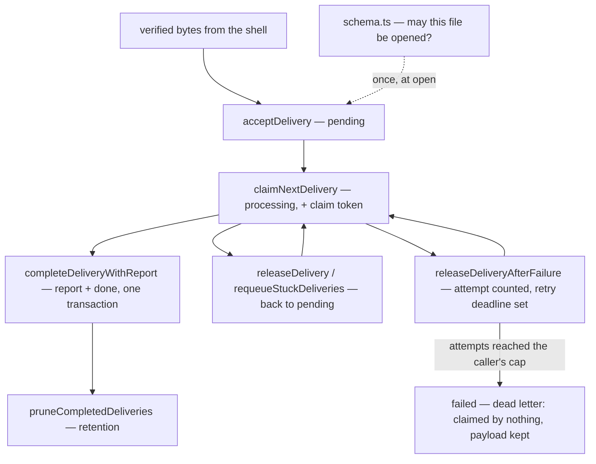

# store/ — the owned operational store

The single-file SQLite store decided by protocol 6.5 and amended by D110 —
`design/findings/storage-decision.md` — **ratification pending** under
the stage-four review. The recovery experiment required four operational
tables; the delivery completion boundary adds a fifth canonical-report table,
and the grace contract (`design/guides/grace.md` §4) a sixth for the warning a
destructive act must stand on.

Two properties hold throughout, and most of the design follows from them:

- **The store never reads the clock.** Every timestamp is caller-supplied and
  validated as exactly the `Date.toISOString()` shape (millisecond-precision
  UTC `Z`). One constant-width format means lexicographic order is
  chronological order, which every `<=` comparison relies on; anything else
  (offsets, mixed precision) throws instead of misordering silently.
- **It fails closed on anything it does not recognize.** A declared schema
  version above the current one, an unversioned file whose fingerprint
  matches no schema this repository created, a delivery whose GUID is reused
  with different bytes — each is refused rather than interpreted.

## What it owns, and what it does not

**Owns:** the durable state transitions — which row may move to which state,
under which write lock, on whose claim token — and the version contract that
decides whether a database file may be opened at all.

**Does not own:** the payload's meaning. The store does not parse JSON,
inspect repositories, verify signatures, normalize events, log bodies, or
scrub payloads. The payload is an opaque byte array at this boundary. It also
owns no policy: callers must supply retention windows, lease durations and
requeue thresholds.

## The path a delivery takes

The effect journal, effect claims and schedules run the same way and are
independent of this path: no foreign keys join them. Delivery finalization is
the one deliberate exception, updating `delivery_report` and `seen_delivery`
together under a single write lock (D110).

## The files

| File | The question it answers |
|---|---|
| [`schema.ts`](schema.ts) | Which owned database format is this, and how does it reach the current version safely? |
| [`store.ts`](store.ts) | Which operational state transition may commit now? The one class, plus the timestamp contract every call validates. |
| [`deliveries.ts`](deliveries.ts) | What is a delivery, and what comes back from operating on one? |
| [`facts.ts`](facts.ts) | What does the ledger record, and what does reading those records answer? |
| [`fold.ts`](fold.ts) | Where does an effect stand, given its facts, and is that history possible? |
| [`ledger.ts`](ledger.ts) | Which fact may be appended, and what do the appended facts add up to? |
| [`schedules.ts`](schedules.ts) | What is a scheduled row, before and after a firing is claimed? |
| [`index.ts`](index.ts) | The barrel, so consumers name the concern rather than the file. |

## The tables

| Table | Role | Evidence status |
|---|---|---|
| `seen_delivery` | atomic webhook acceptance and work queue: opaque GUID, event name, exact payload bytes, SHA-256 digest, receipt/terminal times, claim state, and the failed-attempt count with its retry deadline | GUID dedup was decided in 6.5; durable intake semantics are exercised by this package's restart and two-thread contention tests |
| `effect_fact` | one appended row per fact of an effect — `sent`, `unsent`, `landed`, `refused`, `abandoned`, `warned`, `reversed` — each carrying item, verb and login | the runnable applier folds them to decide every pass, recovers open sends through GitHub read-back, and refuses stale configuration revisions (D161) |
| `decision` | one row per item per capability per pass, webhook and sweep alike, with verdict, code, detail and the effect it minted | written by the lane that decides; retention is the done-deliveries window (D163) |
| `effect_journal` | the superseded write-ahead journal: intent/done rows with revision and attempt counter | retained by schema version 7 and read by nothing; the migration keeps it until the conversion is decided (D164) |
| `effect_claim` | one-winner LEASE per effect: atomic stale takeover, released on completion | the runnable applier claims every effect and its recovery pass; store contention tests cover the D41 mechanics |
| `schedule` | clock-triggered work; `pending → running → done`, with claim age and a per-firing completion token | decided in 6.5; restart/requeue mechanics are pre-covered here; `claimed_at` and claim tokens prevent stale completion under D43 |
| `delivery_report` | the canonical serialized shell record and the claim token that committed it, one row per delivery | report persistence plus delivery completion is crash-atomic; worker-thread fault injection covers both uncommitted steps and the committed boundary (D110) |
| `destructive_warning` | the superseded warning row: one per ACT effect, with the snapshot the act must stand on | retained by schema version 7 and read by nothing; a `warned` fact carries the promise now, and the first one binds (D162) |

Design rules (from the evidence, not preference): state transitions are
synchronous SQLite writes, and delivery acceptance commits before it
returns; tables have no foreign keys, while delivery finalization deliberately
updates `delivery_report` and `seen_delivery` in one transaction;
an open send is deliberately unresolvable from the facts
alone. The applier resolves it against GitHub state before retrying.

Three store findings, argued in full in their register rows:

- `FINDING(store-claim-lease)` → **D41** — claims are leases: atomic
  stale takeover, `release` frees only the holder's own row. These mechanics
  do not fence a GitHub request already in flight, so live takeover remains
  open.
- `FINDING(store-journal-attempts)` → **D42**, revised by **D161** — a fact is
  never rewritten, and an open send's attempts are its `sent` facts less its
  `unsent` ones, so retry bounds survive restart. Retention takes whole
  settled effects, never single facts.
- `FINDING(store-sweep-api)` → **D43** — `requeueStuck(claimedBefore)`
  returns stuck `running` schedules to `pending` (stuckness = claim
  age); `ledger.open(before)` exposes unresolved sends; requeued
  work re-enters `claimDue`. `pruneCompletedDeliveries`, `ledger.prune` and
  `ledger.pruneDecisions` accept caller-supplied retention cutoffs;
  pending/processing deliveries and effects with an open send are never pruned.

## Version contract and migration

`PRAGMA user_version` is the explicit SQLite-native schema marker; the current
version is `7`. A declared version above `7` is refused before the store changes
the database. Version-zero files are accepted only when every owned SQLite
object matches one of the three unversioned schemas this repository created. The fingerprint
includes exact table and index definitions, so column types, nullability,
primary keys, checks, partial-index predicates, and the absence of triggers or
views are enforced together. Unknown or altered shapes fail closed.

All required migrations run in order inside one `BEGIN IMMEDIATE` transaction,
including each `user_version` update. An interruption therefore leaves the
entire pre-migration schema or the complete current schema; reopening repeats
the same ordered work. Fixtures reproduce all four old definitions, and
fault injection interrupts every migration step before reopening the file.
Every upgrade path is held to the fingerprint a fresh database creates.

Information an old schema never stored cannot be reconstructed. Identity-only
delivery rows migrate as completed legacy identities with an unknown event and
digest, so a later redelivery conflicts rather than silently reprocessing.
Original journal rows receive attempt `1` and revision `legacy:unknown`, which
cannot pretend to match a current plan. Original `running` schedules had no
ownership token and return to `pending`. Deliveries already completed before
version 4 remain valid but have no invented report row. Deliveries migrated to
version 5 start with zero failed attempts and no retry deadline: an attempt no
schema counted cannot be reconstructed, and inventing one would spend a
delivery's retry budget on history nobody recorded. Version 6 adds an empty
table and backfills nothing: no earlier row has a warning to recover, and
inventing one would authorise an act nobody was told about. Version 7 adds the
two append-only tables empty and converts nothing: a journal row read back as a
fact would be fiction under a live App (D164).

## Durable webhook intake boundary

GUID-only deduplication had a demonstrated P9 loss window: a receiver
could record the GUID, acknowledge GitHub, and crash before retaining
the payload or creating work. A redelivery would then find the GUID and
be suppressed even though no recoverable work existed.

`acceptDelivery` closes that store-level window by committing the
delivery GUID, verified event name, exact verified payload bytes,
SHA-256 digest, receipt timestamp, and pending state as one durable
record. An identical GUID/event/payload returns `duplicate` with the
current state. Reusing a GUID with a different event name or payload
digest returns `conflict`; neither result overwrites the original.
There is no identity-only insertion API.

`claimNextDelivery` atomically moves one deterministically selected row
to `processing` and returns its event name and exact bytes with a fresh
256-bit claim token, plus the count of attempts already spent on it. It can
take over a processing row whose claim is at or before the caller's stale
boundary, and it skips two kinds of ineligible row inside the same statement:
one still waiting out a retry deadline, and one dead-lettered. `releaseDelivery`,
`releaseDeliveryAfterFailure` and `completeDeliveryWithReport` are conditional
on that token, so an earlier worker cannot mutate a replacement claim.

`releaseDeliveryAfterFailure` is the failed attempt's counterpart to
completion. In one statement it counts the attempt, clears the claim, and
either sets the caller's retry deadline (`retryScheduled`) or — when the
incremented count reaches the caller's `maxAttempts` — dead-letters the
delivery as `failed` (`deadLettered`). The store owns no policy here: the
caller that spaces the retries owns the budget they spend. A dead-lettered
delivery is claimed by nothing, keeps its payload bytes because no canonical
report replaced them, and is never pruned as completed work.
`deadLetteredDeliveries` lists them by dead-letter time then GUID, identity
and attempt count only.

`completeDeliveryWithReport` verifies the GUID, event name, payload digest,
processing state, and current claim token under one write lock. It inserts the
canonical report and changes the delivery to `done` in the same transaction,
clearing payload bytes while retaining delivery identity. The report row keeps
the committing token: retrying the same token with the same canonical bytes
returns `alreadyCompleted`; another token returns `notOwned`, and the same token
with changed report bytes returns `reportConflict`. Thus every completion
performed through the version-4 contract has exactly one report. The exception
is explicit: a delivery already done when an older schema is migrated may have
no report because none existed to recover.

`deliveryReports` reads every canonical report in stable completion-time then
delivery-ID order. It is the current programmatic access to canonical reports;
reportless completions migrated from version 3 are omitted because the migration
does not invent their missing bytes. No automatic filesystem projection or
polished operator query surface is provided.

`requeueStuckDeliveries` provides the explicit reconciliation path.
Retention pruning deletes an eligible delivery and its report in one
transaction; pending and processing work is never eligible.

This is the durable store contract, not end-to-end webhook durability.
A production HTTP receiver still must verify the signature before
acceptance and acknowledge GitHub only after an `accepted` or
`duplicate` result. Queue-capacity/backpressure policy, the event
normalizer, hosting, and the reconciliation service are also still missing.

## What keeps it honest

The timestamp contract is property-tested for order equivalence over random
instant pairs, so the lexicographic-equals-chronological claim is checked
rather than asserted. The two pragmas that make the crash model true —
`journal_mode = DELETE` and `synchronous = FULL` — are pinned by a
configuration test, so they cannot change silently. Crash atomicity is proved
at the real boundary: exact old-schema fixtures, interruption after every
migration step, worker exits after report insert, delivery update and commit,
and two separately connected worker threads racing stale and current tokens.

Requires Node 23.4+ — `node:sqlite` needs `--experimental-sqlite` on
22.x and runs unflagged from 23.4. Node 24.11.1 still emits a non-failing
`ExperimentalWarning`. Part of the repository's pnpm
workspace — `pnpm install` at the repository root links the
`@hiero-hackers/automation-core` dependency (branded `DeliveryGuid`).
`pnpm test` runs typecheck plus the crash-simulation suite (fresh
instance on the same file = the restarted process).
