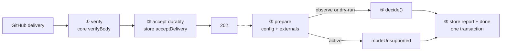

# shell/ — transport, not decisions

The transport package (D93). A webhook delivery goes in; a persisted report comes out; every decision
in between belongs to core's one verb. The shell's entire contribution is **order**:

> verify before accept, accept before ack, decide before act, commit the canonical outcome atomically.



## The five stations, and who owns each

| Step | File | Owned by |
|---|---|---|
| ① Verify the signature before anything else | [`src/receiver.ts`](src/receiver.ts) | core's `verifyBody` — the receiver never parses what it has not verified |
| ② Persist durably, only then `202` | [`src/receiver.ts`](src/receiver.ts) → [`src/shell.ts`](src/shell.ts) | the store's `acceptDelivery` (P9): a crash after the ack loses nothing |
| ③ Prepare: config text → `parseConfigDocument`, externals assembled | [`src/processor.ts`](src/processor.ts), [`src/config.ts`](src/config.ts), [`src/externals.ts`](src/externals.ts) | core's config layer; a broken config becomes `configRejected`, while `active` becomes `modeUnsupported` before `decide()` |
| ④ Decide with one verb | [`src/processor.ts`](src/processor.ts) | core's `decide()`; the shell cannot assert a world — `DerivedWorld` has no public constructor |
| ⑤ Commit report plus completion | [`src/processor.ts`](src/processor.ts) → store's `completeDeliveryWithReport` | store verifies delivery identity and claim ownership, then creates one canonical report and marks the delivery done in one transaction |

## Why a delivery goes into the database and comes back out

The two lanes never speak directly: the receiver's only output is a durable row, and the
processor's only input is that row — inside the same process. If that looks over-engineered,
price every crash:

| A crash… | Costs |
|---|---|
| before the durable row | nothing — no 202 was sent, so GitHub redelivers |
| after the 202 | nothing — the row waits; the next drain (or next start) finds it |
| mid-decision | nothing — the claim stales after 15 minutes and is reclaimed |

The counterfactual is the reason: handle a delivery in memory and there is a window between the
202 and the finished work where a crash loses it **permanently** — and experiment 6.2 measured
GitHub's own delivery ledger recording exactly such a lost delivery as *successfully delivered*.
No sweep or redelivery button would ever find it. The accept-before-ack ordering (P9), the claim
token, and the stale rule exist to make that window's width zero; D18's one-process,
business-hours posture is safe *because* anything a crash leaves mid-flight is repaired by a
later pass.

The configuration file lives at **`automations.yml` in the repository root** (D93): it configures the
automation platform, not GitHub, and everywhere else in the design GitHub is an adapter detail — a
`.github/` home would say otherwise at the most user-visible spot.

## Every stub is a named hole the read-only adapter fills

The stubs have the shape of the truth ([`src/externals.ts`](src/externals.ts)), and the adapter fills
each behind its existing seam. With App credentials in the environment (`APP_ID`,
`INSTALLATION_ID`, `PRIVATE_KEY_PATH`), `main.ts` composes the live fill — one conditional, the one
D93 promised; all three variables are required together and a missing key file fails before
listening. Without them the stubs run, which is CI's permanent path.

| Named hole | Live fill | Status |
|---|---|---|
| `fileConfigSource` (operator's local copy) | fetch `automations.yml` at the default branch | still a stub |
| `installationGrants: ["issues:write"]` | the installation's live grant list, riding the mint response | **filled** (#134) |
| `latestHumanChangeAt: () => null` | timeline evidence per item (D119) | **filled** (#134) |
| no `resolve` | `linkedIssues` / `isAutomationActor` lookups | still a stub |

The stub's `() => null` and not `() => "unknown"` deliberately: `"unknown"` is a safe conflict and
would refuse every write, burying dry-run's real findings under a uniform refusal. On the
credential-free path, dry-run reports **overstate** what would apply.

## Running against the sandbox

```
WEBHOOK_SECRET=…            # the sandbox App's webhook secret
REPO_OWNER=owner-sandbox    # the repository this endpoint serves
REPO_NAME=automation-sandbox
APP_ID=…                    # optional App credentials; provide all three together
PRIVATE_KEY_PATH=…
INSTALLATION_ID=…
PORT=8790                   # optional
HOST=127.0.0.1              # optional; omit to use Node's default bind host
CONFIG_FILE=…               # optional; default data/automations.yml (copy of the repo's file)
STORE_PATH=…                # optional; default data/shell.sqlite
KILL_SWITCH=1               # optional; refuse everything, loudly
```

```bash
pnpm --filter @hiero-hackers/automation-shell start
```

Point the existing smee channel at it and open an issue on the sandbox. The canonical report and
delivery completion are committed together in `shell.sqlite`. Startup still starts draining pending
SQLite deliveries before listening. Automatic filesystem projection is not supported, and a polished
operator report/query surface has not been built yet. `Store.deliveryReports()` is the current
programmatic access to canonical reports.

`data/` is never tracked (see the root `.gitignore`), the same rule as
`packages/dev/lab/evidence/`.

## Deliberately out of the first slice

- **The scheduler** — `staleItemsDue` is queried, not delivered; it arrives as a second caller of
  `decide()`, not a second pipeline.
- **Config hot-fetch** — the seam exists (`ConfigSource`); the fetch is the read adapter's.
- **Active mode** — the runnable shell supports disabled, observe and dry-run and rejects active
  configuration.
  Active GitHub writes are not implemented yet; each real effect will need its own write and durable
  recovery path before active behavior can be enabled.
- **Multi-repository routing** — one endpoint, one configured repository, matching the sandbox.

The capture receiver in `packages/dev/lab/src/capture.ts` was this package's embryo: same verify-first line,
same 202 — it just wrote a file where the shell continues through canonical SQLite completion.
